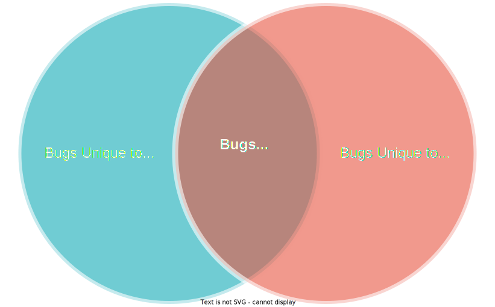

<meta name="title" content="High Assurance Rust">
<meta name="description" content="Developing Secure and Robust Software">

<meta property="og:title" content="High Assurance Rust">
<meta property="og:description" content="Developing Secure and Robust Software">
<meta property="og:type" content="article">
<meta property="og:url" content="https://highassurance.rs/">
<meta property="og:image" content="https://highassurance.rs/img/har_logo_social.png">

<meta name="twitter:title" content="High Assurance Rust">
<meta name="twitter:description" content="Developing Secure and Robust Software">
<meta name="twitter:url" content="https://highassurance.rs/">
<meta name="twitter:card" content="summary_large_image">
<meta name="twitter:image" content="https://highassurance.rs/img/har_logo_social.png">

# Introduction
---

In systems programming - the world you're about to enter - we've become complacent.
Maybe even complicit.

We've promised our customers reliable and secure software, but with an implicit caveat: *not* at the cost of performance.
And the fastest languages have traditionally been memory-unsafe.
By using them, we actively risk both general functional requirements and our most base defensive posture:

* **Reliability:** Memory safety errors cause unpredictable crashes (e.g. "segmentation faults"), unreproducible errors (e.g. "data races"), and eventual outages (e.g. "memory leaks").

* **Security:** Those same memory errors might give an attacker the ability to read sensitive data (e.g. "steal secrets") or execute nearly arbitrary commands under the privileges of the victim program (e.g. "full control").

Your program crashing or producing incorrect output is one thing.
Your machine joining a botnet is another[^RustTrust].
Memory-unsafe programs risk both outcomes, simultaneously.

These incredible risks are largely mitigated[^AppLang] in most modern "application languages", which use garbage collection and/or heavyweight runtimes (think Python, Java, or Go).
Yet there are key verticals - safety-critical systems, high-performance distributed infrastructure, various kinds of firmware, etc. - that continue to rely on C and C++[^CStory].

Despite re-inventing themselves over time and powering much of the world's most critical software, these two traditional "systems languages" remain leading suppliers of worst-case security vulnerabilities (e.g. Heart Bleed[^HBleed], Stagefright[^StageFright], Eternal Blue[^EternalBlue], Dirty Pipe[^DirtyPipe], etc).
The memory corruption threat remains unabated.

Such is the cost of a multi-decade commitment to backwards compatibility.
We don't seek to disparage the giants whose shoulders we stand on.

Yet those shoulders bear an awful burden.
A seminal 2012 research paper[^Sok:EWoM], aptly titled *"Systematization of Knowledge: Eternal War in Memory"*, chronicled 30 years of *failed* C and C++ memory protection schemes.
Fast forward to 2019.
A Microsoft study[^MSBlue], of all security issues in the company's products between 2004 and 2018, claims:

> ~70% of the vulnerabilities addressed through a security update each year continue to be memory safety issues.

That percentage accounts for engineer experience and software quality processes at Microsoft - a market-leading titan.
If you're already a C or C++ programmer, this is an uncomfortable truth.
Understandable:

* C was the *revolution*, it gave the world "high-level" programs portable across processors[^AdvC]. And today it runs, at some deep level, in nearly every device.

* C++'s powerful abstractions enable performant systems of impressive scale: web browsers, graphics engines, databases, etc. Software we couldn't live without.

But *evolution* may be overdue.

> **What if I'm just *really* careful, *all* the time?**
>
> Best practices for modern C-family languages can reduce the *likelihood* of memory vulnerabilities.
> But they can't seem to *eliminate* them.
> And, unlike Rust's compile time errors and runtime checks, best practices are difficult to scale.
>
> Decades of data indicate that developer diligence and extensive testing cannot reliably solve the memory safety problem.
> It's time to seriously consider addressing the root cause.

## We Don't Need to Be Complacent Anymore

Rust, as a relatively new systems language, supports what have traditionally been C/C++ domains.
It offers an alternative set of paradigms, namely compiler-enforced "ownership"[^Lifetime].

If you've never tried Rust, imagine pair programming alongside a nearly-omniscient but narrowly-focused perfectionist.
That's what the borrow checker, a compiler component implementing the ownership concept, can sometimes feel like.

In exchange for the associated learning curve, we get memory safety guarantees.
That means we can, often but not always, prove the *absence of all memory errors with certainty*.

Rust was announced by Mozilla in 2010[^ProjServo], is led by an independent non-profit as of 2021[^RFound], and largely solves the single most pressing security problem in the last 40 years of systems programming: memory safety.

It's arguably the first commercially viable programming language simultaneously offering both memory safety and bare metal speed.

## Is that just an opinion?

It's an opinion gaining formidable momentum.
Past some threshold of social acceptance and market pressures, it might even become a boring stance.
Here are similar takes from some of Rust's production users:[^ProdUsers]

Amazon:[^QuoteAmazon]

> ...at AWS we increasingly build critical infrastructure like the Firecracker VMM using Rust because its out-of-the-box features reduce the time and effort needed to reach Amazon’s high security bar, while still delivering runtime performance similar to C and C++.

Google:[^QuoteGoogle]

> We feel that Rust is now ready to join C as a practical language for implementing the [Linux] kernel. It can help us reduce the number of potential bugs and security vulnerabilities in privileged code while playing nicely with the core kernel and preserving its performance characteristics.

Microsoft:[^QuoteMicrosoft]

> [Rust is] the industry's best chance for addressing this [memory safety] issue head-on.

## Does that mean Rust programs can't be compromised?

Definitely not.
Memory corruption is just one bug class.
It's particularly vicious and is often part of high-value exploit chains[^ZP2O], but other bug classes exist.

Many, if not most, security issues are language-agnostic (e.g. misconfiguration, command injection, hardcoded secrets, etc).
And memory-safe languages infrequently introduce their own issues (e.x. interpreter evaluation of untrusted input, aka "eval injection").
No programming language will make your code absolutely secure against all attacks.

 

  <figure>
  
  <figcaption>
Diagram not to scale: language-agnostic bugs are likely most prevalent, followed by memory-unsafety.
</figcaption> 
  </figure>

Moreover, Rust has a dirty little secret.
Let's address it up front: sometimes it's necessary to use Rust's `unsafe` keyword, which allows potentially memory-unsafe behavior within a specific block of code.
The intention is for a human to carefully review the safety of actions the compiler can't automatically verify.
And only in a few key places, instead of the entire codebase.

We won't need to use `unsafe` *at all* in this book's core project!
You'll learn how to reframe problems in an idiomatic way to maximize Rust's guarantees.
That's a critical skill for getting tangible security value out of the language.

But, for your situational awareness and future endeavors, we'll:

* Cover `unsafe`'s usage and implications in detail.
* Learn tools for auditing the safety of Rust applications.
* Review a handful of real-world vulnerabilities in Rust software, as case studies.

Rust is a monumental leap forward in systems security, not a panacea.

## Is Rust going to replace C and/or C++?

C and C++ power some of the most widely used software in the modern world.
A vast number of C-family codebases have been around for multiple decades, and will march on for several more.
Because they provide time-tested solutions to important problems.

Professional systems programmers stand to benefit from experience in all three languages.
The C-family is not going away any time soon.
And Rust integrates with existing C/C++ code.
Without runtime overhead.

This is a Rust book, but you'll see several small snippets of C.
These will usually demonstrate subtle "undefined behavior" problems that all C programmers should be aware of.

We'll also write bindings for calling the library you build from C via a Foreign Function Interface (CFFI).
That's a prerequisite to integrating new Rust components into existing codebases written in another language.

> **The Curious Case of `curl`**
>
> `curl`[^Curl], a utility for transferring data with URLs that's been ubiquitous since 1998, is written in C.
> Because the tool is so heavily relied upon, it's security impacts much of what we consider "the internet"[^MemSafeCurl].
>
> As of 2020, `curl` has integrated Rust backends for HTTP and TLS (called via CFFI) to bolster security[^MemSafeCurl].
> Memory safe Rust code seamlessly integrates with the existing C code.
> It's all one compiled binary, there's no performance penalty for cross-language interoperability.
>
> Although the average end user can't tell the difference (and that's a good thing!), `curl` is now a safer, more reliable program[^CurlCaveat].

## Is adopting a new language really worth the effort?

You've likely invested significant experience-hours in your language/toolchain/ecosystem of choice.
Even if much of your knowledge is transferable, is Rust worth the effort?

Not for every project.
Rust is a compelling choice when performance, reliability, and security are all mission-critical requirements.
At this intersection of polarized criteria, the barrier to justifiable confidence has traditionally been absurdly high.
We're talking "formal methods": machine-assisted proofs, model checking, symbolic execution, etc.
Approaches that, while valuable, face roadblocks to significant adoption in industry.

Now, Rust's guarantees are a small subset of what those verification approaches provide collectedly.
But Rust also avoids many of the associated practicality pitfalls.

Rust's compiler proves[^TypeProof] a specific set of important properties almost automatically, enabling us to ship quickly.
On the surface, we get memory safety without sacrificing low-latency performance.
Dig deeper, and our advantage is really principled verification at the pace of commercial development.
We get [some] proofs at the speed of real-world code.

> **Isn't verification only for toy programs?**
>
> Most formally-backed guarantees are restricted to research prototypes; they simply don't scale to large, multi-threaded codebases.
> So formal methods have a bad rap with practicing software engineers - too much difficulty, not enough value.
>
> By contrast, the Rust compiler was originally designed to harden components of Firefox's browser engine[^ProjServo] - a multi-million line, highly parallel, commercial codebase.

Now any tool, no matter how potentially beneficial, must be usable to see adoption and impact.

Despite an initial learning curve, Rust was voted the "most loved" programming language for the last 6 years in a row.
In StackOverflow's annual developer survey[^StackSurvey1], which had over 82,000 responses in 2021[^StackSurvey2].

## Alright. So can I learn Rust?

Imagine you chose to immigrate to a different country and learn to speak a new language.
It wouldn't be easy, but it might be worth it.
Our foray into high assurance programming in Rust will likewise be a challenging yet rewarding one.

Here's the beauty of learning something new: anyone can do it.
It takes a bit of time and the right resources, but if you stick with it long enough things will start to click.
This book will help you quickly tame the high learning curve of Rust, so we can all build systems software we can collectively rely on.

## Learning Outcomes

* Understand *what* this book covers and *why*
* Understand where this book fits within the Dreyfus Model of Skill Acquisition
* Setup a development environment so you can start writing Rust

---

[^RustTrust]: [*You Can't Spell Trust Without Rust*](https://gankra.github.io/blah/thesis.pdf). Alexis Beingessner (2015). This Master's thesis by one of the Rust standard library BTree authors is the source of this botnet analogy, and a general influence on this book.

[^AppLang]: "Largely" is a caveat here: Python can have data races, Go can have segmentation faults, etc. But garbage collected languages don't give attackers the same powerful exploitation primitives as C and C++ (more details coming in Chapter 4), so they don't carry the same risks.

[^CStory]: You'd be right to argue that C and C++ have as little in common with each other as they do with their former selves. C++11[^Cpp11] bears little resemblance to C++20[^Cpp20]. In lieu of a skim: the official C++ language standard grew by 515 pages, almost 40%, from 1,308[^Cpp11] to 1,823[^Cpp20] in total.

[^HBleed]: [*Embedded System Security with Rust: Case Study of Heartbleed*](https://blog.getreu.net/projects/embedded-system-security-with-Rust/). Jens Getreu (2016).

[^StageFright]: [*Stagefright: Scary Code in the Heart of Android*](https://www.blackhat.com/docs/us-15/materials/us-15-Drake-Stagefright-Scary-Code-In-The-Heart-Of-Android.pdf). Joshua Drake (2015)

[^EternalBlue]: [*EternalBlue Exploit: What It Is And How It Works*](https://www.sentinelone.com/blog/eternalblue-nsa-developed-exploit-just-wont-die/). SentinelOne (2019).

[^DirtyPipe]: [*The Dirty Pipe Vulnerability*](https://dirtypipe.cm4all.com/). Max Kellerman (2022).

[^Sok:EWoM]: [*SoK: Eternal War in Memory*](https://people.eecs.berkeley.edu/~dawnsong/papers/Oakland13-SoK-CR.pdf). Laszlo Szekeres, Mathias Payer, Tao Wei, Dawn Song (2012).

[^MSBlue]: [*Trends, challenges, and strategic shifts in the software vulnerability mitigation landscape*](https://github.com/Microsoft/MSRC-Security-Research/blob/master/presentations/2019_02_BlueHatIL/2019_01%20-%20BlueHatIL%20-%20Trends%2C%20challenge%2C%20and%20shifts%20in%20software%20vulnerability%20mitigation.pdf). Mat Miller (2019)

[^AdvC]: [*Episode 53 - C Level, Part I*](https://adventofcomputing.libsyn.com/episode-53-c-level-part-i). Sean Haas (2021). As this podcast explains, C was not the first language to compile to assembly - it's a practical variant of the idea that gained widespread adoption.

[^Lifetime]: Ownership isn't entirely new, similar concepts were pioneered by research languages. Lifetimes, a closely related concept, has existed in the C++ community for a while[^LifetimeCpp]. But Rust's novel ownership system *enforces* lifetime rules at compile time. In C++, lifetime assumptions can be violated at run-time if you're not careful. Bugs and vulnerabilities can ensue. Some people argue that Rust crystallizes certain C++ best practices in the compiler itself.

[^ProjServo]: [*Project Servo, Technology from the past come to save the future from itself*](http://venge.net/graydon/talks/intro-talk-2.pdf). Graydon Hoare (2011).

[^RFound]: [*Hello World!*](https://foundation.rust-lang.org/posts/2021-02-08-hello-world/). Ashley Williams (2021).

[^ProdUsers]: [*Production Users*](https://www.rust-lang.org/production/users). The Rust Team (Accessed 2022).

[^QuoteAmazon]: [*Why AWS loves Rust, and how we’d like to help*](https://aws.amazon.com/blogs/opensource/why-aws-loves-rust-and-how-wed-like-to-help/). Matt Asay, Official AWS Open Source Blog (2020).

[^QuoteGoogle]: [*Rust in the Linux kernel*](https://security.googleblog.com/2021/04/rust-in-linux-kernel.html). Wedson Almeida Filho, Official Google Security Blog (2021).

[^QuoteMicrosoft]: [*Microsoft: Rust Is the Industry’s ‘Best Chance’ at Safe Systems Programming*](https://thenewstack.io/microsoft-rust-is-the-industrys-best-chance-at-safe-systems-programming/). Joab Jackson (2020).

[^ZP2O]: [*Zoom RCE from Pwn2Own 2021*](https://sector7.computest.nl/post/2021-08-zoom/). Thijs Alkemade, Daan Keupe (2021).

[^Curl]: [*curl*](https://curl.se/). Daniel Stenberg (2021).

[^MemSafeCurl]: [*Memory Safe ‘curl’ for a More Secure Internet*](https://www.abetterinternet.org/post/memory-safe-curl/). Internet Security Research Group (2020).

[^CurlCaveat]: As of this writing, the Rust-enabled build of `curl` is not its default configuration. It's up to those building and distributing `curl` (e.g. OS distro maintainers) to choose build configurations suitable for the platforms and users they support. A reasonable arrangement worth noting!

[^TypeProof]: [*Computer Scientist proves safety claims of the programming language Rust*](https://www.eurekalert.org/news-releases/610682). Saarland University (2021). Note that formal verification of Rust is a research problem with both current successes and ongoing work.

[^StackSurvey1]: [Technology: Most loved, dreaded, and wanted](https://insights.stackoverflow.com/survey/2021#technology-most-loved-dreaded-and-wanted). StackOverflow (2021).

[^StackSurvey2]: [Methodology: Participants](https://insights.stackoverflow.com/survey/2021#methodology-participants). StackOverflow (2021).

[^Cpp11]: [*[Final] Working Draft, Standard for Programming Language C++*](http://open-std.org/jtc1/sc22/wg21/docs/papers/2012/n3337.pdf). Document Number:N3337 (2012). Document number 3337 - so close to 1337! Missed opportunity.

[^Cpp20]: [*[Final] Working Draft, Standard for Programming Language C++*](http://open-std.org/jtc1/sc22/wg21/docs/papers/2020/n4861.pdf). Document Number:N4861 (2020).

[^LifetimeCpp]: [*Lifetime*](https://en.cppreference.com/w/cpp/language/lifetime). cppreference.com (Accessed 2022).

