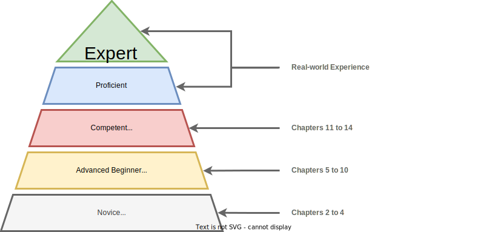

# How is this book structured?

Bottom line up front: this book will help you develop expertise by working through a large project in scaffolded stages.
So, for the majority of readers, it's best to read the whole book in order.

But, realistically, not everyone has the time or energy to read a textbook cover-to-cover.
And some readers are already familiar with certain topics.
So we've created a breakdown to accommodate five types of readers (all of which are already experienced programmers):

| Reader | Recommended Usage |
| --- | --- |
| **Extremely Busy Person:** Short on time, needs value quickly, cannot read an entire book. | Work through Chps. 1 to 4. Perhaps come back one day. |
| **No Prior Experience:** New to Rust/systems/security. | Work through Chps. 1 to 15 and Appendix "Fundamentals" as mentions appear (e.g. whole book). |
| **Security Person:** Systems security background, but new to Rust. | Work through Chps. 1, 3, 5 to 15. Refer to Appendix as needed.|
| **Security Rustacean:** Systems security background, has read another Rust book before. | Work through Chps. 1, 6, 7, 9 to 15. Refer to Appendix as needed.|
| **Advanced Security Rustacean:** Already highly knowledgeable in systems/security/Rust, looking for an advanced topics reference. | Chps. 11, 12, 14, and 15.  |

## The Driving Model

We're going to cover a lot of ground.
From what "assurance" even means to the limits of cutting-edge technology.
The unifying thread is an incremental, capstone project - building a sophisticated library.

That thread wraps a classic spindle: the Dreyfus Model[^Dreyfus] of Skill Acquisition.
This developmental model explains how formal education and hands-on practice intertwine in skill development.
It was originally developed at UC Berkeley in 1980, funded as part of the US Air Force's research initiatives, and remains relevant today.

The crux of Dreyfus' idea is that anyone deliberately improving at a complex task can transition through five distinct stages: Novice, Advanced Beginner, Competent, Proficient, and Expert.

As the learner becomes more skilled, they draw less from abstract principles and more from concrete experience.
The result is a shift from cognitive attention (e.g. taxing concentration) to automatic processing (e.g. "second nature").

The content of this book is *roughly* structured to mirror the first three of the five stages.
Using the updated (circa 2004) definitions[^NewDreyfus].
Let's explain each stage and preview the associated chapters.

## Chapters by Dreyfus Model Stage

 

  <figure>
  
  </figure>

 

### Stage 1 - Novice: Systems Security

Novices learn rules, the "big picture" principles that apply regardless of any specific situation, and follow steps.

Novice-stage chapters focus on core concepts, definitions, and language syntax.

* **Chapter 2 - Software Assurance:** Understanding the landscape of tools and processes for developing secure and robust software. Writing your first Rust program!

* **Chapter 3 - Rust Zero-Crash Course:** A tour of Rust features and syntax, living in harmony with the borrow checker, and organizing code. In the context of industry best-practice guidelines for security and reliability. Plus a sample of tooling for maintaining professional software projects.

* **Chapter 4 - Understanding Memory:** What you need to know about memory to "control" your programs, to exploit memory unsafe programs, and *really* understand Rust's memory safety guarantees at a mechanical level.

### Stage 2 - Advanced Beginner: Core Project

Unlike a Novice, the Advanced Beginner starts to recognize recurring patterns.
They discover "maxims" (loose, situational rules) and, with experience, apply their own creative strategies.

Advanced-Beginner-stage chapters are where we start the core implementation of our library.
The focus is on mapping the assurance concepts you've learned to non-trivial code.

* **Chapter 5 - Binary Search Tree (BST) Basics:** Fundamental searching and sorting algorithms, how tree data structures enable both, and challenges in translating these algorithms to Rust.

* **Chapter 6 - Building an Arena Allocator:** Turning common algorithms into idiomatic, safe Rust code by controlling memory management.

* **Chapter 7 - A Self-balancing BST:** Implementing advanced algorithms to build a memory-efficient, self-balancing binary search tree.

* **Chapter 8 - Digital Twin Testing:** An introduction to whole-system emulation and embedded semi-hosting. Running our library on a tiny, virtual microcontroller taking remote commands!

* **Chapter 9 - Building Maps and Sets:** Turning our humble tree into a largely API-compatible, drop-in alternative to Rust standard library collections.

* **Chapter 10 - Implementing Iterators:** Vastly increasing the utility of our library by supporting one of Rust's core abstractions: safe iterators.

### Stage 3 - Competent: Validation and Deployment

A competent learner develops an understanding nuanced enough to become aware of what they *don't* know.
To cope, the competent learner begins to self-specialize.
They decide which elements of the skill domain are more conducive to their long-term needs and which can be de-prioritized or ignored.

Competent-stage chapters prepare you to apply accumulated lessons to real-world projects.
You'll learn how to use advanced tools for security testing and functionality validation.
And how to integrate Rust code within larger software projects written in another language.

* **Chapter 11 - Static Verification:** Using deductive verification (specification annotations proven by a theorem solver at compile time) to show that our core code is functionally correct. And, for completeness, model checking of `unsafe` code.

* **Chapter 12 - Dynamic Testing:** Using both production-grade and experimental tools to stress test our library and all of its dependencies. Also benchmarking and optimization.

* **Chapter 13 - Operational Deployment:** Unlocking the benefits of Rust for real-world, multilingual projects by adding CFFI bindings to our library. A thorough exploration of `unsafe` (which our library does not use, but many projects do).

* **Chapter 14 - Maximizing Assurance:** Taking a step back to assess Rust in a broader context, looking at limitations, best practices, and cutting edge research.

### What about Stages 4 and 5 (Proficient and Expert)?

The Proficient stage is where the learner shifts from concepts, rules, and skills to *goals*.
Armed with experience, they can determine the appropriate goal in any new situation - even if they don't always possess the ability to achieve it.

Experts can both determine a goal and achieve it via an efficient means.
They may even advance the state-of-the-art, creating new rules for the next generation of novices.

Reading a single book will not make you an expert.
That's a title hard-won on the battlegrounds of the real-world, over the course of a career.

That being said, the last chapter is your sendoff:

* **Chapter 15 - Review:** The entire book distilled into a dense set of notes. Both to cement your understanding and to serve as a quick reference for the future.

The road through proficiency and onto expert status is unpaved.
It's up to you to chart a course.
We hope this book will be your start.

---

[^Dreyfus]: [*A Five-Stage Model of the Mental Activities Involved in Directed Skill Acquisition*](https://apps.dtic.mil/sti/pdfs/ADA084551.pdf). Stuart E.Dreyfus, Hubert L. Dreyfus (1980).

[^NewDreyfus]: [*The Five-Stage Model of Adult Skill Acquisition*](https://www.bumc.bu.edu/facdev-medicine/files/2012/03/Dreyfus-skill-level.pdf). Stuart E.Dreyfus (2004). Note that both original paper and this update have been criticized not using empirical, experimental data to justify the proposed taxonomization.