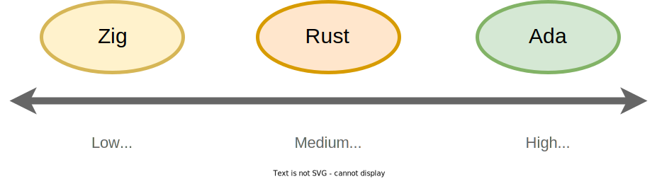

# Why this book?

Rust's momentum has a constellation of factors.
The availability of free, high-quality learning resources[^LearnRust] is undoubtedly one of them.
Including *The Rust Programming Language*[^TRPL], an excellent official text.

So why another Rust book?
Well, in truth, this book isn't *truly* about Rust - although helping you learn the language is a driving goal.
This book is a gateway to fundamentally important but intimidatingly difficult topics: systems programming and low-level security.

More specifically, our systems topics include embedded-friendly data structures and cross-language interoperability.
Our security topics include static verification, dynamic bug-finding, and binary exploitation.

Our hope is that coverage of these topics serves you well going forward.
Or just scratches that itch for understanding how things work.

## A Note on Healthy Skepticism

This book strives to be technically accurate, data-driven, and practical.
But it is also opinionated.
The stances taken reflect the beliefs and experiences of the authors.

Any claims, especially those related to security, should be evaluated through a critical lens.
Not just in the case of this book, but in general.
This is no such thing as information without bias.

We encourage you to cultivate and maintain a mindset of healthy skepticism.
It will pay dividends in any software security context.

If you find a factual error, please [let us know](../engage.md#submit-feedback-questions-issues-or-prs).

## Why learn about systems programming?

If you asked 3 engineers what a "systems program" does, you'd likely get 3 disparate answers.
It's a broad field spanning various industries and use cases:

* "Systems programs are distributed, they make low-latency decisions and coordinate over a network via consensus protocols", the first engineer might say.
    * E.g. distributed **databases** and **fault-tolerant services**.

* "No", the second could pipe in, "systems programs manage a userspace application's view of hardware, they schedule and facilitate physical resource use".
    * E.g. **operating systems** and **device drivers**.

* The third may look dissatisfied and add "What about a tight feedback loop collecting sensor data on a low-power device? That doesn't share resources at all!"
    * E.g. firmware for **microcontrollers** and **control systems**.

All three answers are correct.
The common thread (pun intended[^Thread]) is that systems programs have goals tied to hardware resource constraints.
They sit at a *low-level*.
For special purpose devices, it's the only level present.

More commonly, it's the *foundation for high-level* programs users interact with directly.
Efficient resource use (performance) is critical: any slowdown gets amplified - it impacts *all* reliant high-level programs.

Here's a question you can ask to quickly identify a systems program (as with all rules of thumb, this is an approximation):

* **Who** needs the program to feel responsive?

    * **A person:** it's not a systems program, it's constrained by human time (measured in milliseconds, the smallest unit that feels tangible to us).

    * **Another program:** it's a systems program, it's constrained by machine time (measured in CPU cycles - modern processors execute millions of cycles every millisecond).

Even if you're only interested in writing high-level applications, understanding a bit (last pun, promise) about low-level applications is helpful.
You can more effectively interact with the layer below you, and apply the same performance-oriented reasoning to bottlenecks at your level of the stack - whatever it may be.

## Languages by Level

The Rust programming language isn't used exclusively for systems software, but that's certainly its strength.
Rust can run in levels of the stack where **scripting languages** (Python, Ruby, Lua, etc) and **garbage-collected languages** (Java, Go, C#, etc) cannot.
At these always-present low levels, memory-unsafe **systems languages** (C and C++) have held a monopoly for decades.

 

  <figure>
  
  <figcaption>
Mapping programming languages to levels of the software stack.
</figcaption> 
  </figure>

## Which languages offer safer systems programming?

Programming languages are ultimately just tools.
Language choice may invoke passionate debate, but at the end of the day it's important to choose the best tool for the job.

We can't be objective if we aren't aware of available options.
Before starting our Rust journey, we should briefly mention two alternatives for safer systems programming: Zig and Ada.
Like Rust, both are natively compiled, don't use garbage collection, and have safety advantages over the C-family.
All three languages are similarly suitable for modern low-level programming.

In lieu of an in-depth comparison, let's contrast the three options in terms of maturity for development of mission and safety critical systems.
Assume that *mission-critical* systems run in production, where a security or reliability failure is expensive to a business.
And that *safety-critical* systems drive physical phenomena, so a security or reliability failure could endanger human life, property, or the environment.

 

  
  <figure>
  <figcaption>
Safer systems programming languages contrasted by {safety,mission}-critical maturity.
</figcaption> 
  </figure>

* **Zig** (Low Maturity) - At the time of this writing, Zig has not yet reached a stable 1.0 release. While the toolchain already has production users[^UberZig], any unstable language typically isn't suitable for mission or safety critical products. Zig doesn't offer the temporal memory safety benefits of Rust, but does offer similar runtime enforcement for spatial memory safety[^ZigSafety]. And its own unique merits[^WhyZig].

* **Rust** (Medium Maturity) - Rust hit 1.0 in 2015 and has a plethora of mission-critical production uses[^ProdUsers]. Early efforts to bring Rust into the safety-critical domain include a collaboration between Ferrocene and AdaCore[^Ferrda], an AUTOSAR Working Group[^AUTOSAR], and ongoing R&D in formal verification tooling[^RFMIG]. At the time of this writing, Rust is not yet qualified for use in safety-critical environments.

* **Ada** (High Maturity) - Ada's 1.0 specification was released in 1996. Its commercially-supported runtime libraries and compiler are already qualified for use with standards like DO-178B/C (aviation), ISO 26262 (automotive), IEC 61508 (industrial), and ECSS-Q-ST-80C (space)[^AdaCert]. The SPARK subset of Ada offers mature deductive verification capabilities[^SPARK]. SPARK has made recent advances in heap memory verification, inspired in part by Rust's type system[^SPARKHeap].

Learning a programming language, whichever it may be, is a great way to grow as a developer.
Newer languages with healthy communities may find their own niches and develop their own innovations over time.
Established languages can offer richer tooling and library ecosystems in the present.

We believe that Rust is an exceptional tool for many projects today, and will be a viable choice for many more projects tomorrow.

> **Safety by Design**
>
> Zig, Rust, and Ada employ various strategies for one or more of:
>
> * Building safety features directly into the type system (compile time check)
> * Requiring explicit opt-out of default runtime safety enforcement (runtime detection)
>
> Baking safety into the core design of a language makes defect elimination easier to scale reliably.
> Relative to training in opt-in best practices and/or using 3rd-party error checkers.
>
> On the flip-side, the cost to learn and adopt a new language toolchain can be high for existing projects.
> And, occasionally, there are valid reasons to choose unsafe languages for new projects.
> Tool selection is a highly situational problem.

## Why build a data structure library?

Maybe a white-board coding interview left a bad taste in your mouth.
Maybe your college data structures class didn't quite click.
Or maybe you're self-taught, so the topic feels academic and largely irrelevant.
After all, the libraries are already written - you can have a long and fruitful software career without ever rolling your own binary search tree.

But there's something special about data structures.
They combine the mathematical rigor of Computer Science theory with the practical constraints of efficient implementation.
They're a rare glimpse into what's possible at the intersection of the abstract and the concrete.
Where the math rubber meets the code road, if you will.

The standard libraries of modern programming languages include data structure APIs, or "collections".
These APIs get used by nearly every program written in that language.
Because a single data structure implementation can be so ubiquitous, performance is critical.
Thus real-world data structures are typically implemented in a **compiled** language, like Rust or C, for speed.
This includes those in the standard library of **interpreted** languages like Python[^PyList]!

Building a data structure library involves taking a complex set of functional requirements and translating them into compact and correct code.
It walks you through accomplishing a goal at a strategic level (the overall algorithm) and at a tactical one (the mechanics of individual structure operations - like `insert`, `get`, or `remove` - in the language you're using).

You'll learn both generally-applicable problem solving skills and language-specific development skills.

> **Compiled vs. Interpreted:**
>
> Compilers (like C's `gcc` and Rust's `rustc`) transform source code into **native binaries**, executable files filled with instructions the CPU runs directly. This results in very fast programs built for a specific CPU Instruction Set Architecture (ISA - e.g. x86, ARM, RISC-V, etc).
>
> Interpreters execute source code a chunk at a time. The interpreting program runs your program by walking a **syntax tree**. This means slower execution, but portability to any CPU so long as the interpreter (likely a native binary itself) supports it.
>
> In practice, the line isn't always crystal clear. Python actually transforms source into **bytecode** (instructions the interpreter understands). That's a kind of compilation.
>
>All you need to remember is this: systems software must be natively compiled (turned into CPU instructions) because efficiency is a top priority!

## Aren't data structures particularly challenging in Rust?

Rust's memory safety guarantees are a significant evolution in the security of systems software.
With growing industry adoption and a thriving library ecosystem, Rust is a deserving ambassador for both systems programming and secure coding.

Yet certain data structures are infamously difficult[^TooManyLink] to write in Rust, due to how the compiler checks for safety-specific properties.
This is especially true for structures where one element knows how to reach another and vice versa (e.g. those with "cyclical references").
Some developers get so frustrated by this that they snap their keyboards in half, with a swift upward knee, and give up on Rust altogether!

That's why you'll be *starting* your Rust journey with advanced data structures.
It'll push you to tackle the language's toughest concepts head on.
If a Rust implementation of a troublesome data structure doesn't already exist, you'll gain the skills necessary to re-frame the problem in a Rust-idiomatic way and roll your own.

That ability is the scaffolding to succeed with Rust - whatever your ultimate goal.
Once you build a mental model for how memory works and how Rust manages it, you're well on your way to shipping safe systems software.

## Besides security, why Rust?

Because Rust enables you to maximize performance.

Moore's law[^Moore] has reached its limit, physics has put a ceiling on instruction throughput and clock speed.
Assuming the bottleneck is actually program CPU time (and not, say, network latency or disk I/O limits) there's typically two ways to improve performance:

1. Implement a superior algorithm for your problem, if one exists.
2. Parallelize the slow operation across multiple cores.

Rust's memory reasoning helps with the [often more realistic] latter option: the compiler ensures reliable concurrency.
This *doesn't* mean parallelizing the logic of an algorithm automatically (that's still a challenge) or preventing all race conditions (the compiler can't reason about deadlock, for example).

But it does mean freedom from all "data races" (an important *subset* of possible race conditions).
Those are seemingly random state corruption caused by subtle errors in "timing" (combinatorial thread interleaving) assumptions.

Concurrent programming has traditionally been fiendishly difficult to get right.
The performance benefits required both re-framing a problem and debugging unpredictable behavior.
Rust eliminates much of the debugging by enabling greater determinism.
The language both *solves* the memory safety problem and *alleviates* the concurrency problem.

## But is any of this really for me?

If you enjoy it, then absolutely yes!

Systems programming and low-level security are intimidating topics, so you might assume they're reserved for a certain kind of person.
Traditionally, they have been.
Realistically, the barriers are still there.

Depending on your background and experiences, it may be difficult to picture yourself as part of the systems security world.
But you certainly can be!
It may not *be easy* - but it can *be*.

---

[^LearnRust]: [*Learn Rust*](https://www.rust-lang.org/learn). The Rust Team (2021).

[^TRPL]: [*The Rust Programming Language*](https://doc.rust-lang.org/book/). Steve Klabnik, Carol Nichol (Accessed 2022).

[^Thread]: [*Processes and Threads*](https://wiki.osdev.org/Processes_and_Threads#Threads). OSDev Wiki (2021).

[^UberZig]: [*How Uber Uses Zig*](https://jakstys.lt/2022/how-uber-uses-zig/). Motiejus Jakstys (2022).

[^ZigSafety]: [*How safe is Zig?*](https://www.scattered-thoughts.net/writing/how-safe-is-zig/). Jamie Brandon (2021).

[^WhyZig]: [*Why Zig When There is Already C++, D, and Rust?*](https://ziglang.org/learn/why_zig_rust_d_cpp/). The Zig Team (Accessed 2022).

[^ProdUsers]: [*Production Users*](https://www.rust-lang.org/production/users). The Rust Team (Accessed 2022).

[^Ferrda]: [*Ferrous Systems and AdaCore to join forces on Ferrocene*](https://ferrous-systems.com/blog/ferrous-systems-adacore-joining-forces/). Ferrous Systems (2022).

[^AUTOSAR]: [*AUTOSAR announces new Working Group for Programming Language Rust in Automotive Software context*](https://www.autosar.org/fileadmin/user_upload/20220308_RustWorkingGroup_Announcement_EN.pdf). AUTOSAR (2022).

[^RFMIG]: [*Rust verification tools*](https://rust-formal-methods.github.io/tools.html#rust-verification-tools-2021). Rust Formal Methods Interest Group (2021).

[^AdaCert]: [*Certification Evidence for the Ada Run-Time Libraries and Compiler*](https://www.adacore.com/certification-qualification). AdaCore (Accessed 2022).

[^SPARK]: [*About SPARK*](https://www.adacore.com/about-spark). AdaCore (Accessed 2022).

[^SPARKHeap]: [*Safe Dynamic Memory Management in Ada and SPARK*](https://www.adacore.com/uploads/techPapers/Safe-Dynamic-Memory-Management-in-Ada-and-SPARK.pdf). Maroua Maalej, Tucker Taft, Yannick Moy (2021).

[^PyList]: [*dictobject.c*](https://github.com/python/cpython/blob/master/Objects/dictobject.c). CPython Interpreter (2021).

[^TooManyLink]: [*Learn Rust With Entirely Too Many Linked Lists*](https://rust-unofficial.github.io/too-many-lists/). Alexis Beingessner (2021).

[^Moore]: [*Moore's law*](https://en.wikipedia.org/wiki/Moore%27s_law). Wikipedia (Accessed 2022).