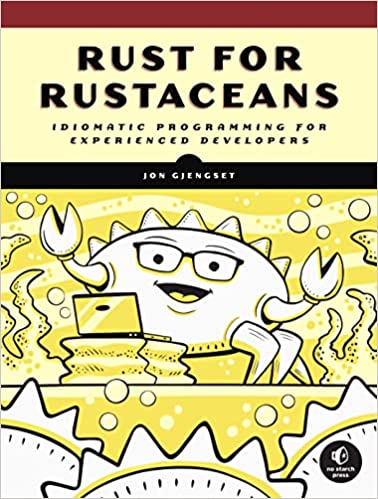

<meta name="title" content="High Assurance Rust">
<meta name="description" content="Developing Secure and Robust Software">
<meta property="og:title" content="High Assurance Rust">
<meta property="og:description" content="Developing Secure and Robust Software">
<meta property="og:type" content="article">
<meta property="og:url" content="https://highassurance.rs/">
<meta property="og:image" content="https://highassurance.rs/img/har_logo_social.png">
<meta name="twitter:title" content="High Assurance Rust">
<meta name="twitter:description" content="Developing Secure and Robust Software">
<meta name="twitter:url" content="https://highassurance.rs/">
<meta name="twitter:card" content="summary_large_image">
<meta name="twitter:image" content="https://highassurance.rs/img/har_logo_social.png">

# Inventory: Recommended Reading

This is a complete inventory of recommended reading, books that appear with the tag ***[PERSONAL FAVORITE]*** in footnotes.
We genuinely feel each book listed is either an essential read in its field or a reference worth keeping in arm's reach.

If you purchase a book using one of the affiliate links below, it helps support ***High Assurance Rust*** - in addition to the book you're buying!

## Rust

 

* ***Programming Rust: Fast, Safe Systems Development***. Jim Blandy, Jason Orendorff, Leonora Tindall (2021).

    * [https://amzn.to/35cu1Za](https://amzn.to/35cu1Za)

 

* ***Rust for Rustaceans***. Jon Gjengset (2021).

    * [https://amzn.to/36GfSDU](https://amzn.to/36GfSDU)

## Software

 

* ***Computer Systems: A Programmer's Perspective***. Randal Bryant, David O'Hallaron (2015).

    * [https://amzn.to/3IBnFA7](https://amzn.to/3IBnFA7)

 

* ***A Philosophy of Software Design***. John Ousterhout (2021).

    * [https://amzn.to/3DbaPrp](https://amzn.to/3DbaPrp)

 

* ***Effective C: An Introduction to Professional C Programming***. Robert Seacord (2020).

    * [https://amzn.to/3wBuNu7](https://amzn.to/3wBuNu7)

## Security

 

* ***Practical Binary Analysis: Build Your Own Linux Tools for Binary Instrumentation, Analysis, and Disassembly***. Dennis Andriesse (2018).

    * [https://amzn.to/3wvtCwa](https://amzn.to/3wvtCwa)

 

* ***Understanding Cryptography***. Christof Paar, Jan Pelzl (2009).

    * [https://amzn.to/3IEYuNd](https://amzn.to/3IEYuNd)

---
