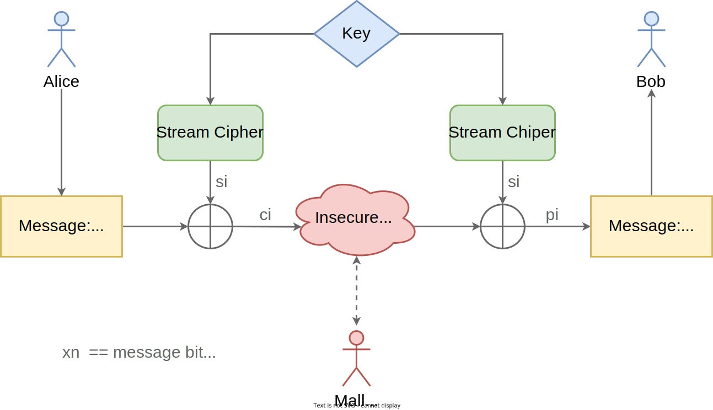

# Fundamentals: Stream Ciphers

Cryptography, the study of techniques to secure communication, is a field of mathematics predating Computer Science.
The majority of security engineers don't need to be experts in cryptography.
But every security engineer should have a healthy reverence for it.

Systems our society relies on, including any that support a financial transaction, all have some notion of "trust".
A communicating party can identify, with confidence, *who* they are "talking" to (authentication).
And they can rest assured that their "conversation" is *private* (confidentiality).

Cryptographic libraries are the technical mechanism underpinning properties like authentication and confidentiality.
The core means by which that trust is built and maintained.
Without them, most modern digital services wouldn't be practical.

As aspiring security engineers, there are basic concepts we should strive to understand before leveraging existing cryptographic APIs.
And definitely before implementing any cryptographic algorithms ourselves (which is generally not advisable).

## How does symmetric encryption work, big picture?

Two users, canonically Alice and Bob, want to communicate securely.
But there's a problem.
They need to exchange messages over an **insecure channel**, like the public internet or the physical space separating two Low Earth Orbit (LEO) satellites.
A malicious attacker, named Mallory, can view and potentially modify data sent across the insecure channel.

Encryption provides **confidentiality**, a mathematical guarantee that only Bob can read the **plaintext** contents of a message sent by Alice and vice versa.
Mallory is left out of the loop - any message she captures will appear indistinguishable from random garbage because it's encrypted.
The encrypted, unintelligible form of the message is called **ciphertext**.

Real-world communication protocols also ensure **data integrity** (proof that Mallory didn't modify Alice's message in transit) and provide **data authentication** (proof Bob is talking to the real Alice and not an imposter).
But we're only concerned with confidentiality for the purposes of this discussion.

So how can Alice and Bob use encryption to keep their communication confidential?
**Symmetric** (aka "secret key") cryptography is the straightforward option:
if Alice and Bob can agree on an encryption **key** using a **secure channel** beforehand, they can use the same symmetric encryption algorithm (like Chapter 2's RC4) to protect subsequent communication over the insecure channel.

The secure channel needs to be one Mallory can't access, because we can only achieve confidentiality if Mallory doesn't know the key (hence *secret* key).
Maybe Alice and Bob meet face-to-face once, months before they plan to communicate, to agree on a key.
Setting up secure channels is often cumbersome.
Sometimes it's entirely impractical.

**Asymmetric** (aka "public key") cryptography addresses this problem.
But that's a topic outside the scope of our discussion.

> **Kerckoffs' Principle**
>
> Mallory can't know the secret key.
> But, perhaps surprisingly, it's actually *preferable* that Mallory *does know* the exact encryption algorithm used by Alice and Bob!
>
> Kerchoff's Principle[^Kerchoff] states that a cryptosystem should be secure even if the attacker knows everything about it except for the key.
> The security guarantee in Alice and Bob's communication should be derived from the mathematical properties of a well-known, well-vetted encryption algorithm - not from the hiding of a specific detail (that's "security by obscurity", a strategy that often fails in practice).

## Ok. So what is a stream cipher?

A class of symmetric algorithm that can be used to actually perform the encryption, after Alice and Bob have agreed on a secret key.

**Stream ciphers** could, in theory, encrypt a single bit at a time.
They "think" of data as a continuous bitstream.
In practice, most implementations encrypt a byte (8 bits) at a time because modern computers use byte addressable memory.

By contrast, **block ciphers** need to break data up into fixed-size chunks.
For the popular Advanced Encryption Standard (AES)[^AES], a block must be 128 bits (16 bytes).

While both stream and block ciphers accomplish the same goal, stream ciphers tend have a smaller memory footprint and faster runtimes[^Perf].
So they're often used for low-resource embedded systems and real-time data processing.

The "smarts" of any stream cipher algorithm is how it turns a finite-size key (RC4 lets Alice and Bob choose anywhere from 40 to 2,048 bits) into a **keystream** as long as the input data (which could be arbitrarily long, maybe we need to encrypt a 10 GB file).

The challenge of stream cipher algorithm design is creating *unpredictable* key streams.
Even though encryption and decryption are deterministic operations, the key stream must *appear truly random* (as if produced by measuring irreplicable physical phenomena) in order to effectively hide messages from Mallory.
Cryptographers call key stream generating functions *Cryptographically Secure Pseudorandom Number Generators (CSPRNGs)*.

If we can generate an unpredictable keystream, encryption is simple: XOR every bit/byte in the key stream with the corresponding bit/byte in the plaintext to produce ciphertext.

Chapter 2's RC4 implementation should give you a feel for how this all works in practice!

 

  
  <figure>
  <figcaption>
Two-party communication over an insecure channel. Based on "Understanding Cryptography" by Paar et al, page 38.
</figcaption> 
  </figure>

## Where can I learn more about cryptography?

We recommend *Understanding Cryptography* by Paar and Pelzl[^UnderstandingCrypto] and it's corresponding video lectures[^UnderstandingCryptoVideo].

Many cryptography books assume a PhD-level math background, making them almost unreadable for the average practicing engineer.
Others dumb it down too much, replacing all math with cartoonish diagrams (a sin this section is guilty of).
*Understanding Cryptography* is a happy medium: accessible with undergraduate-level math experience but still the real deal.

---

[^Kerchoff]: [*Kerchoff's Principle*](https://en.wikipedia.org/wiki/Kerckhoffs%27s_principle). Wikipedia (Accessed 2022).

[^AES]: [*Advanced Encryption Standard*](https://en.wikipedia.org/wiki/Advanced_Encryption_Standard). Wikipedia (Accessed 2022).

[^Perf]: This is a generalization, performance characteristics vary greatly by algorithm and implementation. And sometimes a specific algorithm is implemented in hardware, making it much faster than a comparable software implementation. For example, modern x86 processors offer instruction set extensions specifically for AES - the speed up can be up to 13x[^AESNI].

[^UnderstandingCrypto]: [***[PERSONAL FAVORITE]** Understanding Cryptography*](https://amzn.to/3IEYuNd). Christof Paar, Jan Pelzl (2009).

[^UnderstandingCryptoVideo]: [*Online Cryptography Course*](https://www.crypto-textbook.com/movies.php). Christof Paar, Jan Pelzl (2009).

[^AESNI]: [*Advanced Encryption Standard New Instructions (AES-NI) Analysis: Security, Performance, and Power Consumption*](http://www.sce.carleton.ca/faculty/huang/iccae-2020.pdf). Eslam AbdAllah, Yu Rang Kuang, and Changcheng Huang (2020).

