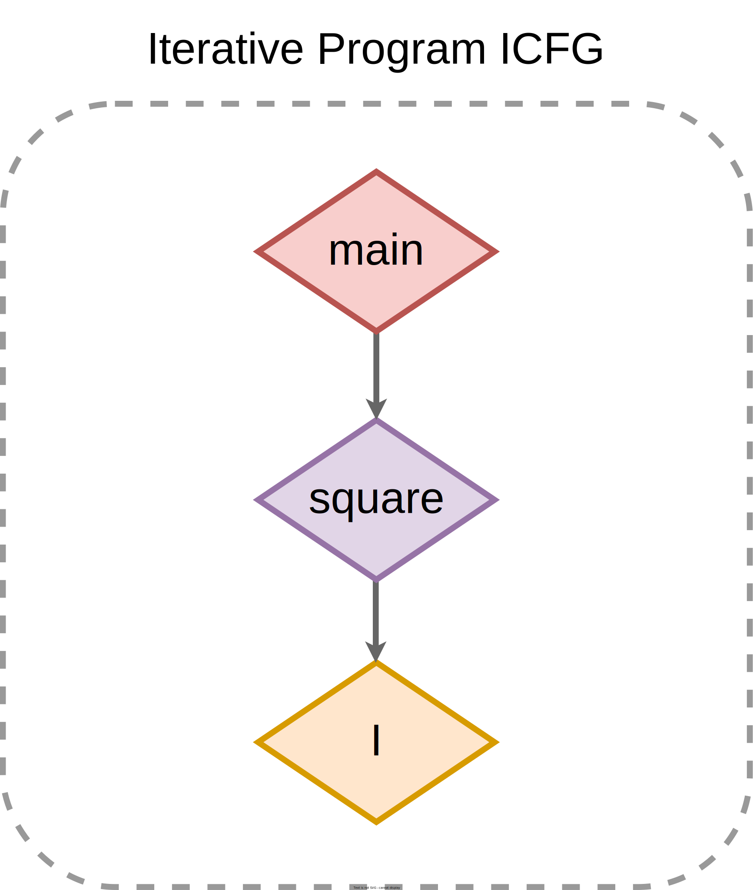
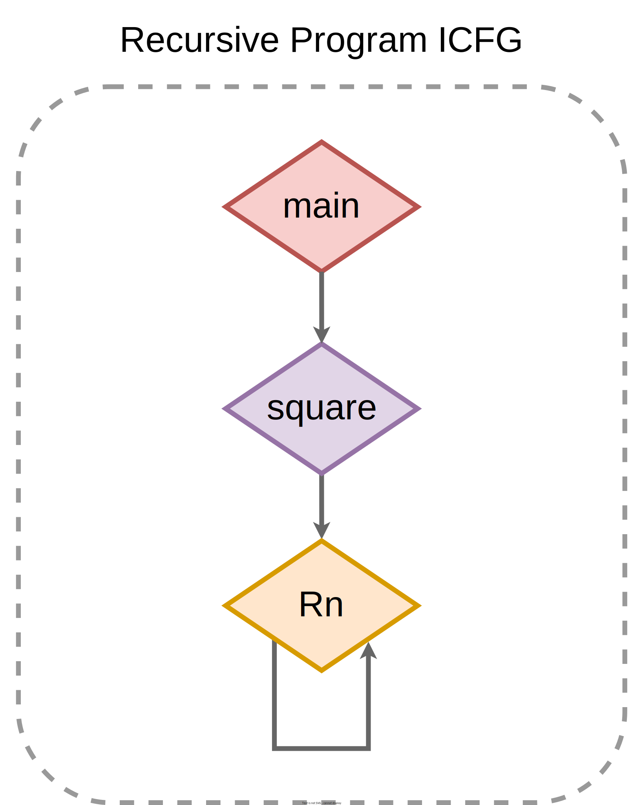

<meta name="title" content="High Assurance Rust">
<meta name="description" content="Developing Secure and Robust Software">
<meta property="og:title" content="High Assurance Rust">
<meta property="og:description" content="Developing Secure and Robust Software">
<meta property="og:type" content="article">
<meta property="og:url" content="https://highassurance.rs/">
<meta property="og:image" content="https://highassurance.rs/img/har_logo_social.png">
<meta name="twitter:title" content="High Assurance Rust">
<meta name="twitter:description" content="Developing Secure and Robust Software">
<meta name="twitter:url" content="https://highassurance.rs/">
<meta name="twitter:card" content="summary_large_image">
<meta name="twitter:image" content="https://highassurance.rs/img/har_logo_social.png">

# Inter-procedural Control Flow Graphs (ICFGs)

When possible, eliminating a bug category with a pattern is ideal for static assurance.
We saw this when exploring stack safety and MISRA C 17.2[^MISRA_2012] ("no recursion") in Chapter 4, Section 2.

What impact does recursion have on the more general case, arbitrary static analysis and/or verification tooling?

Technically, it depends.
Realistically, many useful tools need to build a static **Inter-procedural Control Flow Graph (ICFG)**.
Because it's a "backbone" common analysis algorithms run on.
And because understanding all possible call sequences often enables judgments about all possible executions.

We're going to consider 3 ICFGs of increasing complexity.
First, our MISRA C 17.2-compatible, iterative program from Chapter 4.2:

 

  
  <figure>
  <figcaption>
Iterative program ICFG - a Directed Acyclic Graph (DAG)
</figcaption> 
  </figure>

* This is a **Directed Acyclic Graph (DAG)**. For analysis authors, this graph enables certain algorithms or possibilities.

    * Example: topological sort[^TopSort], which can be used to represent a valid sequence of tasks, requires a DAG.

Next, our initial, recursive version (also from 4.2):

 

  
  <figure>
  <figcaption>
Recursive program ICFG - a Directed Graph (DG)
</figcaption> 
  </figure>

* This is a **Directed Graph (DG)**. For some analysis authors, a problem just got harder. They may be forced to over-approximate (allow false positives) or relax guarantees (weaker analysis).

    * Example: static calculation of a program's worst case stack utilization.

There's also mutual recursion, where two or more functions call each other.
Let's just consider it an even less desirable variation of the prior recursive version:

 

  
  <figure>
  <figcaption>
Mutually recursive program ICFG - a Directed Graph (DG) variation.
</figcaption> 
  </figure>

A DAG vs DG comparison is intentionally vague, we can't really make any claims about static analyzers as a whole - there probably exist thousands of static analyzers serving hundreds of use cases.
But it helps build an intuition.
Imagine writing logic to traverse these graphs - a DAG avoids edge cases.

## Takeaway

Recursion isn't only a problem for runtime memory exhaustion.
It impacts a program's Inter-procedural Control Flow Graph (ICFG), generally hindering static analysis.

[^MISRA_2012]: *MISRA C: 2012 Guidelines for the use of the C language in critical systems (3rd edition)*. MISRA (2019).

[^TopSort]: [*Topological sorting*](https://en.wikipedia.org/wiki/Topological_sorting). Wikipedia (Accessed 2023).
