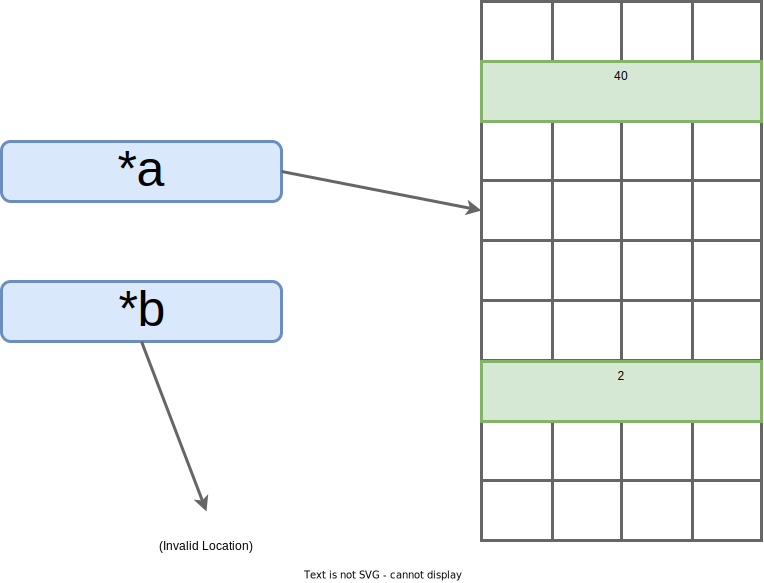

# Static Assurance (1 of 2)

Static analysis can be confusing.
Say we want to test some program, call it `P`.
If we never run `P`, how exactly are we going to learn about what it does or can do?

Static analysis tools often use a layer of indirection that simplifies answering a particular question.
They map the constructs of `P` to an analysis-specific abstract domain[^AbsInt].
This representation is designed to reflect one or more properties of `P`.
Analyzing it allows us to draw conclusions about `P`.

If you've ever used a compiler to build an executable, or had an interpreter check syntax before running a script, then you've seen static analysis in action.

The analysis is itself a program (within your compiler or interpreter of choice) that runs its own special algorithms - let's call it `Q`, the "analyzer".
Since we run `Q` and get a result, we don't need to execute `P` (for which the result applies).
That's one [ironically dynamic] way to understand static analysis.

> **Concrete vs. Abstract:**
>
> Whereas a dynamic analysis *observes* a set of *concrete* states by executing a program, a static analysis *summarizes* possible *abstract* states.
> Each abstract state represents a set of concrete states.
>
> Imagine a simple "guessing game" program where the player chooses a number between 1 and 10, inclusive.
> If the player enters `7`, the program prints `you win!`.
> Otherwise it prints `you lose`.
>
> Dynamic analysis of a run where the player entered `3` would observe an internal variable `x` set to `3`, one side of a branch taken, and the corresponding `you lose` output.
> Those are all concrete events.
>
> One kind of static analysis[^SymEx] would conclude that the program has two abstract states: one leading to `you win!` output if `x == 7` and another leading to `you lose` if `x != 7`.

## Challenges in Static Program Analysis

Assume we're talking about static analyses for finding unknown bugs (the top-left quad from the previous diagram).
Applied to this use case, the static approach has tradeoffs.
Generally speaking:

* **Pro:** Domain-derived conclusions may apply to *all possible executions* of the program. That means they could hold for any possible input! This helps us maximize confidence.

    * Static analysis can, in the best case, *prove the absence* of a specific bug class.

* **Con:** Because we're using an abstract representation and not the real thing, some static analyses can *over-approximate*  or, worse yet, *fail to terminate*[^CMU][^UPenn].

    * *Over-approximation* produces false positive results. Meaning, due to a limitation of the analysis, many of the bugs found aren't real bugs. Getting stuck with a backlog of faulty results is a drag on busy engineering teams.

    * *Failure to terminate* means the analysis never outputs a result. This can be due to "state explosion" - a combinatorial growth in complexity of the problem the analysis is trying to reason about. To avoid spinning forever, many commercial tools reduce complexity via approximation. Which, again, risks false positives.

Designing an static analysis algorithm practical enough to terminate (no state explosion) yet clever enough to never produce a false positive (no over-approximation) is, surprisingly often, impossible.
Not "impossible given our current knowledge and computational power".
Provably impossible, as in the problem is mathematically *undecidable*[^AliasPaper][^AliasPaper2].

  * *Undecidable* means there will never be an algorithm that can make a correct yes-or-no determination in any arbitrary case.

Here's the good news: algorithm designers can make intelligent tradeoffs.
Sometimes that means accepting a tolerable amount of over-approximation.
Other times it means introducing rules, constraints, assumptions, or annotations - all to make more precise analysis practical.

Rust isn't an exception.
The language imposes certain constraints on the programmer.
These constraints make Rust challenging to learn, and the analyses they enable can cause sluggish compile times.
For some teams, those tradeoffs may be unacceptable.

If you can develop a rough intuition for why all static analysis tools require tradeoffs, you'll be well equipped to reason about any static tool or technology you encounter in the future.
Including proprietary static analyzers with hefty licensing costs.
So let's explore limitations in a practical context: pointer analysis.

## Case Study: Pointer Analysis

We're going to discuss pointer analysis (aka "points-to" or "may-alias" analysis) at a very high-level.
So no walkthrough of Steensgaard's algorithm[^Steen] with big-step semantics[^CMU2].
Our aim is to build a practical intuition, not to drown in the "symbol soup" of Programming Languages (PL) formalisms[^SymSoup].

Why look at this specific kind of static analysis?
Pointer analysis is an archetypical example of challenges in verifying properties for real-world, memory-unsafe systems code.
This discussion will help you deeply understand the dire problems Rust solves statically.
And the rationale for the language's stringent rules.

> **What is a pointer?**
>
> If you haven't written C or C++, you've likely been protected from the horrors of "raw pointers".
> But even languages like Go and Java throw exceptions for `nil`/`NULL` pointers (Rust fixes this "billion dollar mistake"[^BillProb]!). Let's explore the C-family case.
>
> Pointers are addresses of locations in memory.
> Usually, but not always, the memory is "virtual" - it's an abstraction over physical memory on the machine (CPU cache, RAM, HDDs, etc).
> Mechanically, the addresses are represented as unsigned integers.
>
> Pointers are commonly used to access data (e.g. array, structure, object) "by reference".
> Meaning without having to copy a potentially large object (aka "pass-by-value").
> Pointers are important tools for traditional systems programming.
> They enable efficient use of memory.
>
> But they're also a double-edged sword.
> Pointers are wildly easy to catastrophically misuse.
> An off-by-one error in pointer arithmetic can mean reading incorrect data and not knowing it. Attempting to access an invalid pointer is a crash at best. If an attacker can set the value of a pointer, your program might be exploitable.
> Think "footgun".

Pointer analysis has one goal:

* Determine what variables or objects each pointer *could* point to at runtime.

Armed with that information, we know where data *could* be read from and where it *could* be written.
"Could" stems from the fact that each run of the program may be different.
We need a set of possibilities representative of all potential runs.
This information allows us to make strong, confidence-inspiring claims about a program.

### One Line to Fool Them All

With that goal in mind, consider this single-line C function[^Creusot]:

```c
void incr(int* a, int* b) {
    *a += *b;
}
```

This seemingly innocuous little function is a wolf in sheep's clothing.
If this function is part of a larger program, a pointer analysis can't tell if `a` and `b` point to the same integer (aka "alias") or not.
The analysis result will be indeterminate: it will conclude that the parameters "may or may not alias".
A classic over-approximation.

Since this might be your first glimpse of C, let's take a minute to break down what's going on:

* `incr`, the **name of the function**, is short for `increment`. We can guess this function is going to increase the value of something.

* **Function parameters** appear within the parentheses. This function takes two arguments, `a` and `b`. Both are pointers to integers stored somewhere in memory.

    * The `*` operator in a function signature denotes a pointer.

    * So `int*` means "pointer to an integer".

* The **return type**, `void`, indicates this function doesn't return anything. So we can guess that it has some sort of "side-effect" (update to program state).

* The **body of the function** reads (from memory) the respective current values of integers pointed to by `a` and `b`, adds the value of `int b` to `int a` (integer addition, not pointer addition), and then updates `int a` with that sum.

    * `*a += *b;` is shorthand for `*a = *a + *b;`, a semicolon-terminated statement.

    * Here, unlike in the signature, the `*` operator means "dereference the pointer", e.g. read the value of its target.

    * `*` takes precedence over `+`, meaning the read happens first. Precedence mistakes can be tricky with pointer arithmetic!

Say `int a` has a value of `40` and `int b` has a value of `2` before we call `incr`.
Pointers `*a` and `*b` would each point to their respective integers in memory, like so:

</br>
<p align="center">
  <figure>
  
  <figcaption><center>*a points to 40, *b points to 2</center></figcaption><br>
  </figure>
</p>

Calling `incr(a, b)` adds `int b` to `int a`. So after the call, we'd have:

</br>
<p align="center">
  <figure>
  
  <figcaption><center>*a points to 42 (incremented), *b points to 2</center></figcaption><br>
  </figure>
</p>

> **Is that "idiomatic" C code?**
>
> No. Integers are typically passed by value (integer itself, instead of a pointer to it).
> That's more efficient since an integer fits neatly into a little piece of the CPU's scratch memory, called a "register".
> Regardless, our `incr` function is representative of day-to-day C code that operates on referenced data.
> The conclusions we're about to draw are broadly applicable.

### So what's the issue?

Once you get past the syntax, the `incr` function is quite simple: it just adds two numbers together.
Why is this such a challenge for pointer analysis practice?

These "raw" (meaning unrestricted[^RawMem]) pointers present two non-trivial complications:

* **1. Undecidable Aliasing:** Say both pointers reference the same memory location (they alias). Then incrementing `a` also increments `b`. That's very likely not what the programmer intended, it's an edge case that changes what this function does. But we can't prove that it won't happen[^AliasPaper]. Because scalable and accurate pointer analysis remains an open research problem.

  * **Implication:** We can't make a detailed claim about what this function will do at runtime, even given additional context (like all the places where `incr` is called, aka "call sites"). The undesirable case pictured below can't be precisely detected by any tool.

  * **Root cause:** Over-approximation *within* the analysis domain. The designers of a pointer analysis have to make conscious tradeoffs in result precision (like tolerating "may or may not alias" conclusions).

</br>
<p align="center">
  <figure>
  
  <figcaption><center>*a and *b both point to 40 (alias). Now a's integer doubles instead of incrementing (e.g. 80, 160, 320, 640, ...).</center></figcaption><br>
  </figure>
</p>

* **2. Complex Memory Models:** Raw pointers may be set to invalid memory locations. A programmer could introduce a pointer-arithmetic bug when computing an offset. Or simply leave the pointers "uninitialized" (a default state in C).

  * **Implication:** Pointer dereference could be a crash. Or a read or write of arbitrary data (no crash but incorrect program output or behavior).

  * **Root Cause:** Over-approximation *outside* the analysis domain. It's a product of an abstraction boundary. Differing semantics at the hardware/software interface, in this case.

</br>
<p align="center">
  <figure>
  
  <figcaption><center>*a points to arbitrary memory, *b points outside the address space of the process</center></figcaption><br>
  </figure>
</p>

Let's recap.
Alias?
Maybe the program doesn't behave as expected.
We can't tell.
Invalid pointer?
Maybe the program crashes, maybe some other value is overwritten and thus becomes incorrect.
Again, we can't prove that this won't happen.

The `incr` function appears simple, but creates insurmountable challenges for static assurance.
We can't claim that this program will perform the intended addition.
Without proof to point to, our confidence is low.

> **Pointer Aliasing Problems in the Real World**
>
> `gcc`, an open-source C compiler, aims to generate efficient code.
> Since it's impossible to reliably tell if any two pointers will alias[^AliasPaper], `gcc` cheats a little: for any optimization level greater than `-O1`, the compiler *assumes* that two pointers can't alias if they point to *different types*.
> The assumption makes certain impactful optimizations possible.
>
> But, in practice, C programmers sometimes violate the assumption (there's a technique called "type-punning").
> In such cases, the optimization may produce nasty bugs or unexpected behaviors.
> Thus, the optimization is explicitly disabled in the Linux kernel with the `gcc` flag `-fno-strict-aliasing`[^GCCSetting][^UndefResearch].

## A Summary of Our Pointer Problems

Static analyses risk two failure modes (not mutually exclusive): *over-approximation* and/or *failure to scale/terminate*.
Both limit the assurance value we can extract from static analysis tools.

Pointer analysis for memory-unsafe languages is a classic example of a real-world problem we're forced to over-approximate.
While pointers (e.g. freely-controlled memory addresses) are a convenient abstraction for systems programming, they cripple our ability to automatically reason about runtime.
Humans also struggle to get it right (pointers are a part of why C programs are infamous for "segmentation fault"[^SegFault] crashes).

Raw pointers are just one reason why eliminating memory safety issues in existing C/C++ code is unrealistic.
At least not without breaking backwards compatibility.
Remember: memory safety is a multi-decade-difficult problem.
Many have tried, most have failed.

Let's get a taste for how Rust handles the pointer problem.

> **Imprecise Analyses Can Still Be Useful!**
>
> Pointer analysis has a close cousin: Value Set Analysis (VSA).
> It can be applied to compiled binaries, supporting use cases where source code isn't available (e.g. reverse engineering).
> Unlike pointer analysis, VSA doesn't differentiate between pointer and integer variables.
> It computes a *range of possible runtime values* for either type of numeric variable.
>
> For the above `incr` example, a precise VSA of a correct program might determine that integer `a` has an inclusive value range of `[40, 42]` - capturing both the pre and post increment values. And that pointer `*a` is similarly within some range of valid memory addresses, notionally something like `[0x7ffe455e5c40, 0x7ffe455e5bf0]`.
>
> Here's the kicker: a recent peer-reviewed human study[^VSA] found that even imprecise (e.g. over-approximate) VSA results improved reverse engineers' ability to determine if a program would print sensitive information (e.g. find "information leakage" vulnerabilities).
> Armed with imprecise VSA results, less experienced reverse engineers could match the unassisted performance of their more experienced counterparts[^VSA] for certain problem types.
>
> Even an approximate static analysis can, in certain contexts, be demonstrably useful.

---

[^AbsInt]: [*Abstract interpretation: a unified lattice model for static analysis of programs by construction or approximation of fixpoints*](https://dl.acm.org/doi/10.1145/512950.512973). Patrick Cousot, Radhia Cousot (1977).

[^SymEx]: Breaking down outcomes according to *constraints* on program variables (like `x != 7`) is a hallmark of "symbolic execution", a particularly powerful program analysis. In theory, symbolic execution is a purely static analysis. But in practice it's often implemented using feedback from concrete, dynamic runs (aka "concolic execution").

[^CMU]: [*17-355/17-665/17-819 Program Analysis*](https://cmu-program-analysis.github.io/2021/index.html). Jonathan Aldrich et al, Carnegie Mellon University (2021).

[^UPenn]: [*CIS 547 Software Analysis*](http://rightingcode.org/lessons.html). Mayur Naiak et al, University of Pennsylvania (2021).

[^AliasPaper]: [*Pointer-induced aliasing: a problem classification*](https://www.cmi.ac.in/~madhavan/courses/program-analysis-2008/papers/landi91-ptr-analysis-popl.pdf). William Landi, Barbara Ryder (1990).

[^AliasPaper2]: [*Precise Flow-Insensitive May-Alias Analysis is NP-Hard*](https://citeseerx.ist.psu.edu/viewdoc/download?doi=10.1.1.49.6454&rep=rep1&type=pdf). Susan Horowitz (1997).

[^Steen]: [*Points-to Analysis in Almost Linear Time*](https://www.cs.cornell.edu/courses/cs711/2005fa/papers/steensgaard-popl96.pdf). Bjarne Steensgaard, Microsoft Research (1996).


[^CMU2]: [*Lecture 11: Pointer Analysis*](https://cmu-program-analysis.github.io/2021/lecture-slides/11-pointer-analysis.pdf). Rohan Padhye, Jonathan Aldrich. Carnegie Mellon University (2021).

[^SymSoup]: That being said, formal notations are worthwhile - learning them can change how you think about certain problems or, at very least, it allows you to read cutting-edge research papers.

[^BillProb]: [*Null References: The Billion Dollar Mistake*](https://www.infoq.com/presentations/Null-References-The-Billion-Dollar-Mistake-Tony-Hoare/). Tony Hoare (2009).

[^Creusot]: [*Safer Rust: Program Verification with Creusot*](https://www.youtube.com/watch?v=BPt987BRdDw). Xavier Denis (2021). The function we borrow from this talk was used to demonstrate how Rust's type system aids verification. We explore this idea in the next section, but in a different context.

[^RawMem]: Well, "unrestricted" relative to the current execution environment - there exist "sandboxes" (memory segmentation enforcement), like the process space the OS has allocated for your program. Such restrictions reduce the likelihood of a bug or exploit in one program affecting other programs or the OS itself.

[^GCCSetting]: [*Re: gcc inlining heuristics was Re: [PATCH -v7][RFC]: mutex: implement adaptive spinning*](https://www.mail-archive.com/linux-btrfs@vger.kernel.org/msg01647.html). Linus Torvalds (2009).

[^UndefResearch]: [*Undefined Behavior: What Happened to My Code?*](https://people.csail.mit.edu/nickolai/papers/wang-undef-2012-08-21.pdf). Xi Wang, Haogang Chen, Alvin Cheung, Zhihao Jia, Nickolai Zeldovich, M. Frans Kaashoek (2012).

[^SegFault]: "segmentation fault" , or "segfault" for short, is an error thrown by the operating system when your program attempts to access regions of memory that don't belong to it (outside allotted "segment"). While it can be frustrating to debug, imagine how difficult things would be if the OS didn't stop you!

[^VSA]: [*Effects of Precise and Imprecise Value-Set Analysis (VSA) Information on Manual Code Analysis*](https://www.ndss-symposium.org/wp-content/uploads/bar2021_23002_paper.pdf). Laura Matzen, Michelle Leger, Geoffrey Reedy (2021).
