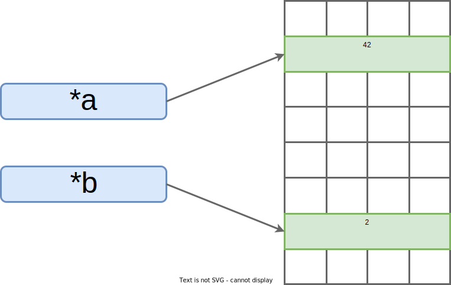

<meta name="title" content="High Assurance Rust">
<meta name="description" content="Developing Secure and Robust Software">
<meta property="og:title" content="High Assurance Rust">
<meta property="og:description" content="Developing Secure and Robust Software">
<meta property="og:type" content="article">
<meta property="og:url" content="https://highassurance.rs/">
<meta property="og:image" content="https://highassurance.rs/img/har_logo_social.png">
<meta name="twitter:title" content="High Assurance Rust">
<meta name="twitter:description" content="Developing Secure and Robust Software">
<meta name="twitter:url" content="https://highassurance.rs/">
<meta name="twitter:card" content="summary_large_image">
<meta name="twitter:image" content="https://highassurance.rs/img/har_logo_social.png">


# Static Assurance (2 of 2)

We now have an informal understanding of challenges in static program analysis.
Or maybe just some intuitions about why pointer analysis is difficult.
And the trouble is, pointers are the peanut butter to our systems programming jelly.
We *must* have pass-by-reference semantics to write performant software.

This is where the tradeoffs start for Rust.
First, we have to forsake raw pointers and instead rely on references (more on this below).
Second, there are rules we must obey whenever using references.

## But what if I *truly* need good ol'-fashioned pointers?

An abstraction is useful if "its assumptions match the context in which it exists"[^CorecurPodcast].
Pointers are an abstraction facilitating interaction with memory.

When your program cannot be expressed within the constraints of safe Rust[^MMIO], you can still write that program using the `unsafe` keyword.
As the keyword implies, you're forgoing certain compiler-enforced safety guarantees for a limited scope.
Inside an `unsafe` block, you may use raw pointers at your own peril.
The burden of proof of correctness is entirely on your shoulders, as the programmer.

Having that "opt-out" mechanism is better than aborting an analysis completely.
In fact, `unsafe` enables seamless integration with existing C code.
That interoperability enables a lot of Rust's real-world use.

> **Isn't `unsafe` a weak link? Don't we lose all assurance?**
>
> Not exactly.
> Work in formal verification of Rust's type system demonstrates that security claims can be upheld despite the presence of `unsafe`[^JungThesis].
>
> Even without formal methods, *safe abstractions* can be built atop *unsafe operations*[^UnsafeAbstraction].
> We can carefully design interfaces which uphold safety invariants no matter how they are called.
> Despite using `unsafe` internally.
> Granted the compiler can't automatically verify the correctness of such designs.
> We'll discuss the difference between *unsafety* and *unsoundness* in Chapter 13.
>
> But let's consider a simpler perspective: the less `unsafe` we use, the less total code we need to audit for memory-related bugs.
>
> Even if a codebase is split 50/50 safe/`unsafe`, we're still saving significant costs in security review, debugging hours, and patch deployments. That's true even if that latter `unsafe` half is C or C++ that interoperates with safe Rust.

## Rust's Static Strategy

The below is our favorite little troublemaker, the C `incr` function, re-written in Rust:

```rust,noplaypen
fn incr(a: &mut isize, b: &isize) {
    *a += *b;
}
```

We broke down the C version piece-by-piece, so you already know what this function does.
Take a second to review the above.
Can you make some guesses about the syntax?

The body of the function is exactly the same.
`*` is still a dereference operator.
`+=` is the same shorthand.
`isize` is the keyword for a signed integer - just like C's `int`.

But there are two differences between our Rust and C `incr` functions.
The first is a minor detail: there's no return type.
`void` is implied, because Rust only requires explicit return type annotations when a function actually returns a value.

The second difference, the fact that we're no longer using pointers, is far more important.
Looking at function signature:

* `&` is a reference. That's like a pointer, except it can't be an arbitrary value. Rust *guarantees* it's the **valid address** of an **initialized variable**.

    * We've just **fixed the memory model problem** from the last section. Whenever we use the dereference operator, `*`, we *do not* risk crashing or reading bad data.

* `&mut` means "mutable reference". Our function gets the ability to *write* to the variable pointed to by `a`. This is not true of `b`, because it's a lowly "immutable reference" (just `&`). Now Rust *guarantees* that, at any given time, **only one mutable reference exists** for any piece of data.

    * If only one mutable reference can exist at any point, then `b` cannot reference the same piece of data as `a`. The two parameters are *guaranteed* to **never alias**.

It's worth reflecting on the gravity of the statements we just made about Rust.
An entire world of powerful static guarantees has opened up.

Last section, we wallowed in the sorrows when discussing the `incr` function: undecidable aliasing forcing over-approximation, potential crashes, reads of arbitrary memory, etc.

When we ported the function to Rust, the mere act of compiling it (creating an executable program) actually *proves* that this program will add two different integers as expected. As in, computer scientists have done early work in formal verification[^TypeProof] of the Rust type system (where those guarantees come from[^RustcBug][^TotSafeTrans]).

By leveraging Rust where it makes sense, we gain a high level of assurance.
At least with respect to memory safety.
We're still not guaranteeing anything about `incr`'s business logic (the big picture meaning of the values `incr` is incrementing and whether or not incrementing them makes sense).
Let's not miss the forest for the trees.

> **Doesn't C++ also have references?**
>
> Yes.
> But its references are not memory-safe.
>
> C++ references are easier to use correctly than raw pointers because they can't be set to arbitrary values.
> But they still allow mutable aliases.
> That's problematic for both verification and concurrent code.
>
> They also don't enforce validity.
> In C++, you can mistakenly use a reference to an object that's already "gone", meaning it has been deallocated. That's a bug, potentially a vulnerability, Rust prevents.

## Verifying Our Claims

"Trust but verify" is a good mindset to adopt whenever security is a requirement.
So let's see Rust's analyses in action.
Consider this valid program:

```rust
fn incr(a: &mut isize, b: &isize) {
    *a += *b;
}

fn main() {
    // Integers
    let mut val = 40;
    let step = 2;

    // References to integers
    let a = &mut val;
    let b = &step;

    println!("Before incr: a == {}, b == {}", a, b);
    incr(a, b);
    println!("After incr: a == {}, b == {}", a, b);
}
```

Recall the first pair of diagrams from the last section, where we didn't have aliasing or invalid pointers.
This program will print:

```ignore
Before incr: a == 40, b == 2
After incr: a == 42, b == 2
```

After the call, we've arrived at that second "good" diagram:

</br>
<p align="center">
  <figure>
  
  <figcaption><center>*a points to 42 (incremented), *b points to 2</center></figcaption><br>
  </figure>
</p>

The function works as expected.
Notice how the format specifier, `{}`, performs a dereference for us to print the integers themselves.

There's no way to generate an invalid pointer with Rust's references.
So that's not something we can even try.
But what happens if we attempt to alias our references, to produce the problematic aliasing diagram from the last section?

```rust,ignore
fn incr(a: &mut isize, b: &isize) {
    *a += *b;
}

fn main() {
     // Integers
    let mut val = 40;
    let step = 2;

    // Aliasing references to integer `val`
    let a = &mut val;
    let b = a;

    println!("Before incr: a == {}, b == {}", a, b);
    incr(a, b);
    println!("After incr: a == {}, b == {}", a, b);
}
```

The program never runs. Instead, we get a compile-time error:

```ignore
error[E0382]: borrow of moved value: `a`
  --> src/main.rs:16:10
   |
11 |     let a = &mut val;
   |         - move occurs because `a` has type `&mut isize`, which does not implement the `Copy` trait
12 |     let b = a;
   |             - value moved here
...
16 |     incr(a, b);
   |          ^ value borrowed here after move

For more information about this error, try `rustc --explain E0382
```

This error is likely confusing.
The compiler is pointing out that we can't duplicate a unique, mutable reference.
That'd be a potentially dangerous alias, especially in a concurrent program.
This error will make more sense after we cover "ownership" and "traits" in Chapter 3.

## Isn't that too good to be true?

We just saw Rust's compiler detect mutable aliasing, quickly and effectively.
If Rust grants C-like control over memory, shouldn't the compiler's internal analyses hit the same fundamental roadblocks as the points-to analysis we discussed?

Perhaps surprisingly, no.
Three related factors are at play:

* **Type-system Support:** Rust's internal analyzers build upon a bedrock of direct integration with the language itself, in its type system. This type system implements a flavor of "affine types"[^AffineTypes] and doesn't permit arbitrary type casting.

    * Performing static analysis on a weakly-typed language (like C) doesn't have comparable co-design advantages. The Rust compiler can prove properties no C-family compiler or analysis tool can prove, by design.

* **Runtime Support:** Not all of Rust's memory safety guarantees are enforced at compile time. Some checks need to happen at runtime, so the Rust compiler inserts additional code for this purpose. Rust programs can terminate if those checks fail.

    * While graceful termination is preferable to the violent death of a program whose memory has been trashed or exploited, it's not ideal. We'll cover robustness testing for runtime "panics" in the latter half of this book.

* **Hard Constraints:** Safe Rust programs have to obey a set of special rules. The `mut` keyword has stipulations. These constraints, which are a feature of the type system, make some algorithms difficult to express in Rust - at least without reframing.

    * The most infamous of these constraints is that a reference can be *shared* (`&T`) or *mutable* (`&mut T`), but not both. This is a roadblock for certain kinds of data structures. We'll explore solutions in the first half of this book.

> **What's a type system, anyway?**
>
> Type systems are a prevalent form of static analysis that can eliminate certain kinds of runtime errors.
> For a brief aside on the topic, see the [*Fundamentals: Type Systems*](../chp16_appendix/types.md) section of the Appendix.

## Takeaway

Rust's compiler provides first-party static analyses to verify memory safety properties.
That's free, immediate, and substantial assurance value-add every time you build a Rust program.

We don't have to rely on expensive products (e.g. complex code analysis tools) or hard-to-scale expert processes (e.g. best-effort code review by skilled security engineers).
It [mostly] "just works".
Assurance becomes a *repeatable default*.

These guarantees are largely a product of Rust's type system, which introduces the novel concept of "ownership".
Its mechanics overcome memory model and aliasing complications, allowing us to prove certain notions of correctness.
We'll dig into how ownership works in Chapter 3.

Let's move on to dynamic analysis, and start writing our first Rust program.

> **Foundations for Formal Verification**
>
> Rust's type system has significant implications for formal verification research.
> Specifically, lack of shared, mutable state makes the language amenable to verification techniques that use *first-order logic*[^RustHorn].
>
> First-order logic is taught in undergraduate discrete math classes.
> Which are common in Computer Science curriculums.
> This could mean that a practicing engineer doesn't have to learn *separation logic* (a more recent and advanced topic) to use Rust deductive verification tools.
>
> We'll try out early prototypes for deductive verification in Chapter 11.
> Rust verification is an area of active academic research.

---

[^CorecurPodcast]: [*Software in Context, With Zach Tellman*](https://corecursive.com/042-zach-tellman-software-in-context/). Zach Tellman, Adam Gordon Bell (2019).

[^MMIO]: Memory Mapped Input/Output (MMIO) is a context in which you need to spray some distant, seemingly random region of memory with a bunch of magic bytes. Perhaps surprisingly, that's one major way to control hardware peripherals. The "data sheet" (an official hardware manual written by the manufacturer) tells you which specific memory address to write what magic bytes to. It's the sort of thing where you just need raw pointers, danger be damned! [^SafeMMIO].

[^JungThesis]: [*Understanding and Evolving the Rust Programming Language (PhD Thesis)*](https://www.ralfj.de/research/phd/thesis-screen.pdf). Ralf Jung (2020).

[^UnsafeAbstraction]: [*Why Rust's Unsafe Works*](https://jam1.re/blog/why-rusts-unsafe-works). jam1garner (2020).

[^TypeProof]: [*Computer Scientist proves safety claims of the programming language Rust*](https://www.eurekalert.org/news-releases/610682). Saarland University (2021). Note that formal verification of Rust is a research problem with both current successes and ongoing work.

[^RustcBug]: [Unsoundness in `Pin`](https://internals.rust-lang.org/t/unsoundness-in-pin/11311). comex (2019). Keep in mind the Rust compiler is written and maintained by humans. It occasionally has bugs, like the `Pin` problem linked to here. Again, there's no such thing as absolute security. Formal verification of Rust's type system does not entail verifying that the entire compiler codebase, which changes often, is bug-free!

[^TotSafeTrans]: [`totally_safe_transmute`, line-by-line](https://blog.yossarian.net/2021/03/16/totally_safe_transmute-line-by-line). William Woodruff (2021). This blog post breaks down an unorthodox trick for *transmutation* (re-interpreting the bits of one type as another type). The trick involves the program using OS facilities to modify its own code at runtime in a way the Rust compiler does not and cannot possibly expect. Hence it's "safe" to the compiler but *extremely unsafe* in reality. This doesn't mean Rust's safety guarantees are broken, just that type systems can't model every possible aspect of a program's execution environment. Nor should they, most real-world programs don't patch their own in-memory representations at runtime.

[^SafeMMIO]: [*tock-registers*](https://crates.io/crates/tock-registers). Tock Project Developers (2021). This project provides safe MMIO abstractions in the form of customizable types. An alternative to raw pointers worth checking out.

[^AffineTypes]: [*Affine type systems*](https://en.wikipedia.org/wiki/Substructural_type_system#Affine_type_systems). Wikipedia (Accessed 2022).

[^RustHorn]: [*RustHorn: CHC-based Verification for Rust Programs*](https://arxiv.org/pdf/2002.09002.pdf). Yusuke Matsushita, Takeshi Tsukada, Naoki Kobayashi (2020).
