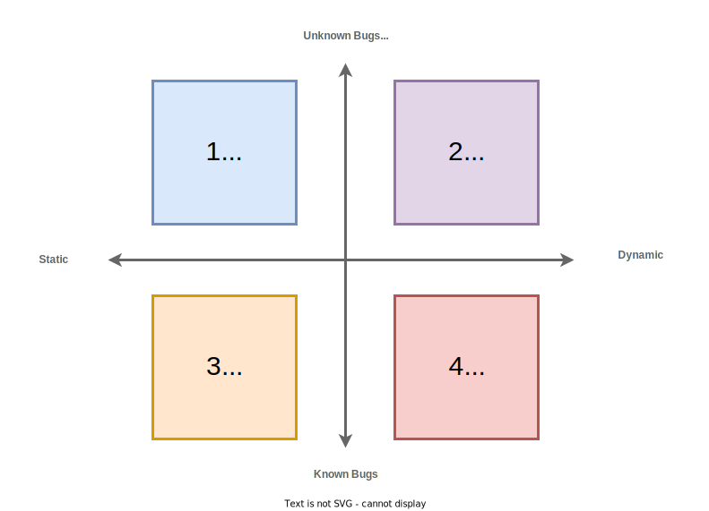

# Static vs. Dynamic Tools

As authors of a mission-critical application, we must be confident that our code has few bugs and even fewer vulnerabilities, if any at all.
Security is necessary, but not in itself sufficient, for reliability.
We need both.
Yet we're writing software against an incomplete set of requirements and under time/resource constraints.
Ego aside, how can we justify our confidence?

The answer is quantitatively.
By accumulating enough pieces of objective proof, via processes and tools.
Academia calls this verification.
Yet prototypes lauded at research conferences are seldom mature enough for real-world, large-scale usage.
Thus industry adopts a pragmatic subset of verification techniques and under the label of **testing**.

The goal of testing is to verify consistency between two sides of the software coin:

* **Specification:** The business-relevant requirements for a software product. Typically expressed in plain English, although "business logic" can be encoded in tool-specific formats (assertions, pre/post conditions, type states, etc).

    * *Plain English Example:* Our company's web application must protect a user's data from network-based attackers.

* **Implementation:** The design and workings of a software product, expressed as actual code.

    * *Example:* The web application uses OpenSSL[^OpenSSL], a industry-standard Transport Layer Security (TLS) library, to encrypt data sent over a network (confidentiality), verify the data wasn't corrupted in transit (integrity), and validate the identity of data senders/receivers (authentication).

We gain confidence if we can demonstrate that specification and implementation are aligned.
This is where tools that analyze our programs come in.
All analysis tools output little fragments of evidence, tiny specification-implementation congruences.
They aren't a *substitute* for manual processes, like code review and security assessments, because they can't match the "smarts" of a skilled person.
Tools are instead a *supplement*, reducing cost and facilitating scale.

Unlike humans, tools are ruthlessly diligent: they never get tired or distracted.
They are also completely consistent, even in the false positive case (reporting a bug when there isn't one).
For detection of certain security issues, like memory safety violations, consistent tools are the best way to achieve assurance.

Rust is far from perfect.
But, given an incredibly modern compiler, it blurs the line between a commercially-viable programming language and a sophisticated tool for validating certain runtime reliability properties.
The type system bridges the two, the toolchain democratizes the benefits.
We can demonstrably answer confidence-inspiring questions like:

* **Can my program *ever* encounter a memory error at runtime?**
    * Rust's compiler provides the answer when building our code for the first time.
    * That's a **static analysis**. The program never executed.
    * The answer applies to most[^Most] realistic states the program can enter!
    * This is a *safety property[^Safety]*: we check that the program can never reach a bad state.

* **Will my program produce the correct result if given this *specific* input?**
    * Rust's official package manager, `cargo`, answers when a unit test runs.
    * That's a **dynamic analysis**. Part of the program executed with concrete inputs.
    * The answer applies only to the states you tested and those semantically close.
    * This is a *liveness property*: we check that the program will reach a good state.

Note how our memory safety question is answered statically, at compile-time, and the input-output correctness question is answered dynamically, at runtime.
The static/dynamic dichotomy is at the crux of analysis tool design.

Static and dynamic analyses are a sort of "Yin and Yang"[^YinYang], in that they're opposite yet complementary powers.
In fitting dualistic fashion, they offer a contrasting set of strengths and weaknesses - underpinned by different algorithms and techniques.

> **What is a unit test?**
>
> A hand-written but automatically runnable check for a subset of a program.
> Usually implemented by calling individual functions and verifying either return values or side effects.
>
> Unit tests are fallible and often incomplete, but superior to the majority of automation approaches - due to higher semantic insight.
> We'll walk through a unit test when we get into dynamic analysis.

## A Lay of the Land for Practicing Engineers

Before we get too far into Computer Science territory, let's break down the solution space from a practicing engineer's perspective.
Assume we're interested in tooling because we need to either expedite or scale testing processes.
Broadly speaking, how can we cluster today's static and dynamic tools?

One approach[^CSE545] is a quadrant with two axises - static vs. dynamic on the X-axis, known bugs vs. unknown bugs on the Y-axis:

  <figure>
  
  </figure>

Let's traverse the quads in their numbered order: left to right, top to bottom.
Above the horizon, we can find **unknown bugs**.
That means discovering brand new bugs, no existing data needed:

1. **Static, Unknown Bugs (S, U)** - Ingest existing source code or build artifacts and use analyses to find bugs or prove properties. Without running the program itself.
    * Example tool: `rustc` (whole book).

2. **Dynamic, Unknown Bugs (D, U)** - Generate concrete test cases and execute the program with these generated inputs, potentially collecting feedback from runtime behavior.
    * Example tool: `libFuzzer` (Chapter 12).

Below the horizon, we can only detect pre-discovered bugs for which signature data is already available.
The **known bugs**:

3. **Static, Known Bugs (S, K)** - Analyze the composition of software systems, checking dependencies for known vulnerable versions or known buggy configurations.
    * Example tool: `cargo-audit` (Chapter 3).

4. **Dynamic, Known Bugs (D, K)** - Query live assets or services to fingerprint their versions or configurations.
    * Example tool class: network vulnerablity scanners (not covered in this book).

For any approach: some subset of reported bugs, in the broader context of the application or service, may be exploitable vulnerabilities.
So a general software security workflow is:

1. Collect results from tools.
2. Triage their review.
3. Develop fixes for the high priority vulnerabilities.
4. Test the patched product.
5. Deploy the fixes to production.

The faster we can move through that cycle, the better.
At minimum, we should be able to keep pace with feature addition.
Ideally, security testing can both support new feature rollout and proactively harden existing attack surfaces.

Now if we have tools that find unknown bugs, why do we even need tools that check for known bugs?
Can't we just find all bugs present using tools from quadrants 1 and 2?

Unfortunately, no.
Many bug classes can't be detected automatically, with any kind of tool or analysis.
We'll get into why when we talk about limitations in a later section.
Most bugs need to be found by skilled humans, and turned into signatures that the 3 and 4 quadrant tools can detect.
Again, tools are a supplement for scale - not a substitute for smarts.

## Takeaway

Software assurance entails a "level of confidence".
Tests bolster our confidence in a match between a business-relevant specification and a particular implementation of a system or product.

Static analyses, which reason about a program without running it, tend to be good at proving the absence of a class of bugs.
But those classes are *limited*.
Often, there are no false negatives (the analysis doesn't miss anything).

Dynamic analyses, which run a program, tend to be good at finding at least one bug.
But it could be *any* kind of bug.
Often, there are no false positives (the analysis result is true).

Both approaches can find known (e.g. existing CVEs) and unknown bugs (e.g. zero-days).
Let's tackle static analysis first, while we're fresh.
It's the more theoretically complex of the pair.

---

[^OpenSSL]: [*OpenSSL*](https://www.openssl.org/). The OpenSSL Project (2021).

[^Most]: "Most" excludes domains outside those the analysis is capable of reasoning about. That could be because they're tough to model, like a power or timing hardware side-channel (where something about the hardware's interaction with the physical world produces a vulnerability). Or because a bug in the code performing the analysis, or a shortcoming of it's design, lead to limitations in the domain it *can* reason about.
Nothing is completely fool-proof. There is no absolute security.

[^Safety]: Here, "safety property" is a general term used to classify the type of specification our question is getting at. Memory safety is just one specific example of safety property.

[^YinYang]: [*Yin and yang*](https://en.wikipedia.org/wiki/Yin_and_yang). Wikipedia (Accessed 2022).

[^CSE545]: [*CSE545 Week 12: 6 Reasons to Love Fuzzing*](https://youtu.be/pw1a4ohgN50?t=153). David Brumley (2020).
