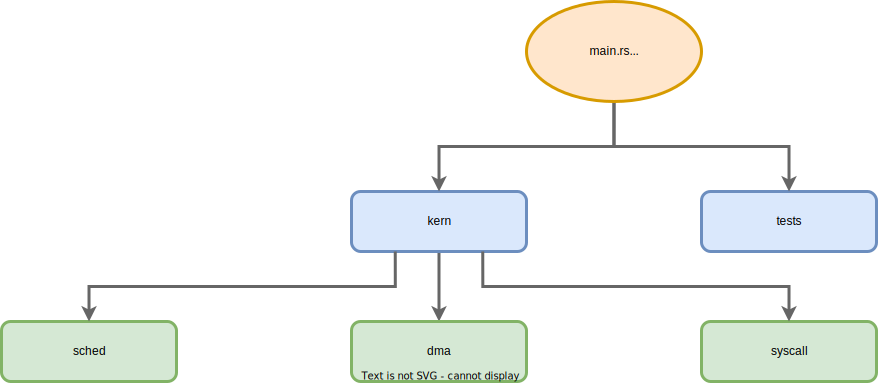

# The Module System

In a 1994 lecture on the design of C++[^CppD], Bjarne Stroustrup, the language's inventor, stated:

> I wanted a tool that provided the support for program organization that Simula[^Simula] provided.
> The help to thinking and help to design that Simula provided.
> On the other hand, I wanted something that ran really fast when it had to, like BCPL[^BCPL] and C.

By "program organization", Dr. Stroustrup was referring to C++'s support for object-oriented classes.
Organization support was one half of C++'s winning formula, performance being the other.
Effectively organizing code in a manner amenable to both maintenance and domain abstraction is so critical a problem that solving it for high performance applications allowed C++ to dominate for decades.

* **Rust's Alternative to Classes:** in our prior discussion of high-level data, we saw how traits and structures interact to define behavior via composition - instead of inheritance. You can think of Rust structs and C++ classes as a fundamental first level of program organization.

So why bring this up in section about modules[^OGMods], especially when C++ didn't even get a module system until the C++20 standard (some 40 years after inception)?
Because modules are an extended solution to the timeless problem of program organization.

In that same 90s interview, Stroustrup offers a profoundly pragmatist insight:

> My main sort of idea about languages is that a language is someone's response to a set of problems at a given time.
> That is, a language is there to solve problems rather than being an interesting item in its own right.
> Our problems and our understanding of those problems naturally change over time.
>
> And as long as a language is a good solution to problems that are faced by real programmers in real code, the language will live and the language will grow to meet the needs of the programmers.

We've already established that Rust's primary value is solving the age-old memory safety problem without sacrificing predictable performance (let's lump safe concurrency under "performance").
With less Undefined Behavior (UB) to debug, we can rapidly build more and more ambitious high-performance systems.

Almost any system worth building will eventually grow in size and complexity.
Customers request new features, development teams onboard new engineers to meet demand, and the codebase starts to expand.
Code organization is so fundamental a problem to "real programmers in real code" that Rust wouldn't be practical without a means to address it.

What tools does Rust afford us, to keep large projects organized and cohesive?
At a high level, we can break down the building blocks like so:

<br>
<p align="center">
  
  <figure>
  <figcaption><center>Fundamental building blocks, which compose to form complex systems.</center></figcaption><br>
  </figure>
</p>

* **Items** are exportable pieces of source code: structures, functions, constants, etc. Structures, Rust's class-like abstraction, are arguably our most fundamental organization tool. The top of the program organization hierarchy.

    * A full list of language constructs considered items is available[^Items]. Technically, modules are items. But for the purpose of our current code organization discussion, we'll consider them taxonomically distinct.

* **Modules** group related items into cohesive units. They facilitate organizing code within a project, much like namespaces.

  * Some programmers like to follow a "one module per source file" convention. But that 1:1 mapping is entirely optional. Modules are a logical, hierarchical grouping. They're not decided by the layout of a filesystem.

* **Crates** group one or more related modules into either a library or a binary. They facilitate organizing code between projects. For libraries, visibility modifiers decide which items the module(s) export (e.g. the public API of the crate).

  * Crates can also have dependencies, which are themselves crates (e.g. 3rd party libraries used internally). Chapter 2's `rcli` tool was a binary crate that had two library crate dependencies: `rc4` and `clap`.

* **System** is the general term for a large piece of software made up of interconnected components. That could mean multiple Rust crates, libraries written in other programming languages that interoperate via CFFI[^CFFI], or even networked sub-services that communicate using structured formats like REST[^REST] and gRPC[^GRPC].

## Combatting Complexity with Modules

Modules are the focus of this section.
They're a major "help to design" when writing code, and a "help to thinking" when reading it.
Modules compartmentalize functional groupings of code and define their interfaces.
They help address the timeless need for code organization, and, ultimately, help keep complexity in check.

As the systems we build grow in size and capability, they tend to incrementally accumulate some form of complicatedness.
Once compounded, complexity makes systems difficult to understand and modify.
Unnecessary complexity increases the chance of an outage or a security breach.

Accrued complexity is sometimes referred to as "technical debt".
Much like financial debt, it's tough to get out of.
So designing for simplicity and maintainability should always be a priority.

Now the data structure library we build in this book will total less than 5,000 lines of code.
That's a tiny codebase in the grand scheme of things.
But we'll make use of Rust's module system from the outset - there are size-agnostic benefits to reap.
So let's get a feel for how modules work.

## Source Code Organization

Some languages infer modules from the layout of the filesystem.
That's not true for Rust.

Rust modules have a loose relationship to individual source code files (whose names end in `.rs`).
Because modules are logical groupings, we can choose from one of three module-file mappings: many-to-one, many-to-many, and one-to-one.
These aren't exclusive: a single project can mix-and-match strategies as appropriate.

Regardless of mapping choice(s), modules always form a tree-like hierarchy.
The module tree must have a root, typically:

* `main.rs` for binary crates (like `rcli`)
* `lib.rs` for library crates (like `rc4`)

Crates which build other targets (like tests, benchmarks, or examples) have other target-specific roots.

In the binary case, the hierarchy decides which items are visible in which module.
That's also true for the library case.
Additionally, library crates can choose to *export* certain items and/or modules - creating a public API.

Let's explore three module-file mappings that maintain the same singular hierarchy.

### 1. Multiple Modules -> One Source File (`m:1`)

A single file can contain nested modules. The syntax for an *inline* module definition is:

```rust,ignore
mod my_module {
    // Module contents here, potentially including nested "submodules"
}
```

Let's continue this chapter's running OS example, but sidestep the details of what it would take to actually create a bootable kernel (a topic well-covered in Philipp Oppermann's excellent tutorial series[^BlogOS]).

We might create a new binary crate and add the following to `main.rs`.

```rust,ignore
mod kern {
    pub mod sched {
        // Scheduling code here, including our `Proc` struct...

        /// Set the priority of a process
        pub fn set_priority(pid: usize, priority: usize) -> bool {
            // Implementation here...
        }
    }

    pub mod dma {
        // Code related to Direct Memory Access (DMA) here...
    }

    pub mod syscall {
        // Code related to system calls here...
    }
}

// Dummy function to show testing via submodule
fn private_helper() -> bool {
    true
}

#[cfg(test)]
mod tests {
    // Import public function from "peer" module
    use super::kern::sched::set_priority;

    // Import private function from "parent" module
    use super::private_helper;

    #[test]
    fn test_private_helper() {
        assert!(private_helper());
    }

    #[test]
    fn test_set_priority() {
        // Unit test here...
    }

    // More individual tests here...
}
```

With any design decision, "can" and "should" are two different things.
You likely won't want to organize an OS, or any large project, within a single file like this.

But a many-to-one mapping shows that modules are a flexible concept.
One aspect of this flexibility you *are* likely to leverage is a `tests` module, like the one at the bottom of the above.
It allows you to keep unit tests close to the code they're responsible for testing (within the same file).

This can be especially useful for testing private functions - notice how the `tests` module can use the `private_helper` function even though the function is not marked `pub`.
To understand why, we need to understand the module hierarchy this single file creates.

Implicitly, the file `main.rs` is itself a module.
In fact, it's the hierarchy's root.
That makes `mod tests` a *submodule* in a hierarchy, meaning "child" of the top-level `main.rs` module.
It sits at the same level as it's "peer" module (`kern`, declared in the same file):

</br>
<p align="center">
  
  <figure>
  <figcaption><center>The module hierarchy of the above snippet. It will remain unchanged for the next two subsections.</center></figcaption><br>
  </figure>
</p>

In Rust, submodules have access to both the private and public items of their parents.

* **Example:** `tests` can import the private function `private_helper` from its parent, with `use super::private_helper;`.

Private items can't be accessed for peers (same level in the hierarchy, like `kern`) or children (although `tests` doesn't have child submodules in our example).

* **Example:** `tests` can only access exported, public items from `kern`. It imports the public `set_priority` function via `use super::kern::sched::set_priority;`.

### 2. Multiple Modules -> Multiple Source Files (`m:n`)

We could move the contents of `mod kern` to a file named `kern.rs`, like so:

```rust,ignore
pub mod sched {
    // Scheduling code here, including our `Proc` struct...

    /// Set the priority of a process
    pub fn set_priority(pid: usize, priority: usize) -> bool {
        // Implementation here...
    }
}

pub mod dma {
    // Code related to Direct Memory Access (DMA) here...
}

pub mod syscall {
    // Code related to system calls here...
}
```

Notice how we no longer need an inclosing `pub mod kern { ... }`, it's implied by the filename.
After making the change, we have the following directory contents:

```ignore
.
├── Cargo.toml
└── src
    ├── kern.rs
    └── main.rs

1 directory, 3 files
```

As we saw, `kern.rs` uses the unchanged, inline definitions for it's submodules (e.g. `pub mod sched { ... }`, etc).
Thus we maintain the hierarchy pictured above.

For `main.rs` to import the `set_priority` function, it would need to use:

```rust,ignore
mod kern;
use kern::sched::set_priority;
```

* `mod kern;` signals that the `kern` module's contents exist in another file, either `kern.rs` or `kern/mod.rs`.

    * These "forward declarations" are typically placed in a module root - whether that's the root of the entire hierarchy (as is the case here, for `main.rs`) or just a module that contains submodules.

* `use kern::sched::set_priority;` imports a specific function from the public `sched` submodule, just like the `tests` submodule did in the previous layout.

### 3. One Module -> One Source File (`1:1`)

In a more realistic project layout, we might opt to place every module in a separate file.
While still maintaining that same hierarchy.

Instead of the inline module definitions for `sched`, `dma`, and `syscall`, we could place each submodule in a dedicated file like so:

```ignore
.
├── kern
│   ├── dma.rs
│   ├── sched.rs
│   └── syscall.rs
├── kern.rs
└── main.rs

1 directory, 5 files
```

When we import a module from another file, Rust looks for either `module_name.rs` or `module_name/mod.rs`.
So the following layout is equivalent to the above, it's only a matter of preference:

```ignore
.
├── kern
│   ├── dma.rs
│   ├── mod.rs
│   ├── sched.rs
│   └── syscall.rs
└── main.rs

1 directory, 5 files
```

In either case, we'd again drop the enclosing, inline `pub mod mod_name { ... }` for three submodules because it's implied by the filename. E.g. `sched.rs` now contains:

```rust, ignore
// Scheduling code here, including our `Proc` struct...

/// Set the priority of a process
pub fn set_priority(pid: usize, priority: usize) -> bool {
    // Implementation here...
}
```

`kern.rs` or `kern/mod.rs` (depending on which layout we choose) is a module root that sits under the whole-hierarchy root `main.rs` (as pictured above).
In our 1:1 layout, this file gets to control how its child submodules are exposed to `main.rs`, its parent.

For simplicity, let's assume we went with the first choice, a `kern.rs`.
This file could choose to expose the entire `sched` submodule (e.g. *re-export* it) with:

```rust,ignore
pub mod sched;
```

Then `main.rs` would import the `set_priority` function as before (in the prior `m:n` case):

```rust,ignore
mod kern;
use kern::sched::set_priority;
```

But we also have the option to abstract away details of `kern`'s internals from users of the module.

Maybe `main.rs` should still be able to use the `set_priority` function, but shouldn't be aware that, internally, the function is part of some larger `sched` module.
If `kern.rs` re-exported only a single function and not the entire module:

```rust,ignore
mod sched;
pub use sched::set_priority;
```

Then `main.rs` would be able to use `set_priority` with:

```rust,ignore
mod kern;
use kern::set_priority;
```

This may seem like a minor difference, we went from importing the same function via `kern::sched::set_priority` to `kern::set_priority`.
The function and the module hierarchy remained unchanged, we only shortened an item's *path*.

But *controlling visibility* is a critical tool for managing complexity in a codebase.
It gives us the freedom to organize a large system internally in one way, but expose only a subset of that system to an end user - in a manner that doesn't leak details of the internal organization.

Keep in mind that a public API (which includes modules, functions, data types, and constants - among other items) often makes stability guarantees.
Systems that expose internal details via public APIs become hard to refactor without "breaking changes" (those that cause downstream code to stop compiling).

In addition to creating maintenance burden, large and detailed API surfaces increase complexity and cognitive load (for both API developers and API users).

Thus, a major goal of modular design is providing abstraction by controlling visibility of internal interfaces.
Let's dig into what options Rust affords us, beyond limiting re-exports at a module root.

## Controlling Visibility

Rust's visibility modifiers help keep internal and external API surface in check.
The goal is to group items into one of two categories:

* **Private** - those accessible only within the same module or its submodules.
* **Public** - those exported by a module.

In addition to reigning in complexity, reducing visibility allows us to maintain *invariants*.
For example, say a structure provides getter and setter functions for a private field.
Instead of making the field public.
If the setter function handles invalid parameters (perhaps by returning an error) we can ensure the structure never enters a bad state (like having a field whose value is illegal or out-of-range).
In object-oriented languages, similar practices fall under the umbrella of *encapsulation*.

By default, items are private in Rust (visible only within the current module).
Increasing visibility requires explicit opt-in.
There are five modifiers[^VisMod] for public visibility than can be applied to any item (module, function, structure, structure field, etc[^Items]).
Listed from least-to-most restrictive:

| Modifier | Where is the item visible? |
| --- | --- |
| `pub` | Everywhere, outside or inside the current module. |
| `pub(crate)` | Anywhere within the current crate. |
| `pub(super)` | Only within the parent module and submodules. |
| `pub(in some::path::here)` | Only within submodules along the provided path. |
| `pub(self)` | Only in the current module (like not using `pub` at all). |

In lieu of an example in this section, we'll use some of the above modifiers as we implement the core project.

Keep in mind that just because an item is *visible* doesn't mean it's *available*.
Items still need to be exported by the module that contains them, and then imported by its end-user.
Without that export and the corresponding import, an item will not be *in scope*.

## Takeaway

Code organization is a critical and timeless problem.
Rust's module system offers a granular and configurable solution for large projects.
Effective use of the module system is key to keeping complexity in check.

Rust modules are a logical, hierarchical grouping.
Although they're not inferred from the filesystem directly, there are several ways to map modules to source files.

Internally, visibility modifiers control which item is visible in which module.
Externally, a module can choose to re-export certain items for public consumption.
In both cases, visibility controls API surface and aids upholding invariants.

We've gotten a taste for how modules keep projects organized.
Let's move onto tools for keeping those same projects healthy over time.

> **What about organizing software systems, beyond Rust modules?**
>
> The [*Fundamentals: Component-Based Design*](../chp16_appendix/components.md) section of the appendix is an expanded, generally applicable continuation of our "program organization" discussion.
>
> Whereas this section focused on Rust's module system, the supplementary appendix section explores universal principles.

---

[^CppD]: [*The Design of C++*](https://www.youtube.com/watch?v=69edOm889V4). Bjarne Stroustrup (1994).

[^Simula]: A 1962 object-oriented language designed for writing simulations. Introduced the idea of classes.

[^BCPL]: A 1967 predecessor to C originally intended for compiler development. Performant but type-less.

[^OGMods]: [*On the Criteria To Be Used in Decomposing Systems into Modules*](https://www.win.tue.nl/~wstomv/edu/2ip30/references/criteria_for_modularization.pdf). David L. Parnas (1972).

[^Items]: [*Items*](https://doc.rust-lang.org/reference/items.html). The Rust Reference (Accessed 2022).

[^CFFI]: [Foreign function interface](https://en.wikipedia.org/wiki/Foreign_function_interface). Wikipedia (Accessed 2022).

[^REST]: [What is a REST API?](https://www.redhat.com/en/topics/api/what-is-a-rest-api). RedHat (2020).

[^GRPC]: [Core concepts, architecture and lifecycle](https://grpc.io/docs/what-is-grpc/core-concepts/). Google (Accessed 2022).

[^BlogOS]: [*Writing an OS in Rust*](https://os.phil-opp.com/). Philipp Oppermann (Accessed 2022).

[^VisMod]: [*Visibility and Privacy*](https://doc.rust-lang.org/reference/visibility-and-privacy.html). The Rust Reference (Accessed 2022).
