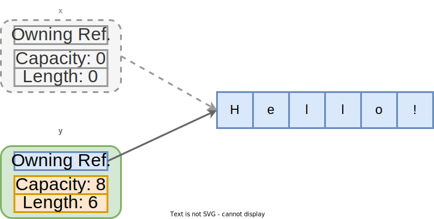
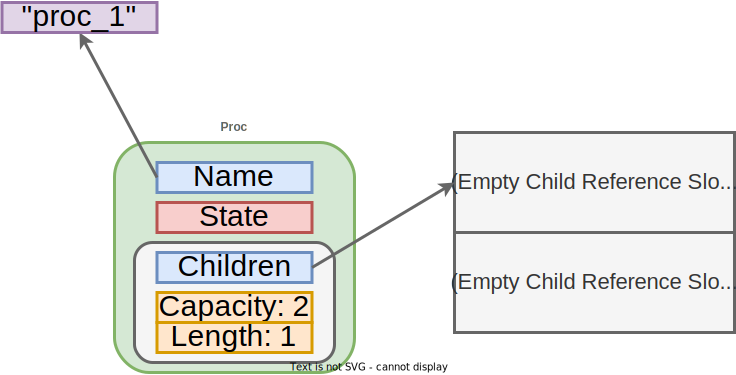

<meta name="title" content="High Assurance Rust">
<meta name="description" content="Developing Secure and Robust Software">
<meta property="og:title" content="High Assurance Rust">
<meta property="og:description" content="Developing Secure and Robust Software">
<meta property="og:type" content="article">
<meta property="og:url" content="https://highassurance.rs/">
<meta property="og:image" content="https://highassurance.rs/img/har_logo_social.png">
<meta name="twitter:title" content="High Assurance Rust">
<meta name="twitter:description" content="Developing Secure and Robust Software">
<meta name="twitter:url" content="https://highassurance.rs/">
<meta name="twitter:card" content="summary_large_image">
<meta name="twitter:image" content="https://highassurance.rs/img/har_logo_social.png">


# Rust: Ownership Principals (4 of 6)

Before we get into the mechanics of ownership, we should understand its motivation: managing memory.

Allocating memory is often easy, it happens at variable declaration.
Fixed-size types (e.g. `[T; N]`) can be allocated on the stack, dynamically-sized types (e.g. `Vec<T>`) must be allocated on the heap.

De-allocating (aka "freeing") memory is where things get tricky.
Traditionally, there have been two strategies: automated garbage collection and manual memory management.
Rust introduces[^Own] ownership, a third approach.
The below table offers an approximate comparison:

| Memory Management | Fast? | Safe? | Tradeoff | Example Languages |
| --- | --- | --- | --- | --- |
| Garbage collection | No, unpredictable latency spikes[^DiscGo] | Yes | Unsuitable for real-time and/or embedded systems | Go, Java, Python, Haskell, etc |
| Manual `malloc`/`new` and `free/delete` | Yes | No, extreme UB risk[^Sok:EWoM] | Significant source of security vulnerabilities for decades | C, C++ |
| Ownership | Yes | Yes | Some constructs difficult to express | Rust |

Garbage collection's performance penalty warrants explanation.
The trouble is that collection is an *asynchronous* operation performed by a language runtime (another program bundled with yours).
That means your program gets "paused", at some difficult-to-predict interval, while other code runs.
The garbage collector eats up your CPU time, temporarily preventing your program from doing its job.

To really understand the safety downside of the manual management approach, we'll write a memory corruption exploit in the next chapter.

## Introducing Ownership

So what is **ownership**, in Rust?
At a high-level, it's a system for determining two pieces of information for every value in a program:

1. **Valid scope:** Where the value is valid and thus can be used.

2. **Access type:** How a reference to a valid value can be used (read-only or writable).

For references, that valid scope is called a **lifetime** in Rust.
Scope and lifetime are distinct concepts in most other languages.
But Rust's ownership model blurs the line:

* In C-family languages, you could access a variable by reference (because it's *in scope*) after it has already been freed (its *lifetime has ended*). The result is UB.

* In Rust, that'd be a compile-time error. Only safe accesses are allowed, so scope and lifetime must overlap.

To reason soundly, the compiler needs lifetime information for every value in the program.

* For values held directly (not behind a reference), lifetime is self-evident: a value must be alive if we currently own it.

* For values behind a reference, the lifetime can often be inferred automatically (this is called *lifetime elision*). Other times, it must be explicitly annotated by the programmer.

> **Are lifetimes present in the executable?**
>
> No, lifetimes are a compile-time construct.
> They don't appear in the machine code emitted, they're only used by the compiler to analyze a program for safety.
> There's no runtime check or cost.

Every value has a single, unique **owner**.
In the exact place in the source where the owner "drops" out of scope (the end of a function in which it was declared, for example), the lifetime of all its owned values ends.
So the compiler automatically inserts code to deallocate (aka "free") every owned value.

The result is precise, source-based control over memory and resource usage.
Comparable to what C and C++ offer, but with additional constraints traded for safety.

Those are the overarching principles, but there's nuance to the code.
In the form of rules and exceptions to them.
We'll explore ownership in detail, in both this section and the next.

> **What are memory leaks? By management strategy?**
>
> A "memory leak" occurs if a value stops being used by the program, yet is never deallocated.
> This is distinct from an "information leak" (accidentally exposing sensitive information).
> Unlike an information leak, a memory leak is **not a security issue**.
>
> It can, however, impact **availability**.
> If a long-running process (e.g. a web server) leaks memory repeatedly (e.g. in a loop) it could eventually exhaust available RAM and be killed by the OS.
>
> Leaks play out differently, depending on the memory management strategy:
>
> * **Garbage collection** - The collector code has no source-level info on value *lifetimes*. It must track references at runtime. And it must be conservative: a value that *might* be alive can't be re-claimed. Application-specific edge cases might keep value references around indefinitely, causing leaks.
>
> * **Manual** - If the programmer ever forgets to manually free a value, even if some distant library code did the original allocation, we have a leak.
>
> * **Ownership** - Leaks are only possible if the programmer opts into specific patterns, like *interior mutability* (see end of this section) with cyclical references.

## The Ownership Hierarchy

Because every value must have exactly one owner, we can think of ownership as a hierarchical tree.
Each node in the tree is a value, and a parent value *owns* its child values.

This roughly parallels the structure of an OS's process tree, where every process has exactly one parent.
It's not a perfect analogy[^RoughAnalogy], but we're going to roll with it for this example - to cement the tree idea.
Trees are a central theme of this book, and a timeless idea in Computer Science.

Consider the following program, which uses a modified version of our prior `Proc` struct:

```rust
{{#include ../../code_snippets/chp3/proc/src/main.rs:process_struct}}

fn main() {
{{#include ../../code_snippets/chp3/proc/src/main.rs:initial_tree}}
}
```

The code builds a tree (`Proc` structs recursively containing other `Proc` structs) using a sequence of **moves**.
Moves are a way to *transfer ownership*.
We'll examine this code's move sequence in the next section.
Let's focus on the the final output now:

```ignore
[src/main.rs:49] init = Proc {
    name: "init",
    state: Running,
    children: [
        Proc {
            name: "cron",
            state: Sleeping,
            children: [],
        },
        Proc {
            name: "rsyslogd",
            state: Running,
            children: [
                Proc {
                    name: "bash",
                    state: Running,
                    children: [],
                },
            ],
        },
    ],
}
```

`Proc` derived the `Debug` trait, we can print a serialization of its contents using the `dbg!` macro.
All four `Proc` values printed above (named `init`, `cron`, `rsyslogd`, and `bash`) have an owner, which we can see in the printed tree.
Working bottom up, from the lowest and deepest level of nesting:

* `bash` is owned by `rsyslogd`.
* `rsyslogd` is owned by `init`.
* `cron` is also owned by `init`.
* `init` isn't owned by another value, it's owned by the function `main`.

We're going to work through how this ownership hierarchy impacts memory allocation and deallocation.

> **Static Lifetimes**
>
> A nuance here is the `name` field.
> Its type, `&str`, is an immutable string reference.
> `&'static str`, means names are *string literals* whose lifetime (`'static`) is the *entire run* of the program, including before and after the `main` function (during which your OS does setup and teardown tasks).
>
> None of our values *own* their string names (`"init"`, `"cron"`, `"rsyslogd"`, and `"bash"`).
> They're just *borrowing* a reference (`&`) to something that lives "forever" (until process termination) and doesn't need to be freed.
> These strings are baked into the compiled binary.

### Allocation

Memory for each `Proc` struct was allocated at variable declaration.
Each instance has a fixed size, only 48 bytes on a 64-bit machine[^ProcPtr]:

```rust,ignore
#[test]
fn test_size() {
    assert_eq!(core::mem::size_of::<Proc>(), 48);
}
```

While a fixed size is convenient for allocation (we need only carve out a 48 byte chunk), it may seem odd.
After all, `Proc`'s `children` field is a dynamic list.
Each child is its own 48 byte instance, and each may have its own children.
`Proc`, as defined, is a recursive structure.
Moreover, `name` can have any length.
So how can size be fixed and so easily allocated?

Because `Proc`'s size calculation only includes a *pointer*[^ProcPtr] to its name and its list of children.
Consider what a single `Proc` struct with no children looks like in memory, approximately:

<br>
<p align="center">
  
  <figure>
  <figcaption><center>Notional memory layout for a Proc struct with no children.</center></figcaption><br>
  </figure>
</p>

Here's what it looks like with one child (which has no children of it's own):

<br>
<p align="center">
  
  <figure>
  <figcaption><center>Notional memory layout for a Proc struct with one child.</center></figcaption><br>
  </figure>
</p>

The struct's size didn't change, just the contents of a slot pointed to.
Take note of the diagram above - this is roughly what memory looks like when the struct named `"proc_1"` owns the struct named `"proc_2"`.
We'll contrast this with another layout, in which one struct *borrows* a reference to another, soon.

### De-allocation

So how does ownership handle deallocation?

Using the hierarchy in the `dbg!` output we saw earlier.
`init` is the "top-level" value, it owns the other three.
And it's *dropped* when the `main` function finished running.
So the compiler adds freeing logic just after `dbg!(init);`, the last line of `main`.
A *destructor* is implemented for us, automatically.
By traversing the ownership hierarchy, this destructor knows how to clean up the other structs owned by `init`.

With just one more `println!`, we can trace the runtime deallocation sequence.
Rust supports running arbitrary logic before destructors, simply by implementing the `Drop` trait[^Drop] for a type.
In case you need to run custom code to release an external resource (e.g. close a network or database connection) or similar.

In our case we'll print the `name` field and `Proc` struct's memory address on every drop:

```rust,ignore
{{#include ../../code_snippets/chp3/proc/src/main.rs:drop}}
```

Running our program now outputs (after the serialized `dbg!` print):

```ignore
De-alloc-ing 'init' Proc @ 0x7ffd4d149460
De-alloc-ing 'cron' Proc @ 0x560d2fbb0b10
De-alloc-ing 'rsyslogd' Proc @ 0x560d2fbb0b40
De-alloc-ing 'bash' Proc @ 0x560d2fbb0ad0
```

We can see that, right before function `main` exits, the entire process tree we've built is cleaned up.
Unlike garbage collection, this sequence of events is predictable.
Even though we didn't manually call a destructor in the source, an experienced Rust developer can infer what will happen.
In writing the program as we did, we exercised granular control over its memory usage.

If you're feeling up for a brain teaser, take a second to consider why the names are printed in this particular order (hint: it's deterministic) and why the first address looks different than the next three (hint: what two *locations* are at play?).

> **Resource Acquisition is Initialization (RAII)**
>
> The allocation/deallocation strategy we just saw is more generally called RAII, especially in the C++ world.
> Some prefer the term to Scope-Bound Resource Management (SBRM).
>
> RAII/SBRM's key idea is that resources (e.g. memory, file handles, locks, etc) are *acquired* in a constructor, able to be used for the lifetime/scope of the constructed value, and *released* in the destructor.
>
> Rust's compiler always enforces this behavior for memory.
> Types, like `std::fs::File`[^File] or a user-defined type implementing `Drop`, can do the same for non-memory resources.

We've now seen, first-hand, how ownership relates to memory management - to allocation and deallocation.
With that motivation under our belts, let's transition to concepts required to effectively use the ownership system.
The two biggest are *moving* (transferring ownership) and *borrowing* (temporarily lending access to owned values).

### Moving

If we couldn't transfer (aka "move") ownership from one value to another, Rust would be a toy language without much practical potential.
**Moving** is what enables day-to-day programming tasks like:

* Returning a value from a function.
* Storing the result of a computation in a variable.
* Using stateful collections, like vectors or hashmaps.

In the above process tree example, moving allowed us to incrementally build up a complex, nested structure: a `Proc` containing other `Proc`s.
But let's start with something simpler:

```rust
fn main() {
    let x = "Hello!".to_string();
    let y = x; // x moved into y. y now owns String value "Hello!"

    // This works
    println!("Owned string: {y}");

    // This would cause a compile-time error, x is "gone", its value moved!
    //println!("Owned string: {x}");
}
// End of scope, y is dropped here.
```

The assignment `let y = x;` didn't create a copy of the heap-allocated `String`.
That'd be expensive for long strings, and thus requires an explicit call to a data duplication function (e.g. `let y = x.clone();`).
Rust prefers performance.

Instead, we performed a cheap transfer of ownership: a move of a fat pointer from `x` into `y` (stack variables).
Because the `String` value can have only one unique owner at any given time, `x` "gave it up" by transferring ownership to `y`.

After the assignment statement executes, `y` is the sole owner.
`x` is left uninitialized, empty.
Which is why we can no longer use or print it.
Visually, the situation is:

<p align="center">
  <figure>
  
  <figcaption><center>y now owns String "Hello!"</center></figcaption><br>
  </figure>
</p>

With that concept in mind, let's revisit how moving played out in building our tree.
The first two lines were:

```rust,ignore
// Alloc bash
let bash = Proc::new("bash", State::Running, Vec::new());

// Alloc rsyslogd, 1st move: bash -> rsyslogd
let rsyslogd = Proc::new("rsyslogd", State::Running, vec![bash]);
```

Recall that the `vec!` macro is initialization shorthand for creating a new `Vec` and pushing elements into it.
When we add an element to a vector, we're performing a move.
As with the assignment `let y = x;`, Rust doesn't duplicate data implicitly.

So creating the `rsyslogd` process *moved* a value (an instance of a `Proc` struct) from the local variable `bash` into the `children` field of the local variable `rsyslogd`.
Since every value must have exactly one owner, the variable `bash`, like our prior `x`, can no longer be used.
Say we tried to print it:

```rust,ignore
// Alloc bash
let bash = Proc::new("bash", State::Running, Vec::new());

// Alloc rsyslogd, 1st move: bash -> rsyslogd
let rsyslogd = Proc::new("rsyslogd", State::Running, vec![bash]);

// Error: can't print an ownerless value!
dbg!(bash);
```

This code wouldn't compile:

```ignore
error[E0382]: use of moved value: `bash`
  --> src/main.rs:70:10
   |
64 |     let bash = Proc::new("bash", State::Running, Vec::new());
   |         ---- move occurs because `bash` has type `Proc`, which does not implement the `Copy` trait
...
67 |     let rsyslogd = Proc::new("rsyslogd", State::Running, vec![bash]);
   |                                                               ---- value moved here
...
70 |     dbg!(bash);
   |          ^^^^ value used here after move

For more information about this error, try `rustc --explain E0382`.
```

Why?
Think back to deallocation.
Moving must maintain a single owner, making it clear (unambiguous) when it's OK to free memory storing an owned value.

The faulty code above tries to give ownership of a specific `Proc` instance to `rsyslog` while simultaneously retaining ownership for `bash`.
That'd make deallocation ambiguous - the compiler wouldn't know which of the two is ultimately responsible for freeing that instance's resources.

Ok.
So we have a feel for why moving must transfer ownership.
But feels restrictive.
What if we're writing a large and complex program?
Losing the ability to print, or even access, variables would quickly become a frustration.
If not an outright roadblock.
This is where **borrowing** comes in.

## Borrowing and Lifetimes

Borrowing is a mechanism for temporarily granting access to a value.
Without moving it and emptying the original owner.

The concept might feel abstract, so let's start with a practical example: function arguments.
The below program is similar to our prior string example, but this time the move is done by a function that prints the length of its string parameter.
If that last line wasn't commented out, we'd get another move-related compile-time error.

```rust
fn print_str_len(s: String) {
    println!("\'{}\' is {} bytes long.", s, s.len());
}

fn main() {
    let x = "Hello!".to_string();

    // x moved into the function, which now owns String value "Hello!"
    print_str_len(x);

    // This would cause a compile-time error, x is "gone", its value moved!
    //println!("Owned string: {x}");
}
```

One potential fix is having `print_str_len` return its input `String` so we could re-assign it to `x`.
Essentially moving back and forth, functional-style.
But borrowing offers a better way.
This code will compile and run:

```rust
fn print_str_len(s: &String) {
    println!("\'{}\' is {} bytes long.", s, s.len());
}

fn main() {
    let x = "Hello!".to_string();

    // Function temporarily borrows x, by reference.
    print_str_len(&x);

    // No error this time! x still owns the String.
    println!("Owned string: {x}");
}
```

* `print_str_len`'s parameter changed from `String` ("string") to `&String` ("immutable reference to a string").

    * **Minor detail:** Using the type `&str` would have been even better, because then `print_str_len` could also work for string *slices* - including those with *static* lifetimes.

* The call site now *borrows* `x` by reference (`print_str_len(x);` updated to `print_str_len(&x);`).

    * **Key concept:** The function no longer takes ownership, it only borrows access to the string for long enough to do its printing.

There are rules borrowing must follow, which we alluded to when discussing mutable aliasing in the previous chapter.
We'll return to those rules in the next section.
Let's look at how borrowing changes our `Proc` tree example.

```rust,ignore
{{#include ../../code_snippets/chp3/proc_2/src/main.rs:process_struct}}

fn main() {
{{#include ../../code_snippets/chp3/proc_2/src/main.rs:initial_tree}}
}
```

Two major differences:

1. With borrowing, we now have the flexibility to access `bash` and `cron` for `dbg!` printing - even after adding them to our tree. That's because the addition no longer performs a move, the `children` are only borrowed by the `Proc` struct and can "live" elsewhere.

2. We've added **lifetime** annotations (`'a`) for the `Proc` struct definition and one of its constructor parameters. Whereas the `'static` lifetime we've been using thus far indicates a value (`name`, here) that lives for the *entire program*, `'a` indicates that `Proc` must live *at least as long* as the references it borrows (non-owned `children` here).

Lifetime annotations may look intimidating, especially if they appear alongside generics.
Rust signatures can get a little convoluted at times.
You don't need to be comfortable with this notation or the underlying concepts right now, it's something you get a feel for with time and experience.
We'll come back to it throughout the book.

> **Why does the compiler need lifetime annotations?**
>
> Rust's compiler needs to compute certain results looking at a single function at a time, because considering every possible sequence of function calls as a holistic "call chain" is prohibitively expensive.
>
> But the computed results need to *be valid* for every possible call chain.
> The technical term for this sort of thing is "interprocedural static analysis".
> Lifetime annotations on structures and functions aid these kinds of analyses.

Long story short, lifetime annotations enable a human-in-the-loop property verification system.
By occasionally querying your genius meat-brain for them, the compiler learns about your intentions and helps solve an otherwise intractable problem: eliminating memory errors.
It's akin to pair programming alongside a nearly-omniscient but narrowly-focused perfectionist.

> **Ugh, do I always have to write out lifetime annotations?**
>
> Fortunately not!
> Lifetime information must always be present, but it can often be inferred automatically.
> In fact, the compiler sees our earlier `print_str_len` function as:
>
> ```rust
> fn print_str_len<'a>(s: &'a String) {
>     println!("\'{}\' is {} bytes long.", s, s.len());
> }
> ```
>
> Static analysis ensures the string reference has a valid lifetime, taking care of safety and memory management, without us having to explicitly spell it out.

Visually, the borrow-based memory layout for a single `Proc` struct with no children looks like:

<br>
<p align="center">
  
  <figure>
  <figcaption><center>Notional memory layout for a Proc struct with no children.</center></figcaption><br>
  </figure>
</p>

And for a `Proc` with one child (which has no children of it's own):

<br>
<p align="center">
  
  <figure>
  <figcaption><center>Notional memory layout for a Proc struct with one child.</center></figcaption><br>
  </figure>
</p>

Parent processes hold a reference to their children, for which the compiler checks lifetime.
Contrast this to our previous move-based diagrams:

* With borrowing, each structure remains independent as far as deallocation is concerned.

* The logical tree we built doesn't change. We can see this within the full printout for the above borrow-based program, at the line starting with `[src/main.rs:73]`:

```ignore
[src/main.rs:61] &bash = Proc {
    name: "bash",
    state: Running,
    children: [],
}
[src/main.rs:70] &cron = Proc {
    name: "cron",
    state: Sleeping,
    children: [],
}
[src/main.rs:73] &init = Proc {
    name: "init",
    state: Running,
    children: [
        Proc {
            name: "cron",
            state: Sleeping,
            children: [],
        },
        Proc {
            name: "rsyslogd",
            state: Running,
            children: [
                Proc {
                    name: "bash",
                    state: Running,
                    children: [],
                },
            ],
        },
    ],
}
De-alloc-ing 'init' proc @ 0x7ffe455e5c40
De-alloc-ing 'cron' proc @ 0x7ffe455e5bf0
De-alloc-ing 'rsyslogd' proc @ 0x7ffe455e5ae0
De-alloc-ing 'bash' proc @ 0x7ffe455e5a90
```

The distinction between the move-built and borrow-built variations of this tree doesn't have to fully click right now.
These are challenging concepts at the intersection of compiler design and computer architecture.
But maybe you're starting to get a feel for how this all fits together.

## Takeaway

Ownership is Rust's most novel feature, but also it's most complex.
Let's recap what we've learned about ownership so far:

* It's a fast and safe way to **manage memory** allocation/deallocation.

* Every value has an **owner**. A transfer of ownership is called a **move**.

* Values are freed when their owner goes out of scope. That scope is effectively a **lifetime** in Rust.

* Values can be **borrowed** via references. Either immutably and non-exclusively, or mutably and exclusively. Both are ways to grant temporary access to a value without moving it.

* Borrows cannot out-live the referenced value. They necessarily have shorter lifetimes (borrows, as the name implies, are temporary).

If those five bullets are starting to align with a rough intuition, we're in good shape.
And ready to take a closer look at code patterns for working with the ownership system day-to-day.

As obtuse as this firehose of concepts may feel now, ownership will eventually sink in - over time and with practice.
It's a different way of doing things, but one you can grow accustomed to.
Let's explore it further.

---

[^Own]: "Ownership" is not something Rust invented, it's based on prior work in linear and affine types. Additionally, ownership-based "region analysis" to do compile-time memory management appeared in an esoteric language called Cyclone. But Rust is the first mainstream, commercially-viable language that uses ownership enforcement to manage memory.

[^DiscGo]: [*Why Discord is switching from Go to Rust*](https://blog.discord.com/why-discord-is-switching-from-go-to-rust-a190bbca2b1f). Jesse Howarth (2020).

[^Sok:EWoM]: [*SoK: Eternal War in Memory*](https://people.eecs.berkeley.edu/~dawnsong/papers/Oakland13-SoK-CR.pdf). Laszlo Szekeres, Mathias Payer, Tao Wei, Dawn Song (2012).

[^RoughAnalogy]: This analogy is imperfect! In Linux, `init`, the first process to run, doesn't have a parent. Similarly, Rust values with `&'static` lifetimes aren't owned by any variable in the program. A parent process can be killed without its children also being terminated. When an owner goes out of scope in Rust, all the values it owns are also deallocated.

[^ProcPtr]: The 48-byte size we `assert` includes only a *fat pointer* (tuple of memory address, total capacity, and current length) to the `children` heap data. Similarly, the `name` field is a pointer to a string hardcoded into read-only memory.
Pointers are just memory addresses with machine specific widths, hence our caveat about the size being for a "64-bit machine".

[^Drop]: [*Trait `std::ops::Drop`*](https://doc.rust-lang.org/std/ops/trait.Drop.html). The Rust Team (Accessed 2022).

[^File]: [*Struct `std::fs::File`*](https://doc.rust-lang.org/std/fs/struct.File.html). The Rust Team (Accessed 2022).

[^MISRA_2012]: *MISRA C: 2012 Guidelines for the use of the C language in critical systems (3rd edition)*. MISRA (2019).
