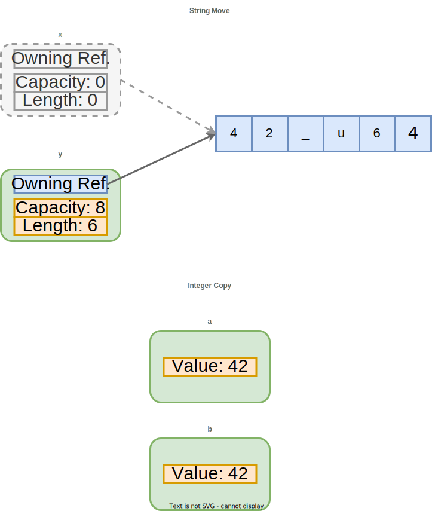
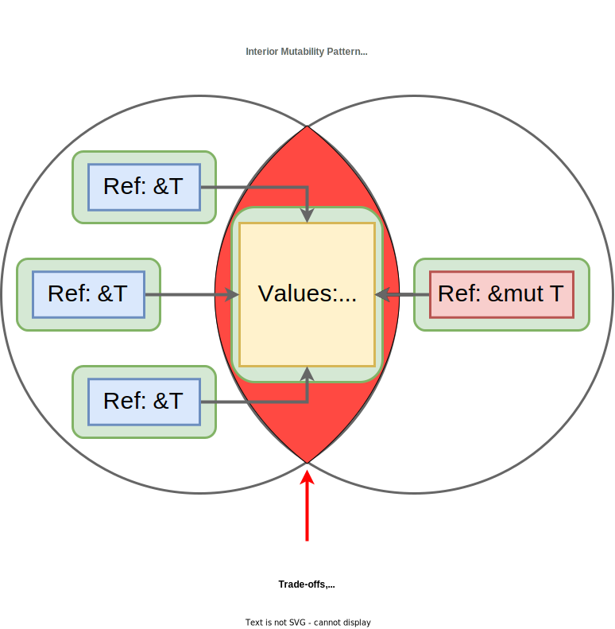

# Rust: Ownership in Practice (5 of 6)

Rust offers four mechanisms to make ownership flexible and practical.
Ways for ownership to ebb and flow throughout a program while still upholding the foundational principles.

We've already seen two of the ways, moving and borrowing, but a survey of the whole gambit is well-warranted.
These are the "tricks" for working with the **borrow checker** - the compiler component[^BorrowChecker] responsible for implementing and enforcing ownership.

Appeasing it can be challenging.
Programmers new to Rust may experience "fighting the borrow checker": running into errors when trying to express a program.
Fortunately, those roadblocks largely disappear with experience.

In this section, we'll continue our discussion of ownership by:

* Motivating the challenge from a new perspective.
* Illustrating lifetimes, with ASCII visualizations.
* Enumerating all four mechanisms for working with the borrow checker.

## Keep the Assurance Goal in Mind

Before heading back down into code snippets, let's reiterate our motivation.
Why are these complex ownership concepts worth learning, again?

You could argue the Rust compiler is akin to a human-in-the-loop property verification engine.
A meld of machine and man.
That's a grandiose conceptualization.
But there's some truth to it[^GeneralTrend].

* **Benefit:** The machine runs analyses to guarantee memory safety under performance constraints (the property proven).

* **Trade-off for partial automation:** The human maintains lifetime source annotations to help out when the machine gets stuck. Or, sometimes, reframes the problem entirely to make it machine-checkable.

  * **Compiler error feedback loop:** Rust's compile-time errors are often highly actionable. But they're also complex and can be frequent. It's an imperfect feedback channel.

The collaboration, when successful, is fruitful.
We get performant programs free of memory safety vulnerabilities and emphasizing general reliability (e.g. strict error handling).
That's a solid starting point for high assurance software.

> **Computers and Humans Exploring Software Security (CHESS)**
>
> CHESS was  DARPA research program[^CHESS] on "the effectiveness of enabling computers and humans to collaboratively reason over software artifacts...with the goal of finding 0-day vulnerabilities at a scale and speed appropriate for the complex software ecosystem upon which the U.S. Government, military, and economy depend"[^CHESSDesc].
>
> It's a response to the fact that in-depth security assessments are a **difficult to scale expert process**.
> Rust was not considered a solution under the CHESS program.
> It wouldn't have met all criteria.
> But we can think of it as a **shift left** in the lifecycle: developers aided by the borrow checker don't introduce memory corruption bugs for assessors to find.
>
> From that perspective, Rust has an incredible **Return On Investment (ROI)**.
> The bugs Rust prevents early would be more expensive to fix later in an asset's lifecycle:
> * Patching production has per-customer cost and risk.
> * Heeding a compiler error does not.

## Scope vs. Lifetime

As alluded to before, scope and lifetime are distinct concepts in most programming languages:

* **Scope** is the *section(s) of code* where a value is accessible.

    * Unless the value is global, that typically means between within a function - between `{` and `}` brackets in many languages.

* **Lifetime** is the *duration* of time during which a value is in a valid state.

    * In garbage collected languages, that's as long as a reference to the value exists. In systems languages, that may be until a value is de-allocated.

Rust's borrow checker blurs the line between these two concepts.
It has a relentless obsession with scope-based lifetime enforcement.

Let's get a feel for these ideas pan out with an example *borrowed from other sources*[^ExampleCredit] (pun intended).
We'll start with a tiny snippet of C++ code:

```cpp
#include <iostream>

int main() {
    int *p; // Pointer to an integer

    { // Start of scope S
        int x = 1337;   // Value
        p = &x;         // Reference to value
    } // End of scope S

    // Printing x triggers undefined behavior! :(
    std::cout << "x = " << *p << std::endl;
    return 0;
}
```

C++ doesn't have a borrow checker, so this program will compile without warnings[^Gpp].
And the print at the end of this function (the line starting with `std::cout`) triggers UB.
In the context of a larger program, any UB may lead to a crash or an exploit.

The problem is that we're attempting to use a reference (`p`) to a value (`x`) that has gone out-of-scope.
`x`'s lifetime is over at the time of the print.
Let's see what the borrow checker has to say, when we try that in Rust:

```rust,ignore
fn main() {
    let p; // Reference to an integer

    { // Start of scope S
        let x = 1337;   // Value
        p = &x;         // Reference to value
    } // End of scope S

    // Compile-time error!
    println!("x = {}", p);
}
```

It emits this error:

```ignore
error[E0597]: `x` does not live long enough
  --> src/main.rs:6:13
   |
6  |         p = &x;         // Reference to value
   |             ^^ borrowed value does not live long enough
7  |     } // End of scope S
   |     - `x` dropped here while still borrowed
...
10 |     println!("x = {}", p);
   |                        - borrow later used here
```

Take a second to read through this compiler error.
For some readers, this may be the point at which a complex compiler error is starting to make some sense.
The borrow checker is complaining about a lifetime problem.
Rightfully so.
We can draw out the two lifetimes at play (`'a` and `'b`):

```rust,ignore
fn main() {
    let p;                  // ---------+-- 'a
                            //          |
    {                       //          |
        let x = 1337;       // -+-- 'b  |
        p = &x;             //  |       |
    }                       // -+       |
                            //          |
    println!("x = {}", p);  // ---------+
}
```

Recall that borrows cannot out-live the referenced value.
Because `'a` outlives `'b` in the above, the borrow checker rightfully rejects this program.
Neither C++ or Rust would have this issue without that nested scope `S` encapsulating `x`'s definition.
This is fine:

```rust
fn main() {
    let p;                  // ---------+-- 'a
                            //          |
    let x = 1337;           // -+-- 'b  |
    p = &x;                 //  |       |
                            //  |       |
    println!("x = {}", p);  // -+-------+
}
```

Here, the borrow's lifetime (`'b`) is a strict subset of the borrowed value's lifetime (`'a`).
No rules have been violated.

Now nested scopes within functions aren't terribly common, so this example may feel contrived.
Fair enough.
It only serves to illustrate the concept.
More realistic examples might include returning references to stack locals, freeing a variable twice, reading a freed value, etc.
Like those nesting brackets in our example, these cases can create lifetime mismatches.

Once a code base grows in size and complexity, lifetimes become difficult to reason about manually.
And even a single mistake could jeopardize reliability, security, or both.

## Flexibility Mechanisms

In order for ownership to be compatible with shipping real-world programs, we need a little leeway.
Some wiggle room within the single-owner rule.
We'll overview these flexibility mechanisms now, and use them throughout the book.

### 1) Moving ownership

We saw moving in the prior section.
Now that we have a better understanding of lifetimes, let's review that first `Proc` tree example from the previous section - the one where we used moves instead of borrowing.

The below right-hand ASCII graph shows how the lifetime for each variable ends when it's value is moved into another variable:

```rust,ignore
// Alloc bash                                                       //
let bash = Proc::new("bash", State::Running, Vec::new());           // ---------+-- 'a
                                                                    //          |
// Alloc rsyslogd, 1st move: bash -> rsyslogd                       //          |
let rsyslogd = Proc::new("rsyslogd", State::Running, vec![bash]);   // ---------+-- 'b
                                                                    //          |
// Alloc cron                                                       //          |
let cron = Proc::new("cron", State::Sleeping, Vec::new());          // -+-- 'c  |
                                                                    //  |       |
// Alloc init, 2nd and 3rd moves: cron -> init, rsyslogd -> init    //  |       |
let init = Proc::new("init", State::Running, vec![cron, rsyslogd]); // -+-------+--'d
                                                                    //          |
// Print serialized tree to see ownership hierarchy                 //          |
dbg!(init);                                                         // ---------+
```

In general, ownership can be moved via:

* Assigning a value to a new variable.
* Passing a value into a function (if not using a reference).
* Returning a value from a function.

### 2) Duplicating data for types that implement the `Copy` trait

We've covered moving for strings and the `Proc` struct - types with the potential to own a lot of data:

* A string might be very long, maybe it contains the contents of an entire file.

* A `Proc` instance might have hundreds of children, direct and/or nested.

Moving makes the assignment operator, `=`, efficient in such cases - sizable data isn't copied when ownership is transferred.
We just duplicate a known-valid pointer.

But for some types, like integers and characters, moving is overkill.
The data these types hold is so small it's trivial to perform a copy - it just means duplicating a short sequence of bits.
There's no resources to free later, a perfect replica can be cheaply created.
We can simply **copy** the data instead of moving it.

Consider the below:

```rust
let x = "42_u64".to_string();
let y = x; // x *moved* into y. y now owns String value "42_u64", x is gone.

let a = 42_u64;
let b = a; // a *copied* and assigned to b. We get two instances of value 42.

// This would be a compile-time error
//println!("Strings: {x}, {y}");

// This works
println!("Integers: {a}, {b}");
```

It outputs:

```ignore
Integers: 42, 42
```

Whereas the string `x` was *moved*, the 64-bit unsigned integer `a` was *copied*.
The assignment operation was still cheap, but it created a tiny duplicate instead of transferring ownership:

<p align="center">
  <figure>
  
  <figcaption><center>y now owns string "42_u64", a and b own separate instances of the integer 42</center></figcaption><br>
  </figure>
</p>

The convenient part is that we don't have to think about ownership and moves, we can freely use our independent duplicates like the distinct values they are.
This makes working with primitive types, like integers and floats, much more ergonomic.
We get a welcome break from the cognitive load of Rust's move semantics.

Assignment performs a copy for any type that implements the `Copy` trait[^TraitCopy].
You can derive or implement `Copy` for your own custom types if they don't hold externally-allocated data (like a `Vec` or `String` field).

Why not just have everything implement `Copy` and never worry about moves again?
Because duplicating data increases program runtime and memory consumption.
`Copy` isn't a good fit for large chunks of data, like most user-defined structures.
That's why, outside of day-to-day primitives, the `Copy` trait must be explicitly opted into.

### 3) Borrowing for a subset of a lifetime

We saw borrowing in the previous section.
The idea was that we could get temporary access to a value by *reference*, without transferring ownership (performing a *move*) or duplicating data (performing a *copy*).

As a review, our reference-based `Proc` struct (note how the lifetime diagram added on the right differs from the prior move case):

```rust,ignore
// Alloc bash                                                           //
let bash = Proc::new("bash", State::Running, Vec::new());               // -------------------------+-- 'a
                                                                        //                          |
// Alloc rsyslogd, 1st move: bash -> rsyslogd                           //                          |
let rsyslogd = Proc::new("rsyslogd", State::Running, vec![&bash]);      // ------------------+-- 'b |
                                                                        //                   |      |
// Print owned value (new!)                                             //                   |      |
dbg!(&bash);                                                            //                   |      |
                                                                        //                   |      |
// Alloc cron                                                           //                   |      |
let cron = Proc::new("cron", State::Sleeping, Vec::new());              // ----------+-- 'c  |      |
                                                                        //           |       |      |
// Alloc init, 2nd and 3rd moves: cron -> init, rsyslogd -> init        //           |       |      |
let init = Proc::new("init", State::Running, vec![&cron, &rsyslogd]);   // --+-- 'd  |       |      |
                                                                        //   |       |       |      |
// Print another owned value (new!)                                     //   |       |       |      |
dbg!(&cron);                                                            //   |       |       |      |
                                                                        //   |       |       |      |
// Print serialized tree to see ownership hierarchy                     //   |       |       |      |
dbg!(&init);                                                            // --+-------+-------+------+
```

Rust guarantees references are always safe to use.
References cannot *out-live* the value they refer to.
This implies they can only have *shorter* lifetimes in which they are *always valid*.
We can't have "dangling pointers", which lead to temporal memory safety issues.
And thus are compliant with the below MISRA rule:

> **[AR, Rule 18.6]** When an object's lifetime expires, so should the reference[^MISRA_2012]

Moreover, there's an infamous rule: "shared XOR mutable".
Rust references can be either of (but never both):

* `&T` - immutable (cannot modify value referred to) and shared (more than reference can be in use simultaneously).

    * References are immutable by *default*.

* `&mut T` - mutable (can modify value referred to) and exclusive (only one exists at any given point).

    * References have to be *explicitly* marked mutable.

<p align="center">
  <figure>
  
  <figcaption><center>2 kinds of references: immutable/shared (&T) and mutable/exclusive (&mut T)</center></figcaption><br>
  </figure>
</p>

Thus far, we've only shown the first case, often called a *shared reference*.
We'll learn how to work with the second case, dubbed a *mutable reference*, as we write more Rust code.
To preview the exclusive-mutable restriction, this code would fail to compile:

```rust,ignore
let mut x = "Hello!".to_string();

let r1 = &mut x; // 1st mutable borrow
let r2 = &mut x; // 1nd mutable borrow - problem!

println!("{}, {}", r1, r2);
```

With the error:

```ignore
error[E0499]: cannot borrow `x` as mutable more than once at a time
 --> src/main.rs:7:10
  |
6 | let r1 = &mut x; // 1st mutable borrow
  |          ------ first mutable borrow occurs here
7 | let r2 = &mut x; // 1nd mutable borrow - problem!
  |          ^^^^^^ second mutable borrow occurs here
8 |
9 | println!("{}, {}", r1, r2);
  |                    -- first borrow later used here

For more information about this error, try `rustc --explain E0499`.
```

But this is OK:

```rust
let mut x = "Hello!".to_string();

let r1 = &mut x; // 1st mutable borrow

// Mutate the string
r1.pop();
r1.push_str(", World");

println!("Modified via r1: {}", r1);
// End of implicit (no open-close brackets) scope for 1st mutable borrow,
// b/c not used again in this function

let r2 = &mut x; // 2nd mutable borrow - OK, not simultaneous!

// Mutate the string via another reference
r2.push('!');

println!("Modified via r2: {}", r2);
```

It prints:

```ignore
Modified via r1: Hello, World
Modified via r2: Hello, World!
```

The trick with mutable borrows is the requirement that they remain *exclusive*.
Satisfying that requirement isn't always straightforward, it's a skill gained through experience.

### 4) The "interior mutability" pattern

The first three ownership "workarounds" (moving, copying, and borrowing) are all that we'll need in this book.
But there's a fourth option, a well-known pattern in Rust.
It's called **interior mutability** and relaxes enforcement of the `&T` xor `&mut T` check.

We must still obey the rule, but we don't have to prove mutual exclusion for all possible executions with *compile-time verification* (static assurance).
That strictness makes encoding certain problems too difficult.
But if it compiles, it's guaranteed.

Instead, interior mutability allows us to do *run-time validation* (dynamic assurance).
Below are two types often used in the interior mutability pattern.
Don't worry about what these type signatures mean, let's focus on the tradeoffs:

* **`Rc<RefCell<T>>`'s availability risk:** if a statement in our code attempts to mutably borrow a value that another statement has already mutably borrowed, the thread will `panic!` (terminate immediately)[^RefCell].

    * E.g. risks terminating single-threaded applications.

* **`Arc<RwLock<T>>`'s potential performance impact:** - if thread A requests read access to data while thread B is holding a write lock, thread A is blocked (pauses execution) until thread B releases the lock. But multiple simultaneous readers are allowed[^RwLock].

    * E.g. risks performance degradation for multi-threaded applications.

    * A reader-writer lock is a common *synchronization* mechanism in systems programming. It's not unique to Rust.

<p align="center">
  
  <figure>
  <figcaption><center>Interior mutability: run-time enforced shared readable xor exclusive writeable</center></figcaption><br>
  </figure>
</p>

To reiterate, **we will not be using interior mutability in this book.**
We can build a feature-rich library without it.
And, because a compile-time guarantee doesn't require a fallible runtime check, our implementation will enjoy a higher level of assurance.

Interior mutability is still worth learning and using, eventually.
It's a best practice for some classes of problems, and well-covered in other resources[^TRPL].
But remember - Rust is a *big* language.
We don't have to master every feature to be productive.

> **We're not out of the run-time woods!**
>
> Our code does index-based array access, e.g. `arr[i]`.
> That incurs a run-time bounds check.
> A failure (out-of-bounds index attempt) would mean `panic!`, just like `RefCell`.
> But array indexing is easier to reason about.
>
> To justify confidence in indexing logic and more general reliability, Chapter 12 introduces an advanced form of stress testing: differential fuzzing.

## Takeaway

We now have a more holistic view of ownership.
Including four ways to work with the borrow checker:

1. **Moving** (transferring) ownership from one variable to another.

2. **Copying** (duplicating) data, creating a second, independent, owned instance.

3. **Borrowing** (accessing) to data for a subset of its lifetime.

4. ~~**Interior mutability** - a form of relaxed, run-time ownership enforcement.~~

That's it!
We've covered the most difficult and infamous aspect of the Rust programming language.
Keep these concepts in mind as we write more code, and soon ownership might even become second nature.

Ownership guarantees memory safety.
But Rust is also known for general correctness - for robustness beyond memory safety.
Its error handling story is a major reason for that reputation.
And our next topic.

---

[^BorrowChecker]: [*MIR borrow check*](https://rustc-dev-guide.rust-lang.org/borrow_check.html). Guide to Rustc Development (Accessed 2022).

[^GeneralTrend]: At some level, that's also true of most Programming Language (PL) innovations (e.g. type systems and annotation-based frameworks).
And it complements the robustness benefits coming from industry development tools/practices (e.g. powerful IDEs and frameworks aiding product creation, and testing/deployment processes underpinning production-quality systems and services). Rust isn't special or a "silver bullet", it's one of many modern development tools. But Rust does tackle an important niche: fast && memory-safe.

[^CHESS]: [*CHESS: Computers and Humans Exploring Software Security*](https://www.darpa.mil/attachments/CHESS-Slides-DISTAR.pdf). Dustin Fraze (2018, Public Domain).

[^CHESSDesc]: [*Computers and Humans Exploring Software Security (CHESS)*](https://www.darpa.mil/program/computers-and-humans-exploring-software-security). William Martin (Accessed 2022).

[^ExampleCredit]: To give appropriate credit, this example is based on [this StackOverflow question](https://stackoverflow.com/questions/11137516/scope-vs-lifetime-of-variable) and [this part](https://doc.rust-lang.org/book/ch10-03-lifetime-syntax.html) of TRPL book. In particular, we use the same ASCII diagram comments of TRPL.

[^Gpp]: We compiled this program with command `g++ scope.cpp -o scope` using `g++` version 9.4.0 (latest shipping on Ubuntu 20.04 LTS at the time of this writing). No warning was emitted.

[^TraitCopy]: [*Trait `std::marker::Copy`*](https://doc.rust-lang.org/std/marker/trait.Copy.html). The Rust Team (Accessed 2022).

[^MISRA_2012]: *MISRA C: 2012 Guidelines for the use of the C language in critical systems (3rd edition)*. MISRA (2019).

[^RefCell]: [*Module `std::cell`*](https://doc.rust-lang.org/std/cell/index.html). The Rust Team (Accessed 2022).

[^RwLock]: [*Struct `std::sync::RwLock`*](https://doc.rust-lang.org/std/sync/struct.RwLock.html). The Rust Team (Accessed 2022).

[^TRPL]: [*`RefCell<T>` and the Interior Mutability Pattern*](https://doc.rust-lang.org/book/ch15-05-interior-mutability.html). by Steve Klabnik, Carol Nichols (Accessed 2022).