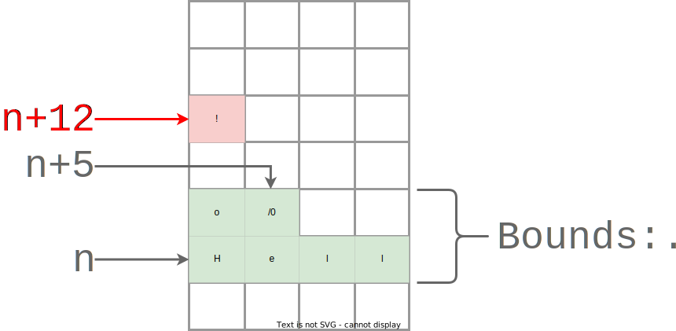

# An Attacker's Perspective: Breaking Safety (1/2)

Let's start from first principles: data is code[^DataCode].
Many abstractions attempt to enforce a logical separation as follows:

* **Data** - Information we can read or write.
* **Code** - Information we can execute.

But the separating abstraction might one or more of:

1. Vulnerable by design (high-level error).

2. Vulnerable in implementation (low-level error).

3. Vulnerable via environmental interaction (fault injection, side-channels, etc).

If a motivated adversary builds an **exploit** for one of the 3 classes of vulnerability, or chains together several classes, they've likely found a way to treat *data they control* as some form of *executable, logical code*.

More generally, Sergey Bratus defines exploitation as[^BratusTalk]:

> Causing a (complex) computer or human-computer system to behave contrary to the trust assumptions and/or expectations of its designers or operators.

"Trust assumptions", in an exploitation context, are beliefs we have about a system meeting specific security or functionality requirements.
In the prior section we saw how breaking stack safety undermines availability.

Say we believe that a system protects confidentiality.
Under this trust assumption, any unauthenticated or unprivileged entity being able to *read* sensitive data (secrets, intellect property, user PII, etc) is a viable attack.
That's still treating data as data.
Just with the wrong access controls.
But the most devastating attacks tend to take some *action*, treating data as code.

If an attacker gains code execution, whether arbitrary or constrained, they may violate almost *any* trust assumption.
Be it confidentiality, integrity, availability, etc.
The attacker's capability is generalized.

This is the topic of upcoming sections - introductory **exploit development** for memory corruption vulnerabilities (implementation problem, vulnerability class #2 above).

Remember: Data. Is. Code.

## At a high level, how is code-data isolation broken?

To create native executables, compilers emit data in an encoding understood only by a CPU that's happy to blindly execute it as code.
One arbitrary chunk at a time.
That's [a dramatization of] the fetch/decode/execute cycle we discussed earlier.

Danger is kept in check by the fact that a single number, the value of the Instruction Pointer (IP), stays within expected bounds and performs the expected logic sequence.
*Most* of the time, anyway.
Creative attackers can, and do, find ways to control contents of the IP register.
The technical term is *control-flow hijacking*, and it's the result of breaking data-code isolation.

Before we dive into exploitation in detail, let's discuss root cause.
Recall the term "value" refers to a concrete instance of typed data in a program: an integer, a string, a structure, a class with inherited methods, etc.
Binary exploitation often requires breaking a value's safety assumptions.
That means violating either one or both of:

1. **Memory Safety** - Requires both spatial and temporal safety, defined as:

    * **Spatial Memory Safety** - All accesses of a value to remain within correct bounds.

    * **Temporal Memory Safety** - A value must be valid at time-of-access (e.g. initialized but not yet deallocated).

2. **Type Safety** - Requires that a value only be accessed as its correct type (semantics), and only by code authorized to do so (visibility).

Now "binary exploitation" refers specifically to attacking natively compiled programs - sometimes without access to the original source code.
Be it C, C++, or `unsafe` Rust.

For a more concrete discussion of memory and type safety, we'll examine three C snippets and visualize the violations therein. Note:

* None of the three snippets are, to the best our knowledge, *exploitable*. These small programs break safety, but not in manner unfortunate enough to enable a break of data-code isolation.

This distinction is intensional.
We're starting by learning to identify bugs, even if innocuous.
We'll build up to exploiting vulnerabilities.

## Breaking Spatial Memory Safety (Value Bounds)

Consider this short C program:

```c
#include <assert.h>     // assert
#include <stdio.h>      // puts
#include <string.h>     // strncpy
#include <stdlib.h>     // malloc

char* get_greeting() {
    char* greeting = (char*)malloc(6);
    if (greeting == NULL) {
        return NULL;
    } else {
        strncpy(greeting, "Hello", 6);
        assert(greeting[6] == '\0');
        return greeting;
    }
}

int main() {
    char* greeting = get_greeting();
    if (greeting != NULL) {
        // Buffer overwrite, spatial safety violation!
        greeting[12] = '!';

        puts(greeting);
        free(greeting);
    }
    return 0;
}
```

There's actually quite a bit of C-specific minutia packed into that tiny snippet.
Let's break it down:

* `get_greeting()` returns a *heap-allocated* string by reference (using a raw pointer). Strings in C are null-terminated, meaning they must end with the byte literal `/0`, a "null byte". And C string handling is notoriously error-prone. This function correctly takes a careful sequence of steps:

    * Allocate `6` bytes on the heap via a call to `malloc()`, the standard library's memory allocator (`std` Rust uses this same API on your behalf!). `6` is the minimum length needed to store the ASCII string `Hello` and its null terminator.

    * `malloc()` can return a `NULL` pointer if heap memory is already full (exhaustion) or if the allocation requested is too large to fit within memory remaining (fragmentation). We've remembered to handle this important edge case by implicitly propagating the error to the caller - similarly returning `NULL`.

    * If `malloc()` succeeds, it returns a heap-allocated buffer of the requested size. We copy the string `Hello`. `strncpy()` (which takes a maximum number of bytes to copy, `6` here) is a "best-practice" safe variant of the unsafe `strcpy()` function (which keeps copying data until a `NULL` byte is reached, often leading to spatial violations).

    * `strncpy()` will include the null byte if doing so doesn't exceed the input maximum length specified. But, to be extra cautious, check that the string has been null-terminated using an `assert()`. Attempting to print an unterminated-string could result in *leaking sensitive data*. Because we'd keep printing adjacent bytes until a `/0` is reached!

> **The Implications of Library Abstraction Design**
>
> Safe Rust doesn't require us to bear as much memory-representation cognitive load when handling strings.
> With `std::string::String`[^String] we don't have to worry about manual allocation, copying specific lengths, null-termination, or encoding.
>
> To some extent, this is also true of modern C++'s `std::string` class[^CppString]!

* Unfortunately, `get_greeting()`'s caller - `main()` - isn't as careful. Here we incorrectly assume that the greeting string is `Hello World`, 11 characters long. We then attempt to add an exclamation mark as the 12th character before printing the greeting with `puts()`.

    * Due to a length mismatch, the statement `greeting[12] = '!';` is writing past the bounds of the heap allocated buffer, *corrupting* memory of any value that may just happen to be stored in the adjacent heap location at the time. This is an **out-of-bounds write**. A bug - not vulnerability - in this case, since the data written isn't attacker-controlled.

        * Note: If `greeting` was indeed 11 characters long and null-terminated, `greeting[12] = '!';` would be overwriting the `NULL` byte, creating the aforementioned data leak at `puts()`. So there's an error here regardless. We'll write out the correct `!` append logic in the next example.

    * Finally, in C we must remember to manually `free()` the memory allocated for the string - despite the `get_greeting()` function making the original allocation. Without ownership, there's no enforced contract for who frees memory and when. Forgetting leads to **memory leaks** (not data leaks - availability problem, not confidentiality), freeing too early can create **use-after-free (UAF)** bugs (potentially exploitable), and accidentally freeing more than once is a **double-free** (as we'll see later on).

The above program will compile without error and, despite containing a spatial safety violation, will run to completion.
It outputs:

```ignore
Hello
```

At least on our personal machine, last we checked - this is a UB "time bomb" that may go off on change of platform/toolchain.
The overwrite broke spatial memory safety, we can no longer have confidence in the functionality of this program.

Visually, statement `greeting[12] = '!';` (an out-of-bounds write) triggers memory corruption like so:

</br>
<p align="center">
  
  <figure>
  <figcaption><center>Buffer overwrite: spatial memory safety violation.</center></figcaption><br>
  </figure>
</p>

> **What are the Prerequisites to a Similar Bug being Exploitable?**
>
> The classic "buffer overflow" is an example of an exploitable, spatial vulnerability.
> It involves overwriting multiple sequential bytes, beyond a buffer's capacity.
> Not just one fixed byte (`!`) at a fixed offset (`12`) - like our buffer overwrite example.
>
> Why does this distinction matter?
> Because of a key detail in the stack's control-flow implementation.
> For function calls to return, compiled code places a return addresses at the top of each stack frame (push the `IP` register onto stack).
> On exit of a function this stored value is popped into the Instruction Pointer.
> This allows the CPU to reach the next statement following a completed function call.
>
> Before the use of compiler-inserted "stack canaries" (an exploit mitigation that inserts a random value before the return address and verifies it on function exit) buffer overflow vulnerabilities were trivially exploitable.
> The attacker could turn data to code just by writing a string long enough to overwrite the return address (control flow metadata used by the CPU).
> That is:
>
> </br>
> <p align="center">
> 
> <figure>
> <figcaption><center>A classic stack buffer overflow exploit.</center></figcaption><br>
> </figure>
> </p>

## Breaking Temporal Memory Safety (Value Validity)

Say we left `get_greeting()` unchanged and updated `main()` to fix the prior spatial bug.
But the refactor introduced a new temporal bug!

> **Refactoring Requires Care**
>
> In professional software engineering, refactoring existing code often has important benefits.
> But it also risks introducing new bugs.
> Test suites and architecture patterns can reduce that risk, but cannot eliminate it for any non-trivial codebase.
>
> Refactor-heavy Pull Requests (PRs) are a great time to do security-specific code review.

<!-- {{#include ../../code_snippets/chp4/greeting/src/main.rs}} -->
```c
int main() {
    char* greeting = get_greeting();
    size_t greeting_len = strlen(greeting); // Excludes null byte
    if (greeting != NULL) {
        // Append "!" correctly
        greeting = (char*)realloc(greeting, greeting_len + 2);
        if (greeting != NULL) {
            // strcat could be used here instead of the two lines below
            greeting[greeting_len] = '!';
            greeting[greeting_len + 1] = '\0';
        }
        puts(greeting);
        free(greeting);
    }

    // Double-free, temporal safety violation!
    free(greeting);
    return 0;
}
```

* This time, we remembered that appending to a string in C requires manually re-allocating  the backing memory (via `realloc()`). We no longer assume an 11-character `Hello World` return, instead we compute the string's length dynamically via `strlen`.

    * As a quirk, the reported length doesn't include the null-terminator (although it must be present for `strlen` to report a correct result). That's why we call `realloc` with `greeting_len + 2` - accounting for both the space to add `!` and to append a new null byte.

    * If we forgot this detail and use `greeting_len + 1`, our code would again trigger a buffer overwrite due to an off-by-one error! Remember - string handling is fraught with peril in C.

* Re-allocation can fail, so we again check for a `NULL` return. If `realloc()` succeeds, we correctly append both `!` and the necessary null-terminator. Then print and free the modified string.

* Despite being so close to getting everything right, we make a critical mistake at the end: freeing `greeting` again. A *double-free* bug. The same chunk of memory should never be deallocated twice. This subtle error can have serious side effects.

But we dodged another bullet today.
Although this program compiles without warning, the double-free error is caught at runtime (on Ubuntu 20.04 with `glibc` 2.31):

```ignore
Hello!
free(): double-free detected in tcache 2
Aborted (core dumped)
```

Visually, the two frees are sequential events in time.
The second free was successfully detected as a fatal error:

</br>
<p align="center">
  
  <figure>
  <figcaption><center>double-free: temporal memory safety violation.</center></figcaption><br>
  </figure>
</p>

An early abort would be jarring for an end-user.
And potentially result in down-time for a back-end service.
But runtime detection could prevent an exploit!
We got lucky here - this *particular* double-free was caught by our *specific* memory allocator[^TCache], which ships with a recent version of `glibc`.
Per `glibc`'s Wiki[^MallocInternals]:

> The malloc subsystem undertakes reasonable attempts to detect heap corruption throughout the code.
> Some checks detect errors consistently (e.g., passing a pointer which is not sufficiently aligned to free).
> However, most checks are heuristic and can be fooled...heap corruption may go unnoticed for some time, or might not be reported at all.

In other words, the double-free in our example snippet happened to be detected by a heuristic in `glibc`'s allocator implementation.
It may not have been caught on a different platform using an older or simpler allocator.
Moreover, double-free bugs involving larger allocation requests in more complex sequences may never be caught.

Why?
Unlike Rust's static ownership verification, dynamic invariant checks have a runtime cost.
Allocators need to balance performance and security, yet are often forced to favor the former.
Realistically, invariant checks may be any combination of:

* "Best-effort" (no guarantee, low assurance) in nature (unlike a type system!)
* Disabled by default.
* Trading off availability guarantees (`assert` failure panics).
* Reliant on randomization for probabilistic defense.
* Reserved only for [often slower] "hardened" allocators.
* Bypassable due to implementation or design flaws.

We'll cover heap mechanics in greater depth later in this chapter.
And exploit a double-free vulnerability backed by a simpler allocator.
Modern heap exploitation, attacking up-to-date `glibc` and its contemporaries, is an art and science beyond our scope.
Other free resources exist for who wish to dive those depths[^How2Heap].

> **Availability Robustness: The Rust Port Isn't Strictly Better**
>
> The `!` appending version in Rust may seem perfectly safe and pleasantly readable by comparison:
>
> ```rust
> fn get_greeting() -> String {
>     String::from("Hello")
> }
>
> fn main() {
>     let mut greeting = get_greeting();
>     greeting.push('!');
>     println!("{}", greeting);
> }
> ```
>
> Ownership takes care of memory allocation and deallocation, the `String` type abstracts reallocation.
> And we don't have to worry about null-termination, since that's not true of Rust strings (unless we using `std::ffi::CString`[^CString]  specifically for interoperability with C external code).
>
> But not all ergonomics are free.
> `libc`'s `malloc` still gets called when heap allocating the `String`.
> A raw buffer pointer is still returned.
> Yet we didn't get a chance to `NULL`-check it ourselves.
> The Rust port is arguably less robust than the C version:
>
> * Rust's `fn get_greeting()` will `panic!` if system memory is exhausted. It's an infallible interface to a fallible operation!
>
> * C's `char* get_greeting()` won't terminate on exhaustion - it propagates that error [implicitly] via a `NULL` return value. That gives the caller a chance to handle the fallible operation with business-appropriate logic.
>
> How realistic is running out of memory on a modern system when allocating a 5-6 character string?
> Probably more than you'd expect.
>
> If a long-running process, like a web server, ever forgets to free even a single, hot-path allocation then memory usage will increase, potentially linearly, with time.
> Making exhaustion inevitable.
> If those leaked allocations are triggered by processing external requests, an attacker can force early exhaustion to deny service.
>
> Now memory leaks are largely prevented in safe Rust.
> But they're still possible if misusing cyclical references or calling `unsafe` code.

## Breaking Type Safety (Low-level Value Semantics)

Given our previous troubles with spatial and temporal memory safety, we've decided to give up on appending the `!` at runtime and simply hardcode a `Hello!` string.
Free of string-handling perils, we can focus on an exciting new feature: adding a user record[^CWE843].

Our feature has two functional requirements:

1. New users should be greeted with `Hello!`
2. Visit count for existing users should be tracked.

To support these requirements, we add a user record structure:

```c
#define TYPE_NEW_USR 1 // New user, to be greeted
#define TYPE_CUR_USR 2 // Current user, increment visit count

struct user_record_t {
    int type;
    union {
        char *greeting;
        unsigned visit_count;
    };
};
```

* The `#define` lines are C preprocessor directives, aka "macros". They tell the compiler to replace all instances of the uppercase constant name with the corresponding constant value, e.g. `TYPE_NEW_USR` is replaced with `1` wherever it appears[^PreTrick] in the source. C macros can have "hygiene" pitfalls[^HygienicMacro], but those aren't relevant here. Typing is weaker than a Rust `enum` with two variants (why do you think that is? There may be multiple answers).

* `user_record_t` is a C structure. It represents either a new user or an existing user (but not both simultaneously). The `union` field allows us to store different data types in the same memory location - here a string pointer (`char*`) for a new user's greeting and an unsigned integer (`unsigned`) for an existing user's visit count.

An updated `main` function leveraging `struct user_record_t`:

```c
int main() {
    struct user_record_t rec;

    rec.type = TYPE_NEW_USR;
    rec.greeting = "Hello!";

    // Logic error: should be `TYPE_CUR_USR`
    if (rec.type == TYPE_NEW_USR) {
        rec.visit_count += 1; // Type confusion, a type safety violation!
    }

    if (rec.type == TYPE_NEW_USR) {
        printf("%s\n", rec.greeting);
    }

    return 0;
}
```

Something *weird* happens when we run the above `main` function.
The program prints a greeting, but we're missing the leading `H` - almost like a casual shorthand:

```ignore
ello!
```

What actually occurred at runtime?
Due to a type safety bug, we accidentally incremented a string pointer (instead of a count integer) by one, causing it to point to the next byte (`e` instead of `H`).
This is possible because of:

1. The bug being present.
2. Intentional operator overloading support (pointer arithmetic is an important feature of C).
3. `union` backing different data types with the same memory location.

It seems like this shouldn't be legal.
But these mechanisms underpin the "raw" power of C - unions and pointer arithmetic can enable clever optimizations.
In fact, a major usecase for `unsafe` Rust is enabling similar optimizations.

Visually, the type confusion plays out like so:

</br>
<p align="center">
  
  <figure>
  <figcaption><center>Type confusion: type safety violation.</center></figcaption><br>
  </figure>
</p>

There's a detail not reflected in the above diagram (for simplicity).
In the memory safety examples, our dynamic string `Hello!` was heap allocated at runtime.
In this type safety example, it happens to be hardcoded and thus stored in static memory.

> **What if we're not talking about binaries?**
>
> We're focused on binary exploitation in this chapter, but that the data-is-code concept applies generally.
> Let's pick on Java for a moment.
>
> The Java language is ubiquitous in enterprise and shares its runtime with languages like Kotlin, Clojure, and Scala.
> Java-family programs are compiled to bytecode executed by the Java Virtual Machine (JVM), which is itself a natively compiled program that runs on the CPU.
>
> This indirection, coupled with garbage collection, has performance costs.
> But, in exchange, Java and its ilk are both memory-safe and type-safe.
> That doesn't mean they aren't exploitable.
> Consider:
>
> * **Serialization attacks** - deserializing attacker-controlled data into a specific in-memory structure (which can sometimes additionally enable type confusion).
>   * See CVE-2023-25194[^KafkaCVE], an RCE in Apache Kafka.
>
> * **Command injection attacks** - passing arbitrary, attacker-specified commands directly to a host system's shell for execution.
>   * See CVE-2021-44228[^Log4J], aka "Log4J" or "Log4Shell", an extremely widespread RCE in Apache Log4j.
>
> Binary exploitation is a fantastic lens through which to understand how system memory works.
> But many software developers and security engineers aren't writing native applications.
>
> We recommend self-guided exploration of non-binary attacks.
> For good measure, we'll briefly cover more Log4J details in the next section.

## Why do attackers break code-data isolation?

Regardless of source language, binary exploits break memory safety, type-safety, or some combination of both.
Once safety is broken, Undefined Behavior (UB) is triggered.
A language's operational semantics go out the window.
The program can execute arbitrary operations that aren't reflected in the faulty source code or valid per the language specification.
This creates room for an exploit developer to:

* **Hijack control-flow** - Redirect execution of the program by setting the value of the Instruction Pointer (IP).
    * This is a key "building block" in powerful exploits (excluding data-oriented attacks[^DOA], a niche). In limited cases, control-flow hijack alone enables a useful malicious operation (perhaps calling an existing function without arguments, if the function has some desirable side-effect).

* **Inject code** - Write an executable memory location to add new code or modify existing code. If control-flow can be hijacked to execute the newly/added modified code, the attacker is free to reprogram the victim process arbitrarily.
    * Modern hardware/OS combos store executable code in read-only memory to prevent code injection. But it's still a major attack vector for resource-constrained embedded systems without this protection[^DeepMitigations]. And applications supporting Just-In-Time compilation, like JavaScript engines used in major web browsers[^JITSoK].

* **Reuse code** - Stitch together many small snippets of existing code, called "gadgets", to generate semi-arbitrary sequences of operations[^XGadget]. Less general than code injection, in both computation flexibility and exploit stability, but often effective.
    * Code-reuse attacks are viable for most modern software: it bypasses common mitigations. But defenses do exist. We'll discuss defenses later in this chapter and cover Return-Oriented Programming (ROP) - the most popular class of code-reuse attack - in a future appendix section.

## Takeaway

Violating memory safety (spatial or temporal) and/or type safety destroys security and functionality assurance.
Because it breaks isolation between attacker-controlled *data* and host-executed *code*.
Safety vulnerabilities can give an attacker control over a victim's software.

Once an attacker gains control of a process, they leverage their foothold to further malicious objectives.
Disrupting services, exfiltrating sensitive data, installing malware, etc.
A seemingly minor vulnerability may lead to major business or mission impact.

This introduction to an attacker's perspective focuses on the low-level, with code snippets and memory/type safety violation mechanics.
In the long-term, it can be helpful to understand exploitation more abstractly - to build a framework for *reasoning* about these kinds of threats.
Such a conceptualization is more general, it translates beyond binary attacks.
That's our next topic!

---

[^DataCode]: "Code is data" or "data is code" is an adage popular with Lisp programmers. Technically, any programming language's code is data - all interpreters and compilers parse files which encode some data. But for Lisp-like languages, any well-formed program's source code is *also* a valid data structure called an "S-expression". Because S-expressions are core to the language itself, Lisp programs have a property called *homoiconicity*[^Homoicon] - the programs can be manipulated as data. This enables rich meta-programming capabilities, which are one influence for Rust's macro system.
Coming back to exploitation, we can think of memory corruption exploits as a weird kind of meta-programming.

[^BratusTalk]: [*What Hacker Research Taught Me*](https://www.youtube.com/watch?v=Dd9UtHalRDs). Sergey Bratus (2011).

[^String]: [*Struct `std::string::String`*](https://doc.rust-lang.org/std/string/struct.String.html). The Rust Team (Accessed 2023).

[^CppString]: [*Class `std::string`*](https://cplusplus.com/reference/string/string/). The C++ Team (Accessed 2023).

[^TCache]: `tchache`, short for "thread local cache", is an internal optimization added in `glibc` version 2.26[^MallocInternals]'s `malloc` implementation. It allows faster allocations for when very small chunks of memory are requested - especially in multi-threaded programs. Our error message is extremely implementation-specific.

[^MallocInternals]: [*Overview of Malloc*](https://sourceware.org/glibc/wiki/MallocInternals#Thread_Local_Cache_.28tcache.29). glibc Wiki (Accessed 2022).

[^How2Heap]: [`how2heap`](https://github.com/shellphish/how2heap). Shellphish CTF team (Accessed 2022).

[^CString]: [*Struct `std::ffi::CString`*](https://doc.rust-lang.org/std/ffi/struct.CString.html). The Rust Team (Accessed 2023).

[^CWE843]: [*CWE-843: Access of Resource Using Incompatible Type ('Type Confusion')*](https://cwe.mitre.org/data/definitions/843). MITRE Corporation (Accessed 2022). Our type [un]safety code snippet is based on the example provided therein.

[^PreTrick]: [*3.13 Options Controlling the Preprocessor*](https://gcc.gnu.org/onlinedocs/gcc-12.2.0/gcc/Preprocessor-Options.html#Preprocessor-Options). The GNU Project (Accessed 2021). When debugging macro-heavy C code, it's sometimes helpful to run the preprocessor to see what macros expand to. `gcc`'s `-E` flag does this expansion.

[^HygienicMacro]: [*Hygienic macro*](https://en.wikipedia.org/wiki/Hygienic_macro). Wikipedia (Accessed 2022).

[^KafkaCVE]: [CVE-2023-25194](https://cve.mitre.org/cgi-bin/cvename.cgi?name=CVE-2023-25194). MITRE (Accessed 2023).

[^Log4J]: [*Apache Log4j Vulnerability Guidance*](https://www.cisa.gov/uscert/apache-log4j-vulnerability-guidance). CISA (2021).

[^DOA]: The *almost* caveat is here to account for "Data-Oriented Attacks". As the name implies, these attacks manipulate non-control data (like variable values and non-function pointers) to leak information, degrade performance, or even escalate privilege. We'll discuss data-oriented attacks briefly in the context of language-agnostic mitigations, but we won't have any code examples in this book. These attacks tend to be far less general and less common than control-flow hijacking attacks.

[^DeepMitigations]: [*Challenges in Designing Exploit Mitigations for Deeply Embedded Systems*](https://ieeexplore.ieee.org/abstract/document/8806725). Ali Abbasi, Jos Wetzels, Thorsten Holz, Sandro Etalle (2019).

[^JITSoK]: [*SoK: Make JIT-Spray Great Again*](https://www.usenix.org/system/files/conference/woot18/woot18-paper-gawlik.pdf). Robert Gawlik, Thorsten Holz (2018).

[^XGadget]: [`xgadget`](https://github.com/entropic-security/xgadget). Tiemoko Ballo and contributors (Accessed 2022). We wish we had more free time to work on this open-source tool for Return-Oriented Programming (ROP) and Jump-Oriented Programming (JOP) exploit development.

[^Homoicon]: [*Homoiconicity*](https://en.wikipedia.org/wiki/Homoiconicity). Wikipedia (Accessed 2022).