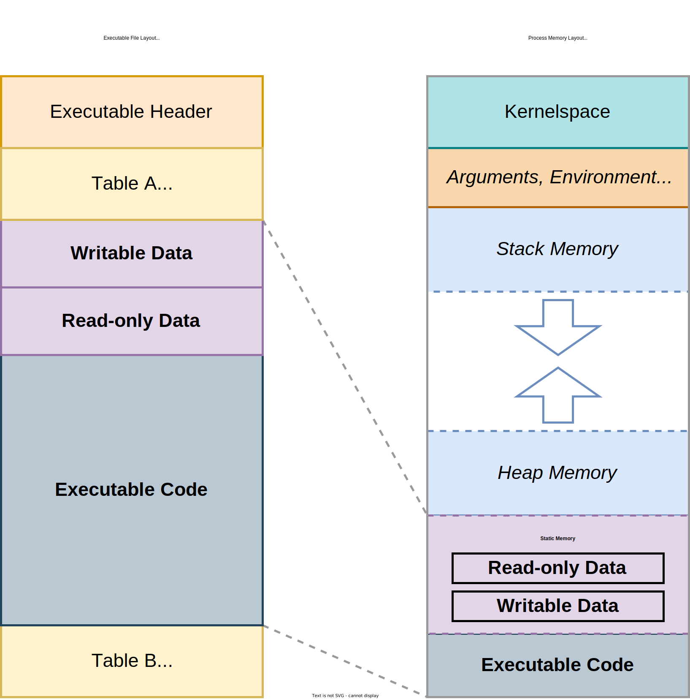

# Software Perspective: CPU to Process

We want to build a mental model of "what the machine is doing".
Of how, at a mechanical level, a computer executes a program in memory.
Systems programmers work within the confines of this model to write efficient programs.
Exploit developers abuse it to take control of vulnerable programs.

Recall that our mental model doesn't need to reflect every intricacy of reality.
A more *complex* model isn't necessarily a more *useful* one, even if technically more accurate.
We're primarily interested in a single concept at the core of every "low-level"[^Chp1Levels] language: runtime memory management.

That entails understanding how the **stack** and the **heap**, two memory locations mentioned in the last chapter, work.
In considerable detail.
We'll start with the stack for two reasons:

1. **Ubiquity** -  Stack memory is present on every system, from the tiniest microcontroller to beefiest server. Use of heap memory is common but also optional. A non-embedded program can choose to avoid heap allocations for performance or portability, but an embedded platform may not support the heap at all. Stack memory is always at play.

2. **Simplicity** - Stack memory is implemented with hardware support, its operations are relatively simple. We can push (add) frames onto the stack and pop (remove) frames from the top. By contrast, heap memory's logic is complex and controlled by software. Stack memory can be discussed generally, but understanding heap fundamentals requires studying a specific allocator's implementation (which we'll do!).

Before we push on to stack memory proper (pun intended), we need to briefly cover two prerequisites: CPUs and program loading.
Both topics are the subjects of entire technical books, so we'll visually diagram just enough detail to scaffold our mental model of the runtime stack.

> **What kinds of "embedded systems" don't use heap memory?**
>
> "Embedded system" is a term so broad it borders on meaningless.
> At least without more specific context.
> To aid general discussion, Muench et al.[^CorruptCrash] propose a taxonomy that can be useful for practical differentiation:
>
> * **Type-I:** General purpose OS-based devices - a "slimmed" down version of commodity desktop/server software.
>   * *Example:* car infotainment system retrofitting the Linux kernel.
>   * Supports both stack and heap memory.
>
> * **Type-II:** Embedded OS-based devices - custom software for low-resources and/or single-purpose platforms.
>   * *Example:* NASA's Mars exploration rover running the VxWorks RTOS[^MarsVx].
>   * Supports stack memory, heap memory use is optional/modular.
>
> * **Type-III:** Devices without an OS abstraction - the entire software stack is a "monolithic firmware", a single control loop occasionally servicing external events (e.g. peripheral-triggered interrupts).
>   * *Example:* a GPS receiver using custom firmware for positional trilateration.
>   * Often restricted to stack memory alone[^CustomAlloc].
>
> Stack memory is crucial to the operation of all 3 types of embedded systems.
> Think of it as a universal abstraction for program runtimes.
>
> The remainder of this section represents Type-I and Type-II systems[^T3].
> Our visualizations generally assume fundamental OS abstractions, like virtual memory and processes, are present.

## The CPU and RAM

 

  
  <figure>
  <figcaption>
A simplified overview of a CPU, RAM, and persistent storage. Not specific to any particular architecture. 
</figcaption> 
  </figure>

Main memory, a physical machine's Random Access Memory (RAM), supports all non-trivial runtime computation.
The bit-patterns it stores and operates on representations two distinct items:

* **Data** - Variable-length sequences of bytes representing any information: hardcoded strings, colors codes, numbers, entire image and video files, etc. Each byte can be addressed individually, even if word-aligned accesses are often preferable for performance.

  * Data can be written to or read from disk or network (e.g. *persistent storage*), but any programmatic update means reading the data into RAM (e.g. *volatile storage*), performing the modification, and writing it back.

* **Code** - Native CPU instructions encoded as short sequences of bytes. In the above diagram, we assume all valid instructions are the same length[^FixedLen]. A *word* is a CPU's "natural" unit of data (what its hardware is designed to operate on efficiently).

  * Instructions focus on low-level operations: arithmetic, boolean logic, condition testing, moving data in memory, etc. Arbitrarily complex programs can be broken down into long sequences of these basic operations[^MovObfu]. Assembly language is a human-readable representation of raw instruction encodings (aka "machine code").

The Central Processing Unit (CPU) is a very fast instruction processing state machine with small pieces of "scratch space" for storing intermediate results called *registers*.
Final results are written back to RAM.
Registers come in two flavors:

1. General Purpose (`GP*`) registers can store any kind of result at any time.

2. Special purpose registers (e.g. `IP`, `SP`, `CCR`) are used to track internal state during result processing.

So how does *processing* actually work?
Both the instructions and data move back and forth between the CPU and RAM via a data bus[^DataBus].
The address bus allows a CPU to specify a given memory location and size of data to be read or written.
Every CPU continually repeats a three step *instruction cycle* (try tracing each step below through the above diagram):

1. **Fetch** - Read an instruction from RAM currently addressed by the **Instruction Pointer (IP)** register[^PC]. Update the `IP` to point to the next instruction.

    * *Above diagram:* CPU sends the current `IP` value over the address bus, gets back the instruction pointed to over the data bus.

2. **Decode** - Interpret the meaning of the fetched instruction. It must include an *opcode* (unique encoding for its operation), but may also include *operands* (arguments for the operation) and/or a prefix (behavioral modifier).

    * *Above diagram:* CPU deciphers the semantics of the received instruction.

3. **Execute** - Execute the instruction to generate side-effects. Internally, this means a Control Unit (CU) passes instruction-specific signals to functional units. For example: the Arithmetic Logic Unit (ALU) is a functional unit which performs mathematical operations on register values.

    * *Above diagram:* Depending on the instruction, the CPU updates `SP`, `CCR`, and `GP*` registers. Additionally:

        * If the instruction writes, the CPU sends an address to write over the address bus and data to be written over the data bus.

        * If the instruction reads, the CPU sends an address to read over the address bus and receives the corresponding data over the data bus.

Modern CPUs rely on complex optimizations, like instruction pipelining[^Pipeline] and speculative execution[^SpecExec], to speed up the instruction cycle.
Fortunately, we don't have to consider or understand such minutia when programming day-to-day.

The jobs of various registers are, by contrast, important for a working mental model.
In addition to the IP, the two special purpose registers worth noting are:

* The **Stack Pointer (`SP`)** register - the address denoting the bottom of the current stack frame. A stack frame is akin to function's in-RAM "notepad" for computing and saving *function-local* results.

    * In the statement `let x = 3 + 6;`, `x` will be computed using registers, then the value `9` will be stored on the stack[^RegisterAlloc]. This allows the CPU to re-use its small, fixed set of `GP*` registers for new computations when multiple functions are called in a program.

* The **Condition Code Register (`CCR`)** register collects the current status flag bits of a processor. Among other uses, this register helps implement conditional logic - like "jumping" the instruction pointer to a particular location if an operation's result is non-zero.

    * This single register enables all the control flow constructs[^DuffDev] we rely on as programmers, like `if` statements and `for` loops. `if z == true { do_1(); } else { do_2(); }` de-sugars to "test the equality of `z` and `true`, if equal set equality flag in `CCR`. If this equality flag in `CCR` is set, jump to `do_1()` and execute, else jump to `do_2()` and execute".

Let's recap: CPUs continually read and execute instructions from RAM, update internal registers, then read/write data from/to RAM.

With the basics of how hardware backs computation under our belt, we're almost ready to discuss  stack memory.
But first we need to understand one more concept: the process - a key OS-level abstraction.

## Executable vs Process

When a compiler outputs a program, it's represented as an executable file stored on disk.
Operating systems use different file formats to standardize the structure of executables: PE on Windows, ELF on Linux, and Mach-O on MacOS.
Every format contains sections storing:

* **A header** (start of the file for all) - contains various metadata: identifier for file type, a description of contents, the offsets of additional sections and special tables (e.g. section header tables on Linux).

* **Executable code** (`.text` section on Linux) - the instructions encoding the compiled program's logic. Most of your hard work as a programmer lives here!

* **Read-only data** (`.rodata` section on Linux) - constant values, like static strings or hardcoded lookup tables.

* **Writable data** (`.data` on Linux) - initialized, writable, global variables and buffers. Aside: uninitialized data gets its own section (`.bss` on Linux, often zero-initialized in practice).

A *process* is an instance of an executable that's currently running.
Meaning the OS has scheduled the process to receive CPU time, the executable bytes will churn through our aforementioned fetch/decode/execute cycle.

An OS's loader takes the contents of an on-disk executable, places them into memory, and prepares that memory for program execution.
A linker may also be involved to combine various pieces of code and data, potentially from several executables, either at compilation or load time.
Either way, the end result of the loading looks roughly like so:

 

  
  <figure>
  <figcaption>
Mapping of on-disk, executable contents to in-memory process space.
</figcaption> 
  </figure>

Because of an OS-provided abstraction called *virtual memory*, a process gets to assume its the only entity in a nearly limitless and entirely linear address space.
For all practical intents and purposes, its memory layout is the right-hand side of the diagram above.

Maintaining mappings from this virtual layout to physical storage shared by other processes is the job of the OS.
And a layer of complexity we can safely ignore in most day-to-day systems programming tasks.
Remember: a perfectly detailed model is seldom the most practical one, that's the beauty of abstraction design!

The most important takeaway from this section is that right side of the diagram.
Specifically how executable code, static memory, stack memory, and heap memory *co-exist* in the same process address space.
Both normal execution and program exploitation happen within the confines of this memory model.
This is what you'll be reasoning about when writing systems code.
It's important you commit it to memory, pun intended.

> **Linux Processes and System Calls**
>
> Processes are a key concept in systems programming.
> Let's take a slight detour to discuss the broader context.
>
> Processes are run by and for users.
> Hence they're sometimes called "userspace applications".
> They have no special privileges, meaning they run in "ring 3" - the least privileged mode code can operate in[^RingProt].
> Many processes run simultaneously, each can't read/write from/to anything outside of their own virtual address space.
>
> But what about the OS kernel itself?
> Its code, data, stack, and heap are stored in an isolated memory area - "kernelspace".
> The kernel runs in "ring 0", the most privileged mode available.
> It can read/write from/to any processes's memory, directly access hardware, and control special CPU features.
>
> Rings 2 and 3 are almost never used in practice[^RingProt].
> These modes were intended for device drivers, special programs that allow a kernel to communicate with vendor-specific hardware.
> In reality most device drivers are loaded directly into the kernel, running alongside it in ring 0 (creating a major OS attack surface[^MSKernBlocklist]).
>
> When a userspace program needs to perform a privileged operation (e.g. spawn a new process) or interact with hardware (e.g. read a file from disk or send a request over a networks)  it must make a request to the kernel.
> The low-level APIs for such requests are called "system calls" - "syscalls" for short.
> The Linux kernel supports over 400 system calls, some of which are architecture-specific[^SyscallTable].
> Consider two common syscalls for managing processes lifecycles:
>
> * **`fork`** (syscall for duplicating a process) - A process can create a copy of itself. A script may want to run a helper task in parallel, a web server might want to scale to more requests. Forked process memory is copy-on-write. The original ("parent") process and the new copy (the "child") each see distinct virtual address spaces, but the common elements (e.g. identical code sections, data that's read-only or hasn't yet been modified) only appear once in physical RAM.
>
> * **`execve`** (syscall for executable loading) - One program can execute another. The system call for doing so doesn't create a new process, instead it loads and runs a new program within the current process - overwriting all previous contents. The new segments are backed by the executable file of the new program.
>
> Let's integrate these two syscalls with an example: how does a commandline shell work?
> When you enter a command, the shell `fork`s a child.
> The child is given an executable path and arguments as input, it calls `execve` to replace itself with the requested application.
> The shell, a parent process still running, captures the output via pipes - typically `stdout` for normal output and `stderr` for error prints.

## Takeaway

The Central Processing Unit (CPU) is a tiny state machine continually operating on main memory or Random Access Memory (RAM).
RAM stores both code and data.
A CPU fetches, decodes, and executes instructions from RAM (code), then writes back results (data) if applicable.

A program must be loaded into memory, creating a *process*, before it can run.
That involves mapping it's executable code into RAM and setting up 3 special memory locations:

1. Static memory - stores global variables and constants.
2. Stack memory - stores function frames, including local variables.
3. [Optionally] Heap memory - stores data shared between functions and threads.

We'll cover stack and static memory next.
In the context of a language, agnostic reliability pattern.
Heap memory will come a bit later!

---

[^Chp1Levels]: "Low-level" can be an ambiguous and overloaded term to apply to a programming language. We briefly explained our usage of the term in the ["Languages by Level"](https://highassurance.rs/chp1/why_this_book.html#languages-by-level) section of Chapter 1.

[^CorruptCrash]: [*What You Corrupt Is Not What You Crash: Challenges in Fuzzing Embedded Devices*](https://www.s3.eurecom.fr/docs/ndss18_muench.pdf). Marius Muench, Jan Stijohann, Frank Kargl, Aurelien Francillon, Davide Balzarotti (2018).

[^MarsVx]: [*An Overview of the Mars Exploration Rovers Flight Software*](https://trs.jpl.nasa.gov/bitstream/handle/2014/37499/05-0539.pdf). Glenn Reeves (2014).

[^CustomAlloc]: Technically, Type-III systems *can* explicitly link in a custom allocator as part of the firmware build, essentially "bringing their own" heap support. But many, if not most, single-purpose devices won't do so - due to resource and/or reliability constraints.

[^T3]: For those curious: Type-III systems can have only one program, baked directly into Read-Only Memory (ROM), whose entry point is jumped to on device reset. Unlike general purpose systems, they don't require the flexibility of being able to run arbitrary executables. Hence they don't need the process abstractions we've diagramed above.

[^FixedLen]: This is true certain Instruction Set Architectures (ISAs), like 32 and 64-bit ARM, that use fixed length encoding. Other ISAs, like x86, use variable length encoding. For 64-bit x86, instructions vary from 1 byte to 15 bytes in length. As you might imagine, that variability creates challenges for software disassemblers.

[^MovObfu]: [`xoreaxeaxeax/movfuscator`](https://github.com/xoreaxeaxeax/movfuscator). Chris Domas(Accessed 2023). In fact, arbitrary programs can be broken down into a sequence of just one instruction type: `mov`! Not efficient, but an effective obfuscation technique.

[^DataBus]: The hardware implementation of a data bus is akin to a multi-lane highway, where each lane is a physical, electrical connection between the CPU and RAM.

[^PC]: An Instruction Pointer (IP) is often referred to as a Program Counter (PC), but will stick with IP in this book.

[^Pipeline]: [*Instruction pipelining*](https://en.wikipedia.org/wiki/Instruction_pipelining). Wikipedia (Accessed 2022).

[^SpecExec]: [*Speculative execution*](https://en.wikipedia.org/wiki/Speculative_execution). Wikipedia (Accessed 2022).

[^RegisterAlloc]: In reality, an optimizing compiler could be clever enough to manage registers across function calls such that `x` never needs to be written to the stack and can be safely preserved in a register (which is faster to read and write). Our example illustrates the general case, not optimized special cases.

[^DuffDev]: [*Duff's Device*](https://en.wikipedia.org/wiki/Duff%27s_device). Wikipedia (Accessed 2023). An interesting and bizarre example of C control flow. Unlike Rust, C allows unstructured control flow (including `goto` statements).

[^RingProt]: [*Protection ring*](https://en.wikipedia.org/wiki/Protection_ring). Wikipedia (Accessed 2022).

[^MSKernBlocklist]: [*Microsoft recommended driver block rules*](https://learn.microsoft.com/en-us/windows/security/application-security/application-control/windows-defender-application-control/design/microsoft-recommended-driver-block-rules). Microsoft (Accessed 2023).

[^SyscallTable]: [*Linux kernel system calls for all architectures*](https://marcin.juszkiewicz.com.pl/download/tables/syscalls.html) Marcin Juszkiewicz (Accessed 2022).

[^IncludeMacro]: [*Macro `std::include`*](https://doc.rust-lang.org/std/macro.include.html). The Rust Team (Accessed 2023).

[^HyperThread]: [*What Is Hyper-Threading?*](https://www.intel.com/content/www/us/en/gaming/resources/hyper-threading.html). Intel (Accessed 2022).

[^CSAPP]: [***[PERSONAL FAVORITE]** Computer Systems: A Programmer's Perspective*](https://amzn.to/3IBnFA7). Randal Bryant, David O'Hallaron (2015).

[^Memset]: [*`memset`*](https://man7.org/linux/man-pages/man3/memset.3.html). Linux manual (Accessed 2022).

[^Zeroize]: [*`zeroize`*](https://crates.io/crates/zeroize). Tony Arcieri (Accessed 2022).
