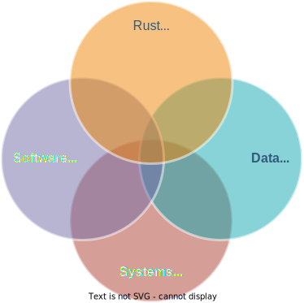

# Frequently Asked Questions (FAQ)
---

 

  
  <figure>
  <figcaption>
Fundamental topics covered.
</figcaption> 
  </figure>

## 0. Briefly, what does this book aim to do?

* Provide an accessible but principled introduction to developing secure and robust systems. At the overlap of "state-of-the-art" and "near-term practical": mostly production-grade tools and techniques, but also some-cutting edge research projects. All open-source.

* Help experienced developers both learn a new language and delve deeper into fundamental Computer Science and Computer Architecture topics.

## 1. Who is this book for?

Anyone interested in some combination of the above diagram:

* The Rust programming language
* Software security
* Data Structures (self-balancing trees, specifically)
* Systems programming

We do, however, assume you're already very comfortable with coding in general.
Maybe you're not a seasoned software engineer, but you've written and debugged a 3,000+ line program before.
You already understand recursion and know how to use command line tools.

This book also assumes you're curious about deeply technical topics.
Things like memory management and performance optimization.
The nitty-gritty of how the sausage is made.
We'll go pretty deep.

## 2. So this is an advanced book?

We won't shy away from "advanced" subjects, like program analysis research, binary exploit development, and self-balancing trees.
Parts of this book may be challenging, but we'll strive to make every topic as accessible and engaging as possible.

An appendix includes short sections marked "Fundamentals".
These provide optional introductions to key concepts, to accommodate readers of different backgrounds.
If a chapter expects or recommends certain knowledge, it's covered in one of these appendix sections.

Moreover, a significant portion of the quoted blocks that appear in this book are specifically intended to give explanatory context for the surrounding text.
They follow this format, roughly:

> **Question about concept X here**
>
> Some brief explanation of concept X and relevant keywords.
> Not comprehensive, but hopefully a start in the right direction.

The C language will occasionally be used for brief snippets, but covered as if you've never written any C yourself.
You don't need any prior Rust experience.

We'll provide clear explanations of any math and use diagrams to explain complex topics visually.

## 3. Is this just another data structures book?

No.
Although we will be using a specific data structure (called a "scapegoat tree") to scaffold a powerful map/set library.
You'll learn through the *lens* of data structures - which combine the rigor of abstract theory with the tricks of practical implementation.
And push toward mastery of Rust's most novel concepts.

## 4. What makes this book "hands-on"?

You'll write code, and use cutting-edge tools, throughout each chapter.

By the end of the first half, you'll be sending remote commands to your data structure library to test it live.
And here's the kicker: it'll be running "bare metal" inside a virtual replica of an embedded system.
We'll explain what that actually means, beyond that you don't have to buy any hardware!

The content of this book is derived from the implementation of a [real-world library](https://github.com/tnballo/scapegoat).
More importantly, you'll build an API-compatible alternative to widely-used collections in Rust's *standard library*.
This is no "toy" example.

## 5. What "hacker" (low-level security, in this usage) skills am I going to learn?

You don't have to be capable of attacking a system in order to build a secure one.
But it's certainly easier if you can think like an attacker and apply some of the same tools.

We'll introduce a spectrum of defensive (aka "blue team") and offensive (aka "red team") skills, but emphasize the former.

* **Blue team skills (focus):**
    * Secure coding in Rust
    * Lightweight formal verification
    * Safe foreign function binding

* **Red team skills (supplement):**
    * The basics of modern binary exploitation
    * Reverse dynamic debugging
    * Bug finding via coverage-guided fuzzing

## 6. Can I apply what I learn at work?

We'll cover C Foreign Function Interface (CFFI) binding: your APIs will be callable from both Python3 and C99 code.
That's a practical skill for integrating fast, secure Rust components into your existing work codebase.

Plus all of the static verification and dynamic testing tools you'll sample are free and open-source.
Some are capable of analyzing executables written in multiple languages - not just Rust.
A full tooling inventory lives [in the appendix](../chp16_appendix/tools.md).

Even if you never get a chance to run Rust in production, you'll gain systems security skills.
Those might be valuable in a range of contexts.

## 7. Can I use Rust in safety-critical domains?

Not yet.
Unlike [SPARK/Ada](https://www.adacore.com/about-spark), Rust isn't certified for use in a *safety-critical* setting.
Industry [standardization](https://www.autosar.org/fileadmin/user_upload/20220308_RustWorkingGroup_Announcement_EN.pdf) and [qualification](https://ferrous-systems.com/ferrocene/) efforts are currently [underway](https://blog.adacore.com/adacore-and-ferrous-systems-joining-forces-to-support-rust), so that may change in the future.

This book is about building secure and robust software in general, regardless of industry.
As the regulatory landscape for Rust evolves, you'll be able to apply our topics in more verticals.

For most industries, Rust is production-ready.
Today.
The language is currently used in many *mission-critical* settings.
Including web-scale infrastructure, financial services, and consumer products.

> **Disclaimer:** An author of this book is also a volunteer on an SAE International task force currently creating guidelines for Rust usage in safety-critical systems.

## 8. Is this book free?

Absolutely!
No paywalls, no obligations, no gate keeping.
The entire book is publicly available at [https://highassurance.rs](https://highassurance.rs).

But it's still a **work in progress**.
The long-term goal is to provide *everyone* in the community with a *high-quality* resource on fundamental topics.
Building a well-rounded book will take time and iteration (your [feedback is appreciated](./engage.md#send-feedback-or-questions)).

If you find this book valuable, you can support this project via:

* **Starring the book's GitHub repo:** It's [here](https://github.com/tnballo/high-assurance-rust). Starring helps increase the visibility of this project among developers.

* **Buying one of the other books referenced throughout:**
Footnotes are used to cite sources.
When that source is a technical textbook we love and cherish, the footnote includes an Amazon affiliate link differentiated by the tag **[PERSONAL FAVORITE]**.
These links are used sparingly, only for books we genuinely feel are essential reads.
A full list is [in the appendix](../chp16_appendix/books.md).
If you purchase one using the link, it supports both this book and, obviously, the one you're buying.

* **Signing up for the physical copy wait list:**
At some point in the future, *High Assurance Rust* will be finished, polished, and worthy of a physical print.
If you're interested in a hardcopy, please [sign up here](https://forms.gle/ESYgXgswCjEoCSHT9) to be notified.

> Are you a **leading security startup or enterprise** that believes in continuing education?
> Would you like to feature your logo on this book's landing page to reach current or aspiring developers?
> If so, please see the [Sponsor Call for Proposals (CFP)](./cfp.md) page.

## 9. Anything else I should know?

A great deal of effort went into making this book a reality.
We hope you have as much fun reading as we did writing.
Let's hack together!

 

---

> \* == may be subject to change, it's not written yet! This book is a [work in progress](./faq.md#8-is-this-book-free).